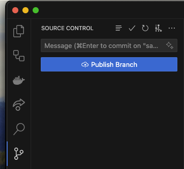
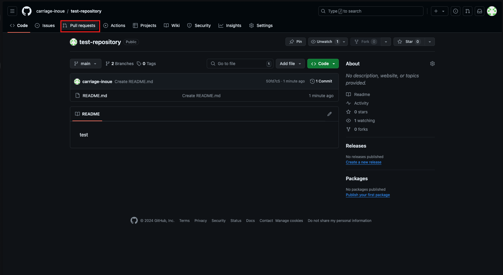
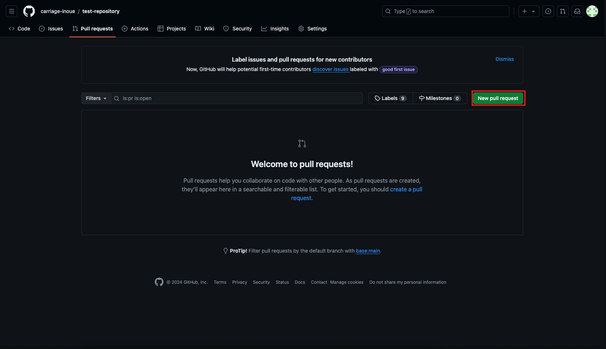
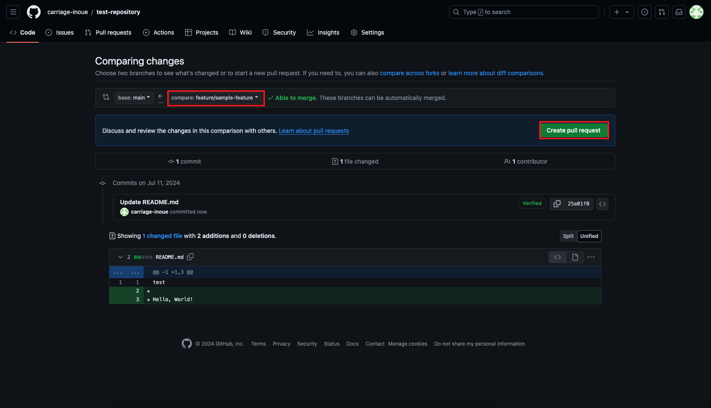
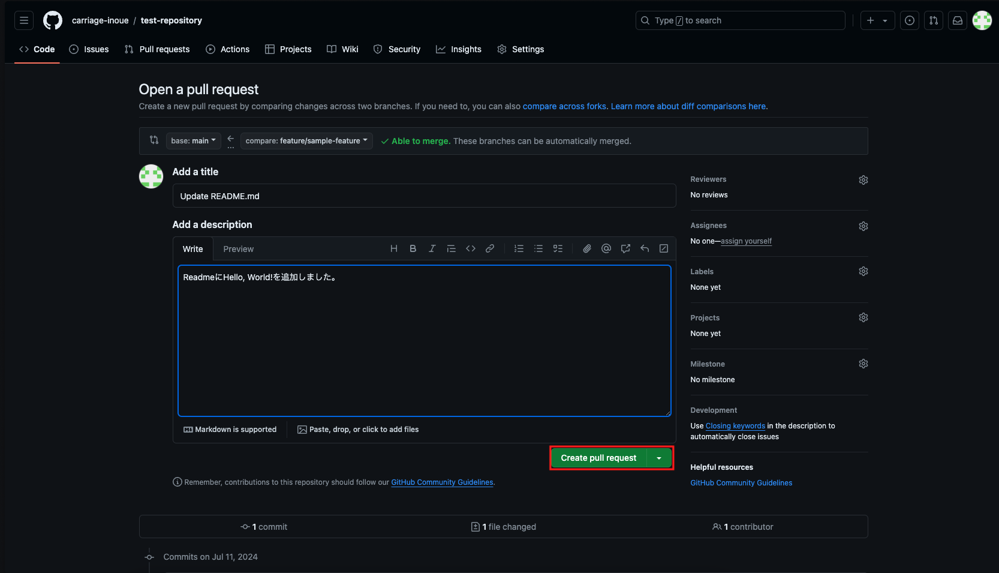
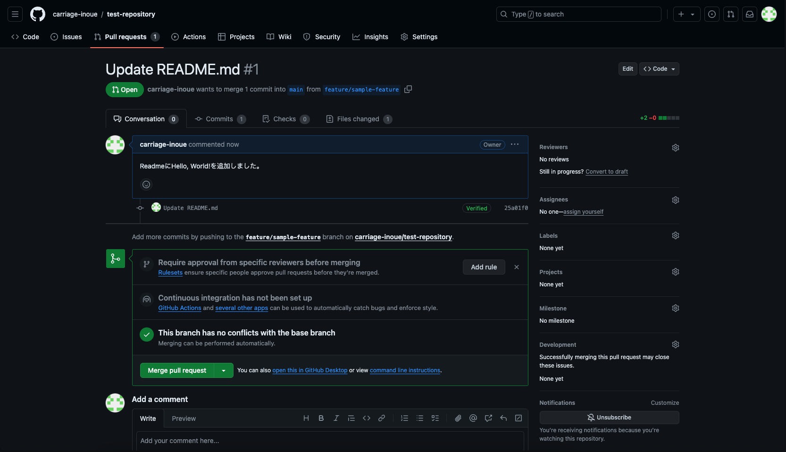

新しく Git で管理を始めた時は main ブランチしかありませんが、今後機能追加を行なっていく際には、機能の単位で新しくブランチを作成して作業を行います。そして、作業が完了したら、main ブランチに向けてプルリクエストを作成し、レビューを経て main ブランチにマージします。

この記事では、ブランチを新しく作成して、プルリクエストを作成・マージする流れを解説します。

<!-- truncate -->

## ブランチの作成

まずは、新しくブランチを作成します。ここでは、`feature/sample-feature` という名前で作成しますが、実際は作業内容が分かりやすいように命名すると良いでしょう。
VSCode でターミナルを開いて以下のコマンドを実行するか、左下の「main」をクリックしてブランチ名を入力して新しいブランチを作成します。

```bash
git checkout -b feature/sample-feature
```

## ファイルの変更

適当なファイルを開いて変更を加えます。ここでは、`README.md` を開いて変更を加えるとします。

```bash
echo "Hello, World!" >> README.md
```

VSCode の Source Control タブから変更をステージングし、適当なメッセージを入力してコミットします。

## ブランチのプッシュ

今の状態だと GitHub 側には新しく作られたブランチが存在していないため、ローカルからブランチをプッシュする必要があります。

VSCode の Source Control タブから、`Publish branch` をクリックしてブランチをプッシュします。



## プルリクエストの作成

ここからは、GitHub の Web ページで操作を行います。

1. リポジトリのトップページにアクセスし、`Pull requests` タブをクリックします。



2. `New pull request` ボタンをクリックします。



3. `compare` の欄で、`feature/sample-feature` を選択してください。差分が表示されるので、問題なければ `Create pull request` ボタンをクリックします。



4. タイトルとコメントを入力して、`Create pull request` ボタンをクリックします。コメントには、変更内容やレビューしてほしいポイントなどを記載しましょう。



5. プルリクエストが作成されました。レビュー待ちの状態になるので、URL を共有してレビューを依頼しましょう。



## プルリクエストのマージ

レビューが完了し、問題がなければ、プルリクエストをマージします。プルリクエストのページにアクセスし、`Merge pull request` ボタンをクリックすると、main ブランチに変更がマージされます。
