GitHub は、Git リポジトリをホスティングするためのサービスです。GitHub を使うことで、複数の人が協力してプロジェクトを進めることができます。

この記事では、Git の基本的な使い方は理解している前提で、GitHub でのリポジトリの作成やコードの管理方法について解説します。

## GitHub アカウントの作成

まずは、GitHub アカウントを作成しましょう。[GitHub のホームページ](https://github.com/)にアクセスして、アカウントを作成します。

Sign up ボタンをクリックして、画面の流れに従ってアカウントを作成してください。

途中で料金プランを選択する画面が表示されますが、無料プランで問題ありません。

## SSH 接続の設定

### SSH キーの登録

GitHub にコードをプッシュしたり、プルしたりするためには、SSH キーを GitHub に登録する必要があります。

まずは、SSH キーをローカルで生成します。以下のコマンドを実行して、SSH キーを生成します。

```bash
cd ~/.ssh
ssh-keygen -t rsa -f github
```

実行すると色々聞かれますが、そのまま Enter キーを押して進めてください。実行が完了すると、`github` と `github.pub` というファイルが生成されます。`github.pub`が公開鍵なので、このファイルを GitHub に登録していきます。

GitHub に戻って、 右上のアバターアイコンをクリックし、Settings を選択します。

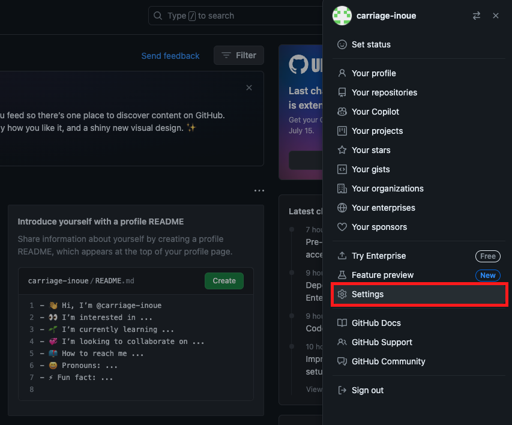

左メニューの SSH and GPG keys を選択し、New SSH key ボタンをクリックします。

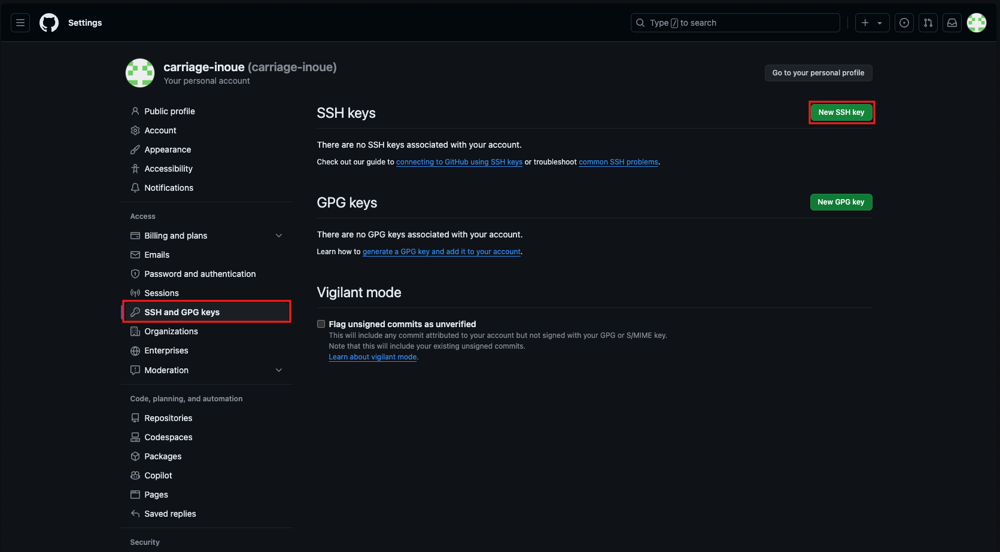

登録画面になるので、Title に任意の名前を入力し、Key に`github.pub` ファイルの中身をコピーして Add SSH key ボタンをクリックしてください。

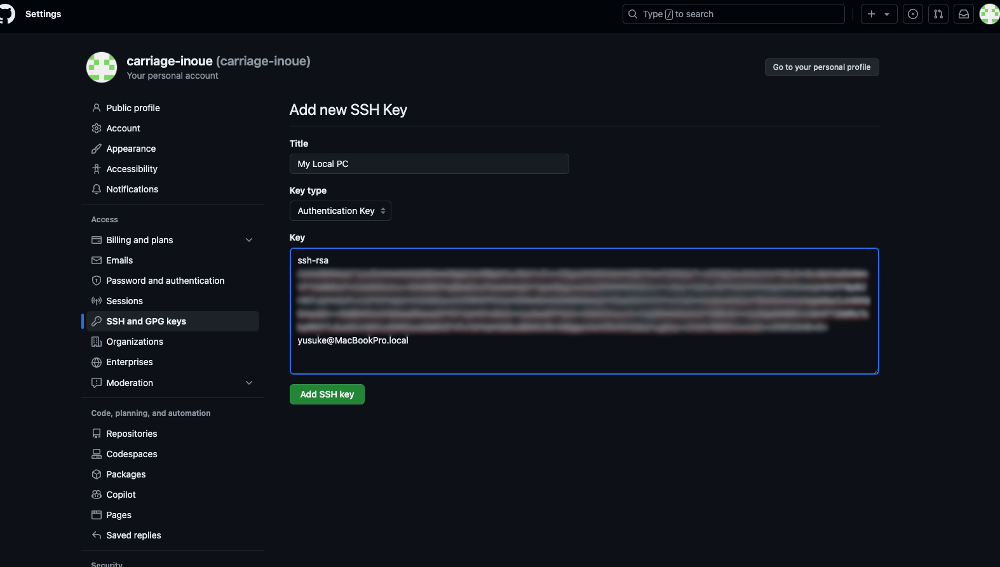

これで SSH キーの登録が完了しました。

### 接続確認

続いて、SSH 接続を確認していきます。
まずは SSH Config ファイルの設定を行います。

`~/.ssh/config` ファイルを作成し、以下の内容を記述します。

```bash
Host github github.com
  HostName github.com
  IdentityFile ~/.ssh/github
  User git
```

そして、以下のコマンドを実行して、SSH 接続ができるか確認します。

```bash
ssh -T github
```

以下のようなメッセージが表示されれば、SSH 接続が成功しています。

```
Hi {username}! You've successfully authenticated, but GitHub does not provide shell access.
```

## リポジトリの作成

### 空のリポジトリを作成する

GitHub でリポジトリを作成してみましょう。

GitHub にログインすると、ダッシュボードが表示されるので、左メニューの「Create repository」をクリックしてください。

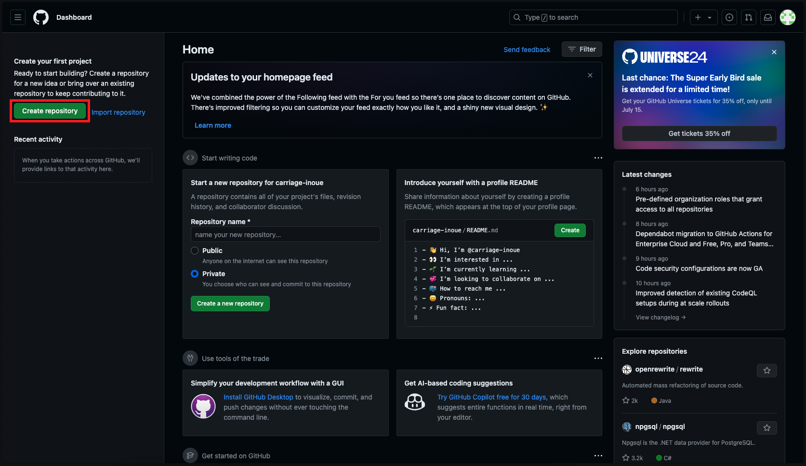

すると、以下のような画面が表示されるので、Repository name にリポジトリ名を入力してください。リポジトリは公開範囲の設定が可能で、Public にすると誰でも閲覧できるリポジトリになり、Private にすると、自分以外は閲覧できないリポジトリになります。

それ以外の設定はデフォルトのままで問題ありません。

入力が完了したら、Create repository ボタンをクリックしてください。

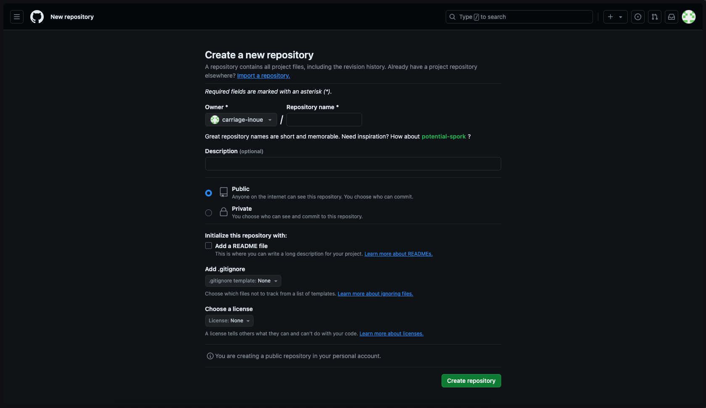

リポジトリの作成方法は、大きく分けて以下の 2 種類あります。

### ローカルの Git リポジトリと連携する

ローカルの Git リポジトリを GitHub のリポジトリと連携させる方法は、以下の 2 種類があります。

1. GitHub のリポジトリをローカルにクローンする方法
2. ローカルと GitHub のリポジトリを紐づけて利用する方法

Laravel や Next.js などのフレームワークでは、プロジェクトを作る際にローカルにプロジェクトのフォルダが作成されるので、2 番目の方法を使うことが多いです。

#### 1. GitHub のリポジトリをローカルにクローンする方法

git コマンドでローカルにリポジトリをクローンする必要があるので、画像のように SSH ボタンをクリックしてから、URL をコピーしてください。

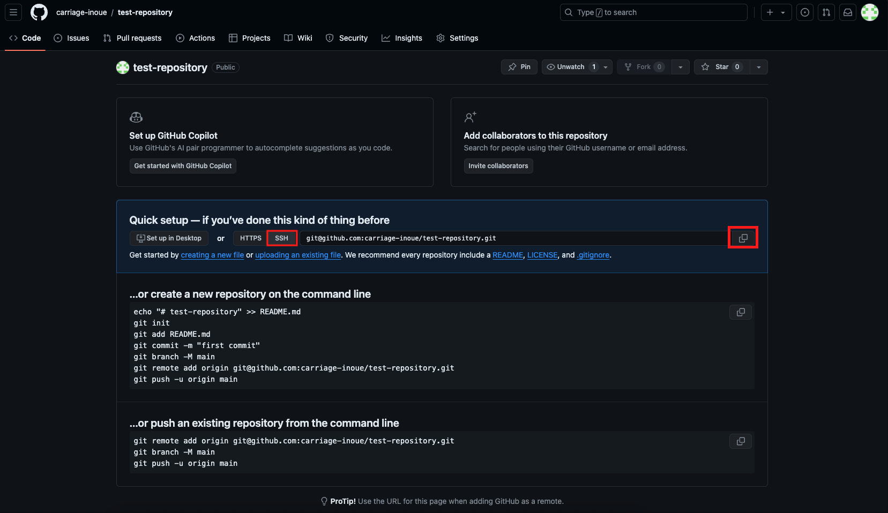

そして、以下のコマンドを実行して、リポジトリをクローンします。

```bash
git clone {git@で始まるリポジトリの URL}
```

そして、クローンしたリポジトリを VSCode などで開いて開発を行い、コミットしてプッシュすることで、GitHub にコードをアップロードすることができます。

#### 2. ローカルと GitHub のリポジトリを紐づけて利用する方法

まずはローカルのリポジトリが Git 管理されている必要があります。VSCode でプロジェクトを開いて、左メニューの Souce Control を開いたときに、Initialize Repository のボタンが表示されている場合、まだ Git 管理されていない状態なので、ボタンをクリックして Git 管理を開始します。

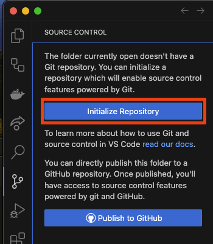

そして、すべてのファイルをステージングして、Initial commit というメッセージでコミットします。

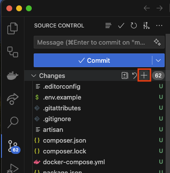

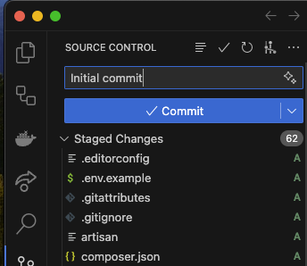

次に、GitHub の「...or push an existing repository from the command line」のコマンドをコピーし、VSCode でターミナルを開いて、コマンドを実行します。

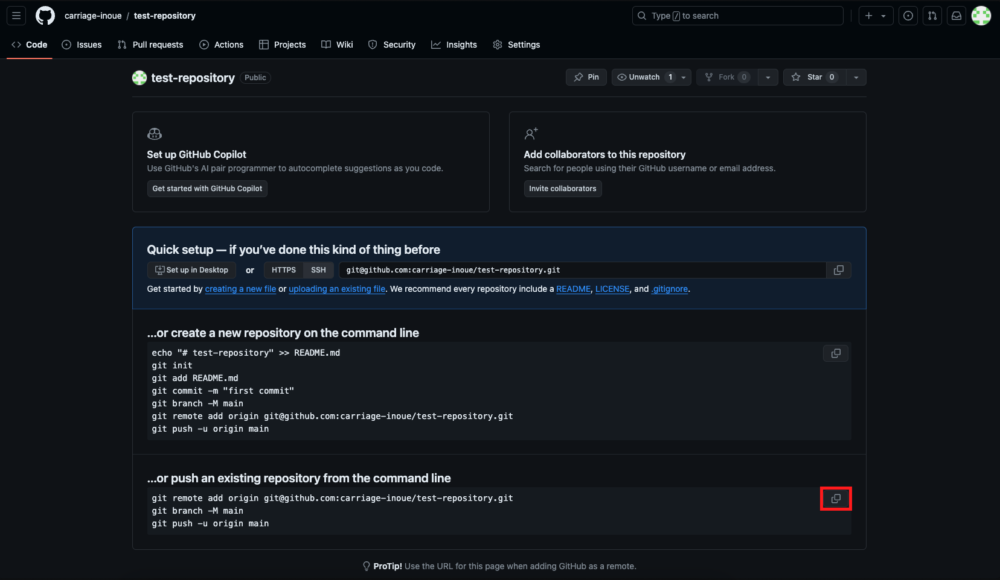

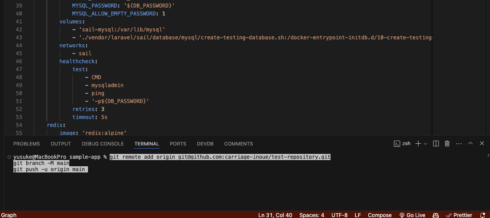

これで、GitHub 上にローカルのファイルの内容がアップロードされるはずです。この後は、VSCode でファイルを編集してコミットし、プッシュすることで、GitHub コードの内容を反映させることができます。
