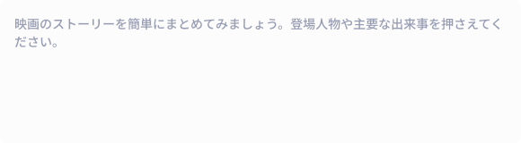
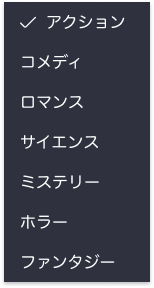
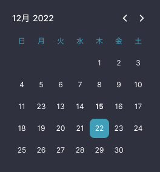

## 課題

以下のコンポーネントを作成してください。

1. `Button`コンポーネント

2. `Input`コンポーネント

3. `Textarea`コンポーネント

4. `Select`コンポーネント

5. `DatePicker`コンポーネント

6. `Slider`コンポーネント

7. `Dialog`コンポーネント

8. `Logo`コンポーネント

9. `Header`コンポーネント

## 要件

- コンポーネント作成には、Blade の匿名コンポーネント、またはクラスコンポーネントを使用してください。

1. `Button`コンポーネント

- ラベルと押した時の処理を設定できるようにしてください。
- ボタンの種類を 引数によって変更できるようにしてください。

2. `Input`コンポーネント

- プレースホルダーとアイコンを設定できるようにしてください。

3. `Textarea`コンポーネント

- プレースホルダーを設定できるようにしてください。

4. `Select`コンポーネント

- 選択肢を設定できるようにしてください。
- 選択された値にはチェックアイコンを表示するようにしてください。

5. `DatePicker`コンポーネント

- 枠内をクリックしたらカレンダーを表示してください。
- カレンダーの日付をクリックしたら、カレンダーを閉じて選択した日付を表示してください。
- カレンダーのデザインを作り込むのは大変なので、デフォルトの見た目でも構いません。

6. `Slider`コンポーネント

- スライダーで選択された値をテキストで表示するようにしてください。

7. `Dialog`コンポーネント

- ダイアログのタイトルとメッセージを設定できるようにしてください。
- ボタンのラベルと押した時の処理を設定できるようにしてください。

8. `Logo`コンポーネント

- 特にありません。

9. `Header`コンポーネント

- 特にありません。

## ヒント

- 実装中のコンポーネントの見た目を確認するため、トップページなどでコンポーネントを読み込んで表示しながら作業を進めてください。

## 提出方法

- 追加したファイルを GitHub にプッシュしてプルリクエストを作成し、 URL を共有してください。
