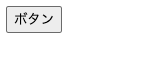
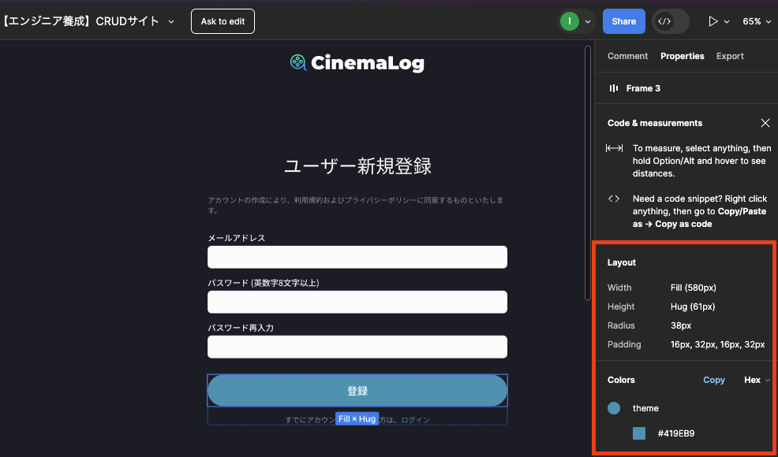
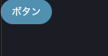
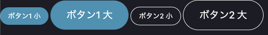
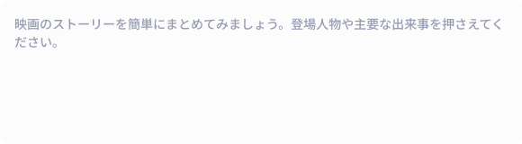
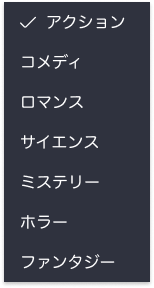

## コンポーネントの作り方

[レイアウトコンポーネントの作成](../tutorial/list.md#レイアウトコンポーネントの作成)でも少し触れましたが、複数の画面で使われる UI をコンポーネントにすることで再利用性を高めて効率的に開発を進めることができます。

課題の前に、以下のボタンの実装を通してコンポーネントの作り方を説明します。


### ファイル作成

まずは、`resources/views/components/elements` ディレクトリに `button.blade.php` という名前でコンポーネントファイルを作成します。
`elements` ディレクトリを作成することで、`<x-elements.button>` という形でコンポーネントを呼び出すことができます。

そして、`button.blade.php` に以下のコードを記述します。

```php title="resources/views/components/elements/button.blade.php"
<button>
    {{$slot}}
</button>
```

次にコンポーネントの表示確認をしたいので、新しく確認専用のページを作成しましょう。`routes/web.php` に以下のルートを追加します。

```php title="routes/web.php"
Route::get('/components', function () {
    return view('components');
});
```

そして、`resources/views/components.blade.php` を作成して以下のコードを記述します。

```php title="resources/views/components.blade.php"
<x-elements.button>ボタン</x-elements.button>
```

http://localhost/components にアクセスすると、ボタンが表示されるはずです。



### コンポーネントの引数

次にボタンの色やサイズを変更できるようにしてみましょう。
Breeze を導入した時点で、[Tailwind CSS](https://tailwindcss.com/) がインストールされているので、Tailwind CSS のクラスを使ってスタイルを変更します。

Tailwind CSS のクラスが反映できるようにするために、まずはレイアウトファイルを作成します。
[レイアウトコンポーネントの作成](../tutorial/list.md#レイアウトコンポーネントの作成)と同じ手順で、`resources/views/components/layout.blade.php` を作成してください。

そして、`resources/views/components.blade.php` を以下のように修正します。

```php title="resources/views/components.blade.php"
<x-layout>
    <x-elements.button>ボタン</x-elements.button>
</x-layout>
```

次に、`button.blade.php` を以下のように修正します。

```php title="resources/views/components/elements/button.blade.php"
@props(['color' => 'primary', 'size' => 'small'])

@php
    $colorClasses = [
        'primary' => 'bg-[#419EB9]',
        'secondary' => 'border-white border',
    ];
    $sizeClasses = [
        'small' => 'px-4 py-2 text-sm',
        'large' => 'px-8 py-4 text-xl',
    ];
@endphp

<button
    {{ $attributes->merge(['class' => 'text-white rounded-full ' . $colorClasses[$color] . ' ' . $sizeClasses[$size]]) }}>
    {{ $slot }}
</button>
```

まず `@props` ディレクティブを使って、コンポーネントが受け取る引数を定義します。ここでは、`color` と `size` という引数を受け取るようにしました。

- `color`：青背景のボタンを`primary`、白枠のボタンを`secondary`とする。
- `size`：ログイン画面などのボタンを`large`、ダイアログ上のボタンを`small`とする。

`primary` と `small` のようにデフォルト値を設定することで、引数が指定されなかった場合にデフォルト値が適用されるようになります。

次に、`@php` ディレクティブを使って、`color` と `size` の値に応じて適用するクラスを定義します。`@php` ディレクティブは PHP のコードを埋め込むためのディレクティブです。
`@endphp` までの間には PHP のコードを自由に記述することができます。

ここでは、`$colorClasses` と `$sizeClasses` という連想配列に、それぞれの引数に対するクラスを定義しています。
パディングや色などの情報は、Figma で UI を選択すると右側のプロパティに表示されるので、それを参考にしてください。



最後に、`button` タグの `class` 属性に、`$attributes` 変数を使って、コンポーネントに渡された属性をマージしています。
`$attributes` 変数は、コンポーネントに渡された属性を格納している変数で、`merge` メソッドを使って、コンポーネントに渡された属性とコンポーネント内で定義した属性をマージしています。

`$colorClasses[$color]` と `$sizeClasses[$size]` は、`$color` と `$size` の値に応じて適用するクラスを取得しています。

この時点で http://localhost/components にアクセスすると、青色のボタンが表示されるはずです。



最後に、`resources/views/components.blade.php` を以下のように修正して、ボタンの色やサイズを変更してみましょう。

```php title="resources/views/components.blade.php"
<x-layout>
    <x-elements.button color="primary" size="small">ボタン1 小</x-elements.button>
    <x-elements.button color="primary" size="large">ボタン1 大</x-elements.button>
    <x-elements.button color="secondary" size="small">ボタン2 小</x-elements.button>
    <x-elements.button color="secondary" size="large">ボタン2 大</x-elements.button>
</x-layout>
```



### 押した時の動作を引数で渡せるようにする

最後に、ボタンを押した時の動作を引数で渡せるようにしてみましょう。ボタンは form タグ内で type="submit"を指定すると、form 側の action 属性で定義した動作を行いますが、それ以外にも JavaScript の処理を行いたい場合があります。

以下の方針で修正していきましょう。

1. `type`という引数を追加し、`submit` と `button` の 2 つの値を受け取れるようにする。
2. `onclick` という引数を追加し、ボタンを押した時の JavaScript の処理を受け取れるようにする。

まずは、`button.blade.php` を以下のように修正します。

```php title="resources/views/components/elements/button.blade.php"
@props(['color' => 'primary', 'size' => 'small', 'type' => 'submit', 'onclick' => ''])

@php
    $colorClasses = [
        'primary' => 'bg-[#419EB9]',
        'secondary' => 'border-white border',
    ];
    $sizeClasses = [
        'small' => 'px-4 py-2 text-sm',
        'large' => 'px-8 py-4 text-xl',
    ];
@endphp

<button
    {{ $attributes->merge([
        'class' => 'text-white rounded-full ' . $colorClasses[$color] . ' ' . $sizeClasses[$size],
        'type' => $type, 
        'onclick' => $onclick
    ]) }}>
    {{ $slot }}
</button>
```

`type` と `onclick` という引数を追加し、デフォルト値を設定しています。

`resources/views/components.blade.php` を以下のように修正して、一つ目のボタンにクリックした時の動作を追加してみましょう。

```php title="resources/views/components.blade.php"
<x-layout>
    // highlight-next-line
    <x-elements.button color="primary" size="small" type="submit" onclick="alert('ボタンが押されました！')">ボタン1 小</x-elements.button>
    <x-elements.button color="primary" size="large">ボタン1 大</x-elements.button>
    <x-elements.button color="secondary" size="small">ボタン2 小</x-elements.button>
    <x-elements.button color="secondary" size="large">ボタン2 大</x-elements.button>
</x-layout>
```

一つ目のボタンをクリックすると、アラートが表示されるはずです。

## 課題

上記で作成した `Button` コンポーネントを参考に、以下のコンポーネントを作成してください。

1. `Input`コンポーネント


2. `Textarea`コンポーネント



3. `Select`コンポーネント



## 要件

- コンポーネント作成には、Blade の匿名コンポーネント、またはクラスコンポーネントを使用してください。

1. `Input`コンポーネント

   - プレースホルダーとアイコンを設定できるようにしてください。

2. `Textarea`コンポーネント

   - プレースホルダーを設定できるようにしてください。

3. `Select`コンポーネント

   - 選択肢を設定できるようにしてください。
   - 選択された値にはチェックアイコンを表示するようにしてください。

## ヒント

- 実装中のコンポーネントの見た目を確認するため、トップページなどでコンポーネントを読み込んで表示しながら作業を進めてください。

## 提出方法

- 追加したファイルを GitHub にプッシュしてプルリクエストを作成し、 URL を共有してください。
