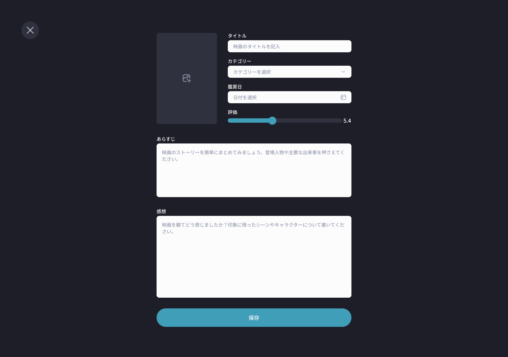

## 課題

映画記録の登録画面を実装してください。

## 要件

- 画像をアップロードできるようにしてください。
- タイトル、カテゴリー、評価、あらすじ、感想を入力できるようにしてください。
- あらすじは任意入力、それ以外は必須入力として、バリデーションを実装してください。
- 左上の「×」ボタンを押した際の動作は以下の通りです。
  - 何も入力していない場合は、そのままリスト画面に遷移します。
  - 入力している場合はダイアログを表示し、「記録を破棄」をクリックするとリスト画面に遷移します。

## 提出方法

- 実装したファイルを GitHub にプッシュしてプルリクエストを作成し、 URL を共有してください。
