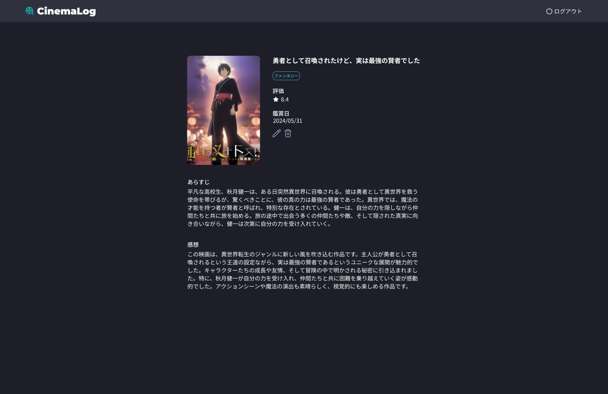

## 課題

映画記録の詳細画面を実装してください。

## 要件

- 鉛筆アイコンをクリックすると、編集画面に遷移するようにしてください。
- ゴミ箱アイコンをクリックすると、削除確認ダイアログを表示して、削除をクリックすると DB から削除してリスト画面に遷移するようにしてください。

## 提出方法

- 実装したファイルを GitHub にプッシュしてプルリクエストを作成し、 URL を共有してください。
