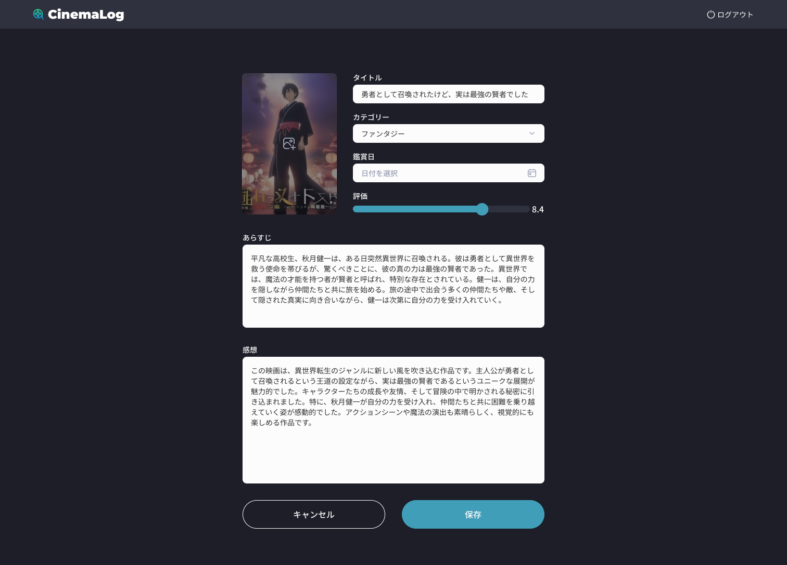

## 課題

映画記録の編集画面を実装してください。

## 要件

- 画面を開いたら、既存の映画記録の情報が入力された状態で表示されるようにしてください。
- キャンセルボタンを押した際の動作は以下の通りです。

  - 何も変更していない場合は、そのまま詳細画面に遷移します。
  - 変更している場合はダイアログを表示し、「確定」をクリックすると詳細画面に遷移します。

  

## 提出方法

- 実装したファイルを GitHub にプッシュしてプルリクエストを作成し、 URL を共有してください。
