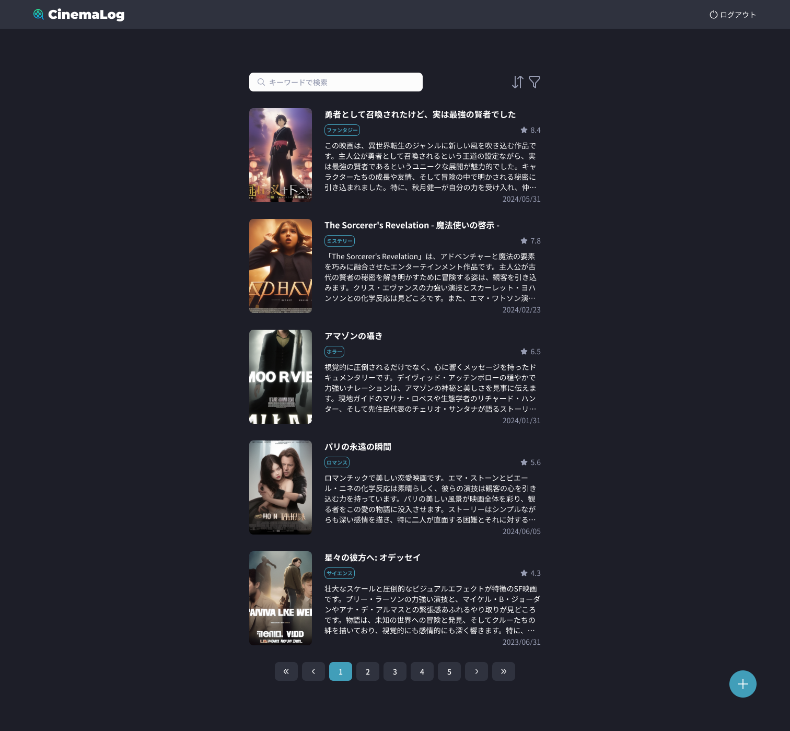

## 課題

映画記録のリスト画面を実装してください。

## 要件

- 検索フォームはタイトルとあらすじ、感想で検索できるようにしてください。
- 絞り込みはカテゴリーで絞り込めるようにしてください。
- 並び替えは、新しい順、古い順、評価の高い順、評価の低い順のうちのどれか一つを選べるようにしてください。デフォルトは新しい順です。
- 右下の「＋」ボタンを押すと、登録画面に遷移するようにしてください。
- ページネーションは発展課題なので、余裕があれば実装してください。

## ヒント

- 実装に当たって認証が必要であれば、Breeze で生成された画面からユーザー登録してログインしてください。
- 以下の部分は一つのコンポーネントにすると良いでしょう。

## 提出方法

- 実装したファイルを GitHub にプッシュしてプルリクエストを作成し、 URL を共有してください。
