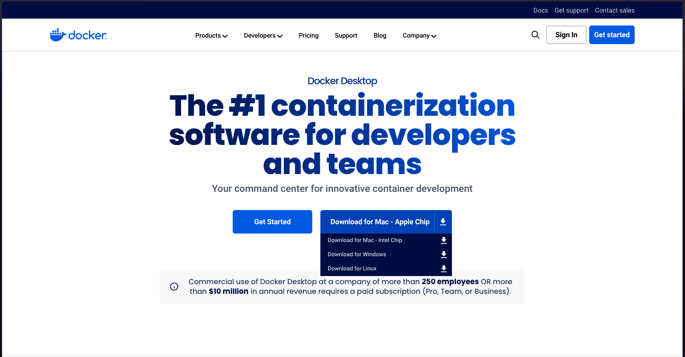

本コースに必要な環境構築手順を説明します。

## Docker Desktop のインストール

Docker Desktop は、Docker というコンテナ仮想化技術を利用するためのソフトウェアです。

以下のリンクから、各自の OS に応じた インストーラをダウンロードしてインストールしてください。

[ダウンロードページ](https://www.docker.com/products/docker-desktop)

コンテナとは、アプリケーションとその依存関係を一つのパッケージにまとめ、どの環境でも一貫して動作するようにする技術です。  
コンテナ内に必要なソフトウェアとライブラリを全て含むため、ローカル PC にソフトウェアを直接インストールして環境を汚す心配がありません。  
これにより、開発者間での環境差異や、開発環境と本番環境の差分を最小限に抑えることができます。

:::note
本コースでは Docker の一部の機能しか使わないため、詳細な説明は省略します。
:::

インストールが完了したら、Docker Desktop を起動してください。
