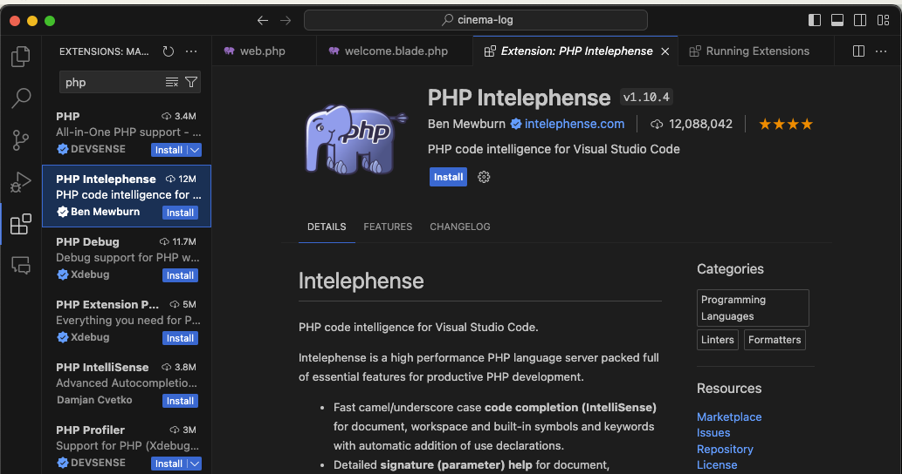
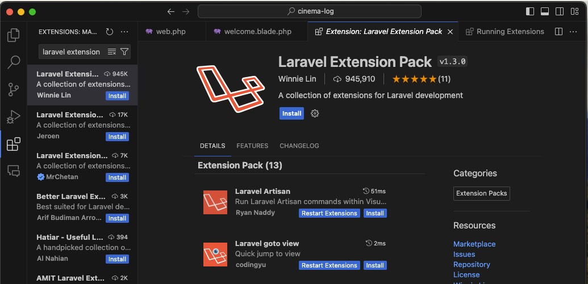
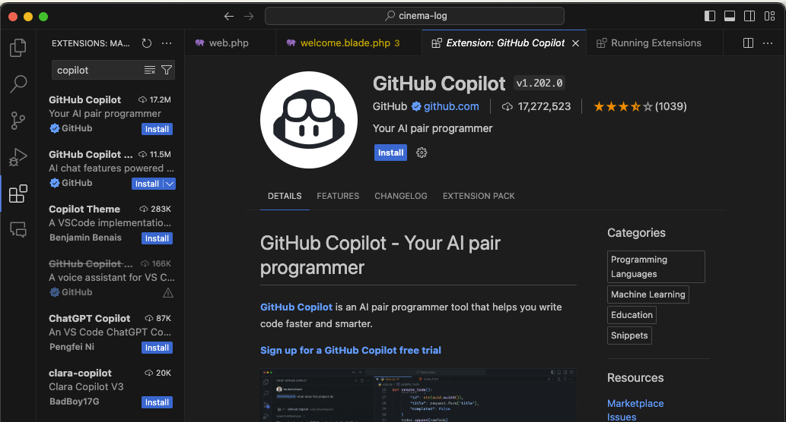

本コースに必要な環境構築手順を説明します。

## Docker Desktop のインストール

Docker Desktop は、Docker というコンテナ仮想化技術を利用するためのソフトウェアです。

以下のリンクから、各自の OS に応じた インストーラをダウンロードしてインストールしてください。

[ダウンロードページ](https://www.docker.com/products/docker-desktop)

コンテナとは、アプリケーションとその依存関係を一つのパッケージにまとめ、どの環境でも一貫して動作するようにする技術です。  
コンテナ内に必要なソフトウェアとライブラリを全て含むため、ローカル PC にソフトウェアを直接インストールして環境を汚す心配がありません。  
これにより、開発者間での環境差異や、開発環境と本番環境の差分を最小限に抑えることができます。

:::note
本コースでは Docker の一部の機能しか使わないため、詳細な説明は省略します。
:::

インストールが完了したら、Docker Desktop を起動してください。

## VSCode 拡張機能のインストール

PHP および Laravel 開発に便利な拡張機能をインストールしましょう。

### PHP Intelephense

PHP のコード補完やリファクタリングをサポートする拡張機能です。
import 文の自動補完や、クラスやメソッドの定義元へのジャンプなどができます。

:::tip
ジャンプするには、クラス名やメソッド名を右クリックして`Go to Definition` を選択するか、`Cmd (WindowsではCtrl) + Click` を押します。
重要な操作なので、覚えておきましょう。
:::

### Laravel Extension Pack

Laravel 開発に便利な拡張機能のセットです。
Laravel Blade Snippets、Laravel Snippets、Laravel goto view などが含まれています。

この拡張機能を入れると、view 名や controller 名をクリックすると、対応するファイルにジャンプできるようになります。
こちらも、`Cmd (WindowsではCtrl) + Click` でジャンプできます。

### (Extra) Github Copilot

AI がコードを自動生成する機能を提供する拡張機能です。  
コードの自動生成により、開発効率を向上させることができます。

コードを書いていると候補がエディター上に表示されるので、あとは Tab キーを押すだけでコードを生成できます。

:::note
初学者が入れることの賛否はあると思いますが、プロのエンジニアも使っている人が多く、実際かなり効率良くコードを書けるようになるため、もはや必須の拡張機能と言えるかもしれません。  
利用料がかかるので、強制はしませんが、使ってみることをおすすめします。
:::
