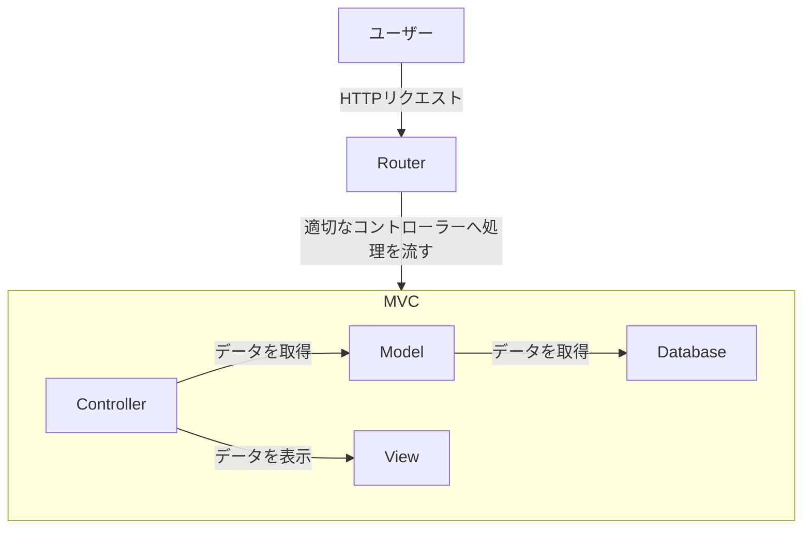

## Laravel とは

Laravel（ララベル）は、PHP 言語で書かれたオープンソースの Web アプリケーションフレームワークです。

同じようなフレームワークには、Ruby 言語の Ruby on Rails、Python 言語の Django、Java 言語の Spring Framework などがありますが、最近の採用数で言うと Laravel が最も多い印象です。

Laravel は、以下のような特徴を持っています。

- **シンプルな構文**  
  Laravel は、シンプルな構文を採用しており、初心者でも簡単に学習できます。

- **高速な開発**  
  Laravel は、開発効率を重視しており、短期間でアプリケーションを開発することができます。

- **豊富な機能**  
  Laravel には、認証機能やデータベース操作、メール送信、キュー処理など、多くの機能が標準で用意されています。

- **拡張性**  
  他のフレームワークと比べると、Laravel はディレクトリ構造の変更や機能の追加が容易で、規模が大きくなり MVC では対応できない場合でも、拡張性が高いです。

- **コミュニティ**  
  Laravel は、世界中の開発者によって開発されており、多くの情報が公開されています。

これらの特徴により、個人から大企業まで幅広い開発者に利用されています。

Laravel が特に力を発揮するのは、初期段階のプロトタイピングや中規模の Web アプリケーションの開発でしょう。  
しっかりと身につければ、副業として稼ぐことも比較的容易のはずです。

## 基本的な構造

Laravel は、MVC（Model-View-Controller）アーキテクチャを採用しています。

MVC は、アプリケーションを 3 つの部分に分割し、それぞれに責務を分解することで、開発効率を向上させるアーキテクチャです。



- **Model**  
  データベースとのやり取りを担当します。データベースのテーブルと 1 対 1 で対応します。

- **View**  
  ユーザーに表示される画面を担当します。必要に応じて、Model からのデータを受け取り、HTML や CSS、JavaScript などを生成してユーザーに表示します。

- **Controller**  
  ユーザーからのリクエストを Router 経由で受け取り、Model から取得したデータを View に渡す処理を担当します。

このあと入門として TODO アプリを実装しますが、その際にこの構造を意識すると理解が深まるでしょう。

## Artisan コマンド

Laravel には、コマンドラインツールとして `artisan` が用意されており、様々な操作を簡単に行うことができます。

例えば、以下のような操作が行えます。

- マイグレーションの実行
- モデルの作成
- コントローラーの作成
- テストの実行

`artisan` コマンドは、以下のようにして実行します。

```bash
php artisan <コマンド名>
```

例えば、マイグレーションを実行する場合は、以下のようにします。

```bash
php artisan migrate
```

`artisan` コマンドには、多くのコマンドが用意されており、公式ドキュメントを参照することで、詳細な使い方を確認することができます。

## まとめ

Laravel は、PHP 言語で書かれたオープンソースの Web アプリケーションフレームワークです。

シンプルな構文や高速な開発、豊富な機能、拡張性、コミュニティなど、多くの特徴を持っています。

Laravel を使いこなせるようになれば、Web アプリケーションの開発が格段に楽になるでしょう。
