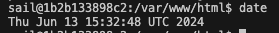
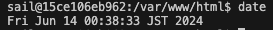
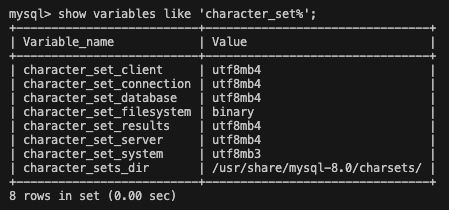

## Laravel プロジェクトの作成

Docker Desktop のインストールが完了したら、次に Laravel プロジェクトを作成します。  
ここでは、Laravel Sail という Docker コンテナを利用した開発環境を提供するパッケージを利用します。

以下のコマンドを実行してください。途中でパスワードを求められる場合があります。

```bash
curl -s "https://laravel.build/sample-app?php=82" | bash
```

:::note

- Laravel のバージョンを 11 系にするために、`php=82`を指定しています。
- sample-app の部分を変えれば、プロジェクト名を変更できます。
  :::

プロジェクトの作成が完了したら、ルートディレクトリに移動して、Laravel Sail を起動します。

```bash
cd sample-app
./vendor/bin/sail up -d
```

sail コマンドによって、Docker コンテナが起動し、Laravel アプリケーションが動作します。

http://localhost にアクセスして、Laravel の初期画面が表示されれば環境構築は完了です。

VSCode を使って、sample-app ディレクトリを開いてください。

### Laravel Sail のコマンド

Laravel Sail は、Laravel アプリケーションを Docker コンテナで動作させるためのコマンドを提供します。

毎回 `./vendor/bin/sail` を入力するのは面倒なので、エイリアスを設定しておきましょう。

```bash
alias sail='bash vendor/bin/sail'
```

以下は、Sail でよく使うコマンドです。

- `sail up` : Docker コンテナを起動します。-d オプションをつけるとバックグラウンドで起動します。
- `sail down` : Docker コンテナを停止します。
- `sail mysql` : MySQL クライアントを起動します。
- `sail artisan` : Laravel の artisan コマンドを実行します。
- `sail composer` : Composer コマンドを実行します。
- `sail npm` : npm コマンドを実行します。
- `sail tinker` : Tinker という対話型シェルを起動します。

### Laravel Sail で作られるコンテナ

次に docker-compose.yml ファイルを開いてみましょう。

```yaml title="docker-compose.yml"
services:
  laravel.test:
    build:
      context: ./vendor/laravel/sail/runtimes/8.3
      dockerfile: Dockerfile
      args:
        WWWGROUP: "${WWWGROUP}"
    image: sail-8.3/app
    extra_hosts:
      - "host.docker.internal:host-gateway"
    ports:
      - "${APP_PORT:-80}:80"
      - "${VITE_PORT:-5173}:${VITE_PORT:-5173}"
    environment:
      WWWUSER: "${WWWUSER}"
      LARAVEL_SAIL: 1
      XDEBUG_MODE: "${SAIL_XDEBUG_MODE:-off}"
      XDEBUG_CONFIG: "${SAIL_XDEBUG_CONFIG:-client_host=host.docker.internal}"
      IGNITION_LOCAL_SITES_PATH: "${PWD}"
    volumes:
      - ".:/var/www/html"
    networks:
      - sail
    depends_on:
      - mysql
      - redis
      - meilisearch
      - mailpit
      - selenium
  mysql:
    image: "mysql/mysql-server:8.0"
    ports:
      - "${FORWARD_DB_PORT:-3306}:3306"
    environment:
      MYSQL_ROOT_PASSWORD: "${DB_PASSWORD}"
      MYSQL_ROOT_HOST: "%"
      MYSQL_DATABASE: "${DB_DATABASE}"
      MYSQL_USER: "${DB_USERNAME}"
      MYSQL_PASSWORD: "${DB_PASSWORD}"
      MYSQL_ALLOW_EMPTY_PASSWORD: 1
    volumes:
      - "sail-mysql:/var/lib/mysql"
      - "./vendor/laravel/sail/database/mysql/create-testing-database.sh:/docker-entrypoint-initdb.d/10-create-testing-database.sh"
    networks:
      - sail
    healthcheck:
      test:
        - CMD
        - mysqladmin
        - ping
        - "-p${DB_PASSWORD}"
      retries: 3
      timeout: 5s
  redis:
    image: "redis:alpine"
    ports:
      - "${FORWARD_REDIS_PORT:-6379}:6379"
    volumes:
      - "sail-redis:/data"
    networks:
      - sail
    healthcheck:
      test:
        - CMD
        - redis-cli
        - ping
      retries: 3
      timeout: 5s
  meilisearch:
    image: "getmeili/meilisearch:latest"
    ports:
      - "${FORWARD_MEILISEARCH_PORT:-7700}:7700"
    environment:
      MEILI_NO_ANALYTICS: "${MEILISEARCH_NO_ANALYTICS:-false}"
    volumes:
      - "sail-meilisearch:/meili_data"
    networks:
      - sail
    healthcheck:
      test:
        - CMD
        - wget
        - "--no-verbose"
        - "--spider"
        - "http://localhost:7700/health"
      retries: 3
      timeout: 5s
  mailpit:
    image: "axllent/mailpit:latest"
    ports:
      - "${FORWARD_MAILPIT_PORT:-1025}:1025"
      - "${FORWARD_MAILPIT_DASHBOARD_PORT:-8025}:8025"
    networks:
      - sail
  selenium:
    image: seleniarm/standalone-chromium
    extra_hosts:
      - "host.docker.internal:host-gateway"
    volumes:
      - "/dev/shm:/dev/shm"
    networks:
      - sail
networks:
  sail:
    driver: bridge
volumes:
  sail-mysql:
    driver: local
  sail-redis:
    driver: local
  sail-meilisearch:
    driver: local
```

#### コンテナの構成

- `laravel.test` : Laravel アプリケーションのコンテナ。
- `mysql` : DBMySQL のコンテナ。データベースとして使用します。
- `redis` : Redis のコンテナ。キャッシュやセッションストアとして使用します。
- `meilisearch` : MeiliSearch のコンテナ。全文検索エンジンとして使用します。
- `mailpit` : MailPit のコンテナ。メールのテスト用 SMTP サーバとして使用します。受信したメールを Web 画面で確認する機能もあります。
- `selenium` : Selenium のコンテナ。ブラウザテストを自動化するためのツールです。

#### volumes

volumes はコンテナ内のデータとホストマシンのデータを共有するための設定です。

例えば`laravel.test` コンテナの `volumes` には、`".:/var/www/html"` という設定があります。  
これは、ホストマシンのルートディレクトリ `.`　をコンテナ内の `/var/www/html` にマウントする設定です。  
これにより、ホストマシンで編集したファイルがコンテナ内に反映されるようになります。

#### ports

ports はコンテナのポートとホストマシンのポートをマッピングするための設定です。

`laravel.test` コンテナの `ports` には、`"${APP_PORT:-80}:80"` という設定があります。  
これは、ホストマシンの 80 番ポートをコンテナの 80 番ポートにマッピングする設定です。

`"${APP_PORT:-80}"` は、環境変数 `APP_PORT` が設定されていればその値を使い、設定されていなければ 80 を使うという意味です。

:::info
環境変数は、`.env` ファイルに設定されています。
:::

このポートにアクセスするには、`http://localhost` のあとに`:ポート番号`を付けてブラウザなどで開きます。  
例えば 80 番ポートの場合は、`http://localhost:80` 、mailpit で使用している 1025 番ポートの場合は、`http://localhost:1025` です。

:::note

- 80 番ポートはデフォルトで使用されるポートなので、`:80` を省略して `http://localhost` としても同じです。
- すべてのコンテナが Web 画面を持っているわけではないので、ポート番号を指定してアクセスしても何も表示されないことがあります。
  :::

## 各種設定

### タイムゾーンの設定

デフォルトでは、`laravel.test` コンテナのタイムゾーンは UTC になっています。

```bash
sail shell
date
```



これを日本時間に変更するには、sail の publish 機能を使います。  
以下のコマンドを実行すると、docker ディレクトリが作成され、docker-compose.yml が書き換わります。

```env
sail artisan sail:publish
```

コマンドが完了したら、`docker/8.3/Dockerfile` を開いて、以下の修正を行います。

```dockerfile title="docker/8.3/Dockerfile"
FROM ubuntu:22.04

LABEL maintainer="Taylor Otwell"

ARG WWWGROUP
ARG NODE_VERSION=20
ARG MYSQL_CLIENT="mysql-client"
ARG POSTGRES_VERSION=15

WORKDIR /var/www/html

ENV DEBIAN_FRONTEND noninteractive
ENV TZ='Asia/Tokyo'  # UTC から変更

〜省略〜
```

そして、Docker イメージを再ビルドします。

```bash
sail build --no-cache
```

:::note
`--no-cache` オプションをつけることで、キャッシュを使わずにビルドします。
ビルドには結構な時間がかかるはずです。
:::

ビルドが終わったら、一度コンテナを停止してから再起動してください。

```bash
sail down
sail up -d
```

最後に、以下のコマンドでタイムゾーンが変更されていることを確認しましょう。

```bash
sail shell
date
```



### MySQL の文字コードの設定

日本語を扱うアプリケーションでは、MySQL の文字コードを `utf8mb4` に設定することが一般的です。

`docker/mysql/my.cnf` ファイルを作成して、以下の設定を追加します。

```ini title="docker/mysql/my.cnf"
[mysqld]
character-set-server=utf8mb4
collation-server=utf8mb4_bin

[client]
default-character-set=utf8mb4
```

そして、`docker-compose.yml` ファイルに `my.cnf` をマウントする設定を追加します。

```yaml title="docker-compose.yml"
〜省略〜

mysql:
  image: "mysql/mysql-server:8.0"
  ports:
    - "${FORWARD_DB_PORT:-3306}:3306"
  environment:
    MYSQL_ROOT_PASSWORD: "${DB_PASSWORD}"
    MYSQL_ROOT_HOST: "%"
    MYSQL_DATABASE: "${DB_DATABASE}"
    MYSQL_USER: "${DB_USERNAME}"
    MYSQL_PASSWORD: "${DB_PASSWORD}"
    MYSQL_ALLOW_EMPTY_PASSWORD: 1
  volumes:
    - "sail-mysql:/var/lib/mysql"
    // highlight-next-line
    - "./docker/mysql/my.cnf:/etc/my.cnf" # 追加
    - "./vendor/laravel/sail/database/mysql/create-testing-database.sh:/docker-entrypoint-initdb.d/10-create-testing-database.sh"

〜省略〜
```

一度コンテナを停止してから再起動し、MySQL の文字コードが `utf8mb4` になっていることを確認しましょう。

```bash
sail down
sail up -d
```

```bash
sail mysql
show variables like 'character_set%';
```

以下のような結果が表示されれば成功です。


