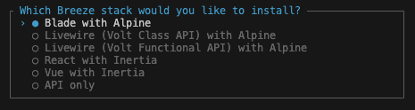

Laravel には、Laravel Breeze という認証機能を追加するための機能が用意されており、自前で実装すると大変な認証周りの処理を簡単に追加することができます。

今の TODO アプリは誰でもタスクを追加・編集・削除できてしまうため、認証機能を追加して、ログインしているユーザーだけがタスクを追加・編集・削除できるようにします。

## Laravel Breeze のインストール

Laravel Breeze をインストールするには、以下のコマンドを実行します。

```bash
composer require laravel/breeze --dev
sail artisan breeze:install
```

コマンドを実行すると、以下のようなメッセージが表示されます。



画面を作る UI ライブラリを選択できるのですが、今回は一番上の `Blade with Alpine`を選択します。
これは、Blade テンプレートエンジンと、Alpine.js という JavaScript フレームワークを使った UI ライブラリを使用するという意味です。

その後の選択肢は、デフォルトのまま Enter キーを押して進めてください。

### マイグレーションの実行

vite が起動している場合は、一度停止してから実行してください。

```bash
sail artisan migrate
sail npm install
sail npm run dev
```

### ルーティングの修正

インストールによって、ルートが上書きされてしまうので、`routes/web.php` の内容を以下のように修正してください。

```php title="routes/web.php"
<?php

use App\Http\Controllers\ProfileController;
use App\Http\Controllers\Task;
use Illuminate\Support\Facades\Route;

Route::get('/', function () {
    return view('welcome');
});

Route::get('/dashboard', function () {
    return view('dashboard');
})->middleware(['auth', 'verified'])->name('dashboard');

Route::middleware('auth')->group(function () {
    Route::get('/profile', [ProfileController::class, 'edit'])->name('profile.edit');
    Route::patch('/profile', [ProfileController::class, 'update'])->name('profile.update');
    Route::delete('/profile', [ProfileController::class, 'destroy'])->name('profile.destroy');
});

Route::get('/tasks', Task\IndexController::class)->name('tasks.index');
Route::get('/tasks/create', Task\Create\IndexController::class)->name('tasks.create');
Route::post('/tasks/create', Task\Create\StoreController::class)->name('tasks.store');
Route::get('/tasks/{id}/edit', Task\Edit\IndexController::class)->name('tasks.edit'); // 編集画面表示
Route::put('/tasks/{id}', Task\Edit\UpdateController::class)->name('tasks.update'); // 更新処理
Route::delete('/tasks/{id}', Task\Delete\DestroyController::class)->name('tasks.destroy');

require __DIR__ . '/auth.php';
```

### レイアウトの修正

`resources/css/app.css` も上書きされてしまうので、以下のように修正してください。

```css title="resources/css/app.css"
@tailwind base;
@tailwind components;
@tailwind utilities;

.container {
  margin: 50px auto;
  max-width: 680px;
}
```

インストールがうまくいけば、http://localhost のヘッダーにログインと登録のリンクが表示されるようになるはずです。

### 登録とログインを試す

http://localhost にアクセスして、右上の「登録」リンクをクリックして、ユーザー登録を行います。

登録が完了すると、ダッシュボードにリダイレクトされます。

一度右上のユーザー名をクリックして開くメニューからログアウトし、再度ログインしてみましょう。  
うまくいけば、ログイン後に再度ダッシュボードにリダイレクトされるはずです。

## 追加されたルーティングを確認する

`routes/web.php`を確認すると、`/dashboard`、`/profile`に関するルーティングが追加されていることがわかります。
これらはログイン後に表示されるダッシュボードとプロフィール画面に関するルートです。

また末尾に`require __DIR__ . '/auth.php';`が書かれており、`routes/auth.php`を開くと、認証周りのルーティングが記述されていることが理解できます。

```php title="routes/auth.php"
<?php

use App\Http\Controllers\Auth\AuthenticatedSessionController;
use App\Http\Controllers\Auth\ConfirmablePasswordController;
use App\Http\Controllers\Auth\EmailVerificationNotificationController;
use App\Http\Controllers\Auth\EmailVerificationPromptController;
use App\Http\Controllers\Auth\NewPasswordController;
use App\Http\Controllers\Auth\PasswordController;
use App\Http\Controllers\Auth\PasswordResetLinkController;
use App\Http\Controllers\Auth\RegisteredUserController;
use App\Http\Controllers\Auth\VerifyEmailController;
use Illuminate\Support\Facades\Route;

Route::middleware('guest')->group(function () {
    Route::get('register', [RegisteredUserController::class, 'create'])
                ->name('register');

    Route::post('register', [RegisteredUserController::class, 'store']);

    Route::get('login', [AuthenticatedSessionController::class, 'create'])
                ->name('login');

    Route::post('login', [AuthenticatedSessionController::class, 'store']);

    Route::get('forgot-password', [PasswordResetLinkController::class, 'create'])
                ->name('password.request');

    Route::post('forgot-password', [PasswordResetLinkController::class, 'store'])
                ->name('password.email');

    Route::get('reset-password/{token}', [NewPasswordController::class, 'create'])
                ->name('password.reset');

    Route::post('reset-password', [NewPasswordController::class, 'store'])
                ->name('password.store');
});

Route::middleware('auth')->group(function () {
    Route::get('verify-email', EmailVerificationPromptController::class)
                ->name('verification.notice');

    Route::get('verify-email/{id}/{hash}', VerifyEmailController::class)
                ->middleware(['signed', 'throttle:6,1'])
                ->name('verification.verify');

    Route::post('email/verification-notification', [EmailVerificationNotificationController::class, 'store'])
                ->middleware('throttle:6,1')
                ->name('verification.send');

    Route::get('confirm-password', [ConfirmablePasswordController::class, 'show'])
                ->name('password.confirm');

    Route::post('confirm-password', [ConfirmablePasswordController::class, 'store']);

    Route::put('password', [PasswordController::class, 'update'])->name('password.update');

    Route::post('logout', [AuthenticatedSessionController::class, 'destroy'])
                ->name('logout');
});
```

これによって、ログインや新規登録時にどのコントローラーが呼ばれるかがわかります。

### ミドルウェア

`middleware('auth')`や`middleware('guest')`といった記述がありますが、これはミドルウェアを指定している部分です。

ミドルウェアは、リクエストをコントローラーに渡す前後に処理を挟むための仕組みです。

試しにサンプルのミドルウェアを作成してみましょう。

```bash
sail artisan make:middleware SampleMiddleware
```

以下のようなファイルが作成されます。

```php title="app/Http/Middleware/SampleMiddleware.php"
<?php

namespace App\Http\Middleware;

use Closure;
use Illuminate\Http\Request;
use Symfony\Component\HttpFoundation\Response;

class SampleMiddleware
{
    /**
     * Handle an incoming request.
     *
     * @param  \Closure(\Illuminate\Http\Request): (\Symfony\Component\HttpFoundation\Response)  $next
     */
    public function handle(Request $request, Closure $next): Response
    {
        return $next($request);
    }
}
```

$next の前後に処理を挟むことで、リクエストをコントローラーに渡す前後に処理を追加することができます。

```php title="app/Http/Middleware/SampleMiddleware.php"
public function handle(Request $request, Closure $next): Response
{
    // リクエストをコントローラーに渡す前の処理
    $response = $next($request);
    // コントローラの処理が終わった後の処理

    return $response;
}
```

### ミドルウェアの登録

ミドルウェアを使うためには、`bootstrap/app.php`に以下のような記述を追加します。

```php title="bootstrap/app.php"
// 省略

use App\Http\Middleware\SampleMiddleware; // 追加

return Application::configure(basePath: dirname(__DIR__))
    ->withRouting(
        web: __DIR__ . '/../routes/web.php',
        commands: __DIR__ . '/../routes/console.php',
        health: '/up',
    )
    ->withMiddleware(function (Middleware $middleware) {
        $middleware->alias([
            'sample' => SampleMiddleware::class,
        ]);
    })
    ->withExceptions(function (Exceptions $exceptions) {
        //
    })->create();
```

ルーターにミドルウェアを適用するには、`routes/web.php`のルート定義に `middleware()` メソッドを追加します。

```php title="routes/web.php"
Route::get('/', function () {
    return view('welcome');
})->middleware('sample');
```

### デフォルトのミドルウェア

Breeze によって新しく追加されたルート定義を見ると、`auth`、`guest`、`verified`といったミドルウェアが使われています。

これらはデフォルトで定義されたもので、`vendor/laravel/framework/src/Illuminate/Foundation/Configuration/Middleware.php`の中にエイリアスの設定があります。

```php title="vendor/laravel/framework/src/Illuminate/Foundation/Configuration/Middleware.php"
// 省略
protected function defaultAliases()
{
    $aliases = [
        'auth' => \Illuminate\Auth\Middleware\Authenticate::class,
        'auth.basic' => \Illuminate\Auth\Middleware\AuthenticateWithBasicAuth::class,
        'auth.session' => \Illuminate\Session\Middleware\AuthenticateSession::class,
        'cache.headers' => \Illuminate\Http\Middleware\SetCacheHeaders::class,
        'can' => \Illuminate\Auth\Middleware\Authorize::class,
        'guest' => \Illuminate\Auth\Middleware\RedirectIfAuthenticated::class,
        'password.confirm' => \Illuminate\Auth\Middleware\RequirePassword::class,
        'precognitive' => \Illuminate\Foundation\Http\Middleware\HandlePrecognitiveRequests::class,
        'signed' => \Illuminate\Routing\Middleware\ValidateSignature::class,
        'throttle' => $this->throttleWithRedis
            ? \Illuminate\Routing\Middleware\ThrottleRequestsWithRedis::class
            : \Illuminate\Routing\Middleware\ThrottleRequests::class,
        'verified' => \Illuminate\Auth\Middleware\EnsureEmailIsVerified::class,
    ];

    // 省略
}
```

これにより、それぞれがどの Middleware クラスを指しているかがわかります。

- #### `auth` ミドルウェア

`auth` ミドルウェアは、Authenticate クラスに紐づいており、`vendor/laravel/framework/src/Illuminate/Auth/Middleware/Authenticate.php`ファイルを開くと、定義が確認できます。

少しコードを読むのは難しいですが、`handle()` メソッドを見ると、**認証されていない場合**には例外を発生させてログイン画面にリダイレクトするようになっています。

ログインしているユーザーだけがアクセスできるページには、`auth` ミドルウェアを適用します。

- #### `guest` ミドルウェア

`guest` ミドルウェアは、RedirectIfAuthenticated クラスに紐づいており、`vendor/laravel/framework/src/Illuminate/Auth/Middleware/RedirectIfAuthenticated.php`ファイルを開くと、定義が確認できます。

`handle()` メソッド内を見ると、**認証されている場合**には HOME 画面にリダイレクトするようになっています。

この処理はまだログインしていないユーザーだけがアクセスできるページに適用します。例えば、すでにログインしている人にはログイン画面を表示する必要はないため、ログイン画面に適用することで、ログイン済みのユーザーがログイン画面にアクセスした時に自動的にリダイレクトされるようになります。

:::info
`guest` ミドルウェアと `auth` ミドルウェアは、**お互いに対になる存在**であることが理解できます。
:::

- #### `verified` ミドルウェア

`verified` ミドルウェアは、EnsureEmailIsVerified クラスに紐づいています。
名前から分かる通り、メールアドレスの認証状況によってアクセスを許可するかどうかを判定するミドルウェアです。

## TODO アプリに統合する

認証機能の概要はおよそわかったので、TODO アプリに統合していきましょう。

対応内容は以下の通りです。

- 登録・ログイン時のリダイレクト先を変更
- ミドルウェアを適用して、認証状況に応じてアクセスを制限
- タスクとユーザーを紐付けて、自分のタスクだけを CRUD できるように

### 登録、ログイン時のリダイレクト先を変更

認証完了後のリダイレクト先の変更をします。

`routes/auth.php`を確認すると、登録時には `RegisteredUserController` クラスの `store` メソッドが呼ばれ、ログイン時には `AuthenticatedSessionController` クラスの `store` メソッドが呼ばれることがわかります。

例えば`RegisteredUserController` クラスの `store` メソッドは以下のようになっています。

```php title="app/Http/Controllers/Auth/RegisteredUserController.php"
public function store(Request $request): RedirectResponse
{
    $request->validate([
        'name' => ['required', 'string', 'max:255'],
        'email' => ['required', 'string', 'lowercase', 'email', 'max:255', 'unique:'.User::class],
        'password' => ['required', 'confirmed', Rules\Password::defaults()],
    ]);

    $user = User::create([
        'name' => $request->name,
        'email' => $request->email,
        'password' => Hash::make($request->password),
    ]);

    event(new Registered($user));

    Auth::login($user);

    return redirect(route('dashboard', absolute: false));
}
```

この最後の `return redirect(route('dashboard', absolute: false));` の部分を変更することで、登録後のリダイレクト先を変更できます。

リダイレクト先はタスク一覧画面にしたいので、`return redirect(route('tasks.index', absolute: false));` に変更します。

ログイン時も同様に、`AuthenticatedSessionController` クラスの `store` メソッドの最後のリダイレクト先を変更します。

これで、登録・ログイン後にタスク一覧画面にリダイレクトされるようになります。

### ミドルウェアを適用して、認証状況に応じてアクセスを制限

今のままだと、認証されていないユーザーもタスク一覧画面にアクセスできてしまいます。
`auth` ミドルウェアを適用して、ログインしていないユーザーがアクセスできないようにしましょう。

`routes/web.php`を以下のように修正してください。

```php title="routes/web.php"
// 省略

Route::middleware('auth')->group(function () {
    Route::get('/profile', [ProfileController::class, 'edit'])->name('profile.edit');
    Route::patch('/profile', [ProfileController::class, 'update'])->name('profile.update');
    Route::delete('/profile', [ProfileController::class, 'destroy'])->name('profile.destroy');

    // middleware('auth')->group内に移動
    Route::get('/tasks', Task\IndexController::class)->name('tasks.index');
    Route::get('/tasks/create', Task\Create\IndexController::class)->name('tasks.create');
    Route::post('/tasks/create', Task\Create\StoreController::class)->name('tasks.store');
    Route::get('/tasks/{id}/edit', Task\Edit\IndexController::class)->name('tasks.edit'); // 編集画面表示
    Route::put('/tasks/{id}', Task\Edit\UpdateController::class)->name('tasks.update'); // 更新処理
    Route::delete('/tasks/{id}', Task\Delete\DestroyController::class)->name('tasks.destroy');
});
```

また、`auth`ミドルウェアや`guest`ミドルウェアでリダイレクトする先を変更するため、`routes/auth.php`を以下のように修正してください。

```php title="bootstrap/app.php"
// 省略

return Application::configure(basePath: dirname(__DIR__))
    ->withRouting(
        web: __DIR__ . '/../routes/web.php',
        commands: __DIR__ . '/../routes/console.php',
        health: '/up',
    )
    ->withMiddleware(function (Middleware $middleware) {
        $middleware->alias([
            'sample' => SampleMiddleware::class,
        ]);
        $middleware->redirectGuestsTo('/login');
        $middleware->redirectUsersTo('/tasks');
    })
    ->withExceptions(function (Exceptions $exceptions) {
        //
    })->create();
```

`redirectGuestsTo`で `auth` ミドルウェアを適用したページにアクセスした際のリダイレクト先を指定し、`redirectUsersTo`で `guest` ミドルウェアを適用したページにアクセスした際のリダイレクト先を指定します。

このようにすることで、ログインしていないユーザーがアクセスできないページにアクセスした際には、ログイン画面にリダイレクトされるようになります。
一度 http://localhost/dashboard からログアウトして、http://localhost/tasks にアクセスしてみてください。ログイン画面にリダイレクトされるはずです。

ログアウトを簡単に行うために、タスク一覧画面にもログアウトボタンを追加しておきましょう。

```php title="resources/views/tasks/index.blade.php"
<x-layout>
    <h1>タスク一覧</h1>

    <a href="{{ route('tasks.create') }}">新規作成</a>

    // ログアウトボタンを追加
    <form method="post" action="{{ route('logout') }}">
        @csrf
        <button type="submit">ログアウト</button>
    </form>

// 省略
```

### タスクとユーザーを紐付けて、自分のタスクだけを CRUD できるように

現状はどのユーザーでログインしても同じタスク一覧が表示されてしまいます。
ユーザーごとにタスクを管理できるようにするために、タスクとユーザーを紐付けて、自分のタスクだけを CRUD できるようにします。

まず、タスクとユーザーを紐付けるために、`tasks`テーブルに`user_id`カラムを追加します。
以下のコマンドを実行して、マイグレーションファイルを作成してください。

```bash
sail artisan make:migration add_user_id_to_tasks_table --table=tasks
```

作成されたマイグレーションファイルを開いて、以下のように修正してください。

```php title="database/migrations/yyyy_mm_dd_000000_add_user_id_to_tasks_table.php"
public function up(): void
{
    Schema::table('tasks', function (Blueprint $table) {
        $table->foreignId('user_id')->constrained()->cascadeOnDelete();
    });
}

public function down(): void
{
    Schema::table('tasks', function (Blueprint $table) {
        $table->dropForeign(['user_id']);
        $table->dropColumn('user_id');
    });
}
```

foreignId は外部キーを表し、constrained メソッドで外部キー制約を設定します。
外部キー制約があると、`tasks`テーブルの`user_id`カラムには、`users`テーブルの`id`カラムに存在する値しか入れることができなくなります。

また、cascadeOnDelete メソッドをつけることで、`users`テーブルのレコードが削除された際に、それに紐づく`tasks`テーブルのレコードも削除されるようになります。

マイグレーションを実行して、変更を反映させてください。

```bash
sail artisan migrate
```

次に、`Task`モデルと`User`モデルにリレーションを追加します。

```php title="app/Models/Task.php"
class Task extends Model
{
    use HasFactory;

    public function user()
    {
        return $this->belongsTo(User::class);
    }
}
```

```php title="app/Models/User.php"
class User extends Authenticatable
{
    use HasFactory, Notifiable;

    // 省略

    public function tasks()
    {
        return $this->hasMany(Task::class);
    }
}
```

belongsTo メソッドは、`Task`モデルが`User`モデルに所属していることを示しています。
hasMany メソッドは、`User`モデルが複数の`Task`モデルを持っていることを示しています。

`user`と`task`の関係は、1 対多の関係です。1 人のユーザーが複数のタスクを持つことができるため、`hasMany`となり、タスクは 1 人のユーザーに所属するため、`belongsTo`となります。

これで、ユーザーごとにタスクを管理できるようになりました。

#### タスクの作成時にユーザー ID を保存する

タスクを作成する際に、ログインしているユーザーの ID を保存するようにします。

`Task/Create/StoreController`クラスの`__invoke`メソッドを以下のように修正してください。

```php title="app/Http/Controllers/Task/Create/StoreController.php"
use Illuminate\Support\Facades\Auth; // 追加

public function __invoke(TaskCreateRequest $request)
{
    $task = new Task;
    $task->title = $request->input('title');
    $task->user_id = Auth::id(); // ログインしているユーザーの ID を保存
    $task->save();

    return redirect()->route('tasks.index');
}
```

`Auth::id()` でログインしているユーザーの ID を取得できます。

続いて、タスク一覧画面にログインしているユーザーのタスクだけを表示するように修正します。

`Task/IndexController`クラスの`__invoke`メソッドを以下のように修正してください。

```php title="app/Http/Controllers/Task/IndexController.php"
use Illuminate\Support\Facades\Auth; // 追加

class IndexController extends Controller
{
    /**
     * Handle the incoming request.
     */
    public function __invoke(Request $request)
    {
        $tasks = Task::where('user_id', Auth::id())->get(); // ログインしているユーザーのタスクだけを取得

        return view('tasks.index')->with('tasks', $tasks);
    }
}
```

これで、ログインしているユーザーのタスクだけが表示されるようになりました。

#### データのリセット

今テーブルに入っているタスクはユーザーに紐づいていないため、テーブルをリセットしてデータを初期化します。

その際、シーディングは不要になるので、シーダーファイルを先にコメントアウトしておきます。

```php title="database/seeders/DatabaseSeeder.php"
public function run()
{
    // $this->call(TaskSeeder::class);
}
```

それでは、テーブルをリセットしてデータを初期化してください。

```bash
sail artisan migrate:refresh
```

これで、ログインしているユーザーのタスクだけが表示されるようになりました。
複数のユーザーを作成してみて、正しく動作しているか確認してみてください。

#### 編集・削除時にユーザー ID をチェックする

編集・削除時にもユーザー ID をチェックして、自分のタスクだけを編集・削除できるようにします。
一覧画面に他のユーザーのタスクは表示されないので、問題ないと思われるかもしれませんが、直接 URL を入力して他のユーザーのタスクを編集・削除することができてしまうので、セキュリティ上必要になります。

`Task/Edit/IndexController`クラスの`__invoke`メソッドを以下のように修正してください。

```php title="app/Http/Controllers/Task/Edit/IndexController.php"
use Illuminate\Support\Facades\Auth; // 追加

class IndexController extends Controller
{
    /**
     * Handle the incoming request.
     */
    public function __invoke(Request $request, int $id)
    {
        $task = Task::where('user_id', Auth::id())->find($id); // ログインしているユーザーのタスクだけを取得

        if ($task === null) {
            abort(404);
        }

        return view('tasks.edit')->with('task', $task);
    }
}
```

`Task/Edit/UpdateController`や`Task/Delete/DestroyController`クラスも同様に修正してください。

これで、ログインしているユーザーのタスクだけを編集・削除できるようになりました。
