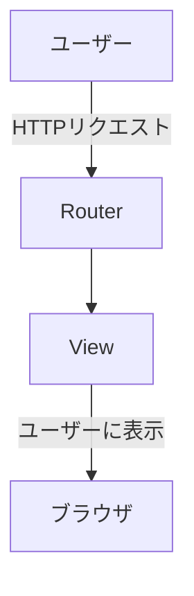
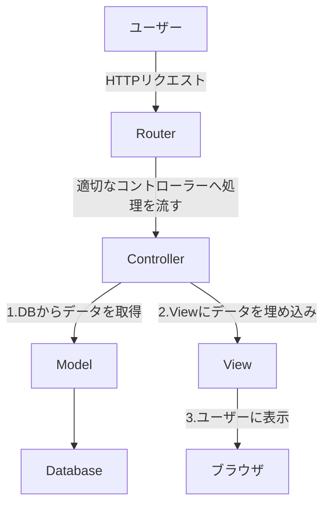
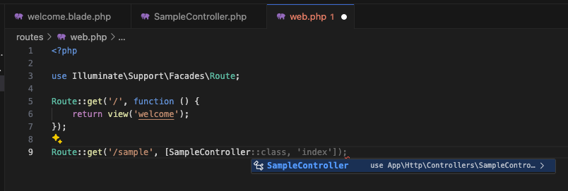
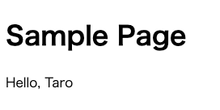

## 初期状態の確認

まずは Laravel のトップページが開かれるまでの処理の流れを見てみましょう。

まず、`routes/web.php` には以下のような記述があります。

```php
<?php

use Illuminate\Support\Facades\Route;

Route::get('/', function () {
    return view('welcome');
});

```

この記述は、`/` にアクセスがあった場合に `resources/views/welcome.blade.php` の内容を表示するという意味です。

では、`resources/views/welcome.blade.php` の内容を見てみましょう。

```html
<!DOCTYPE html>
<html lang="{{ str_replace('_', '-', app()->getLocale()) }}">
  <head>
    <meta charset="utf-8" />
    <meta name="viewport" content="width=device-width, initial-scale=1" />

    <title>Laravel</title>

    <!-- Fonts -->
    <link rel="preconnect" href="https://fonts.bunny.net" />
    <link
      href="https://fonts.bunny.net/css?family=figtree:400,600&display=swap"
      rel="stylesheet"
    />

    <!-- Styles -->
    <style>
      /* ! tailwindcss v3.4.1 | MIT License | https://tailwindcss.com */
      *,
      /* 省略 */
    </style>
  </head>
  <body class="font-sans antialiased dark:bg-black dark:text-white/50">
    <div class="bg-gray-50 text-black/50 dark:bg-black dark:text-white/50">
      
      <div
        class="relative min-h-screen flex flex-col items-center justify-center selection:bg-[#FF2D20] selection:text-white"
      >
        〜　省略　〜
      </div>
    </div>
  </body>
</html>
```

詳細は省きますが、http://localhost で表示されているページの HTML と CSS であることがわかります。

そしてその中に、`@if`や`Laravel v{{ Illuminate\Foundation\Application::VERSION }} (PHP v{{ PHP_VERSION }})`など見慣れない記述がありますが、これは Blade テンプレートエンジンの記法です。

このあたりの説明は後ほど行います。

## 処理の流れ

このページが表示されるまでの処理の流れを図にすると以下のようになります。



このように Router から直接 View を返却することができますが、実際のアプリケーションでは、Controller を経由して View の表示に必要なデータを Model から取得し、Controller から VIew を返却するという流れが一般的です。



## サンプルページを作成

それでは、Controller を使って View を返却する方法を見ていきましょう。

### Controller の作成

artisan コマンドを使って Controller を作成します。

```bash title="shell"
sail artisan make:controller SampleController
```

すると、`app/Http/Controllers/SampleController.php` が生成されるので、中身を見てみましょう。

```php title="app/Http/Controllers/SampleController.php"
<?php

namespace App\Http\Controllers;

use Illuminate\Http\Request;

class SampleController extends Controller
{
    //
}
```

`SampleController` という名前のクラスが、空の状態で定義されているようです。  
実際には `Controller` クラスを継承しているため、リクエスト処理などの便利なメソッドがすでに使えるようになっています。

:::tip
`Controller`という文字を Cmd（Windows は Ctrl) + クリックすると、定義されているファイルを開けます。  
中身の理解は難しいですが、興味があれば見てみてください。
:::

router から呼び出すためのメソッドを作成します。

```php title="app/Http/Controllers/SampleController.php"
<?php

namespace App\Http\Controllers;

use Illuminate\Http\Request;

class SampleController extends Controller
{
    public function index()
    {
        return "Hello, World!";
    }
}
```

この例では View は使わずに直接文字列を返すようにしました。

### ルーティングの設定

次に、`routes/web.php` にルーティングの設定を追加します。

```php title="routes/web.php"
<?php

use App\Http\Controllers\SampleController; // 追加
use Illuminate\Support\Facades\Route;

Route::get('/', function () {
    return view('welcome');
});

Route::get('/sample', [SampleController::class, 'index']); // 追加
```

`/sample` にアクセスがあった場合に、`SampleController` の `index` メソッドを呼び出すように設定しました。  
ちなみに use 文は, `SampleController::class`の部分を記述するときに、エディタの保管機能を使うことで自動的に追加できます。



手動で書くとタイポなどバクの温床になるので、できるだけ自動補完やコピペを使って記述するようにしてください。

以上の記述により、http://localhost/sample に対して、`SampleController` の `index` メソッドが呼び出されるようになります。  
実際にアクセスしてみましょう。


### シングルアクションコントローラ

上記の例では、`SampleController` に `index` メソッドを追加しましたが、色々なアクションを追加していくと、ファイルがどんどん肥大化してしまいます。  
そのため、コントローラーには、1 つのアクションだけを持つようにするのがおすすめです。

そのようなコントローラーをシングルアクションコントローラーと呼び、Laeravel では以下のように `--invokable` オプションをつけて `make:controller` コマンドを実行することで作成できます。

**一度 `SampleController` を削除して**、以下のコマンドを実行してみましょう。

```bash title="shell"
sail artisan make:controller SampleController --invokable
```

するとファイルの中身は以下のようになります。

```php title="app/Http/Controllers/SampleController.php"
<?php

namespace App\Http\Controllers;

use Illuminate\Http\Request;

class SampleController extends Controller
{
    /**
     * Handle the incoming request.
     */
    public function __invoke(Request $request)
    {
        //
    }
}
```

`__invoke` メソッドが追加されていることがわかります。  
このメソッドは、クラスが呼び出されたときに自動的に実行されるメソッドです。

中身を先ほどの index メソッドと同じように書き換えてください。

```php title="app/Http/Controllers/SampleController.php"
public function __invoke(Request $request)
{
    return "Hello, World!";
}
```

router の書き方も変わります。

```php title="routes/web.php"
// Route::get('/sample', [SampleController::class, 'index']);
Route::get('/sample', SampleController::class);
```

元のコードと比べて、`SampleController::class` だけで済むようになり、シンプルになりました。

### View の返却

続いて文字列を返すのではなく、View を返す方法を見ていきましょう。

まずは View を作成します。

```bash title="shell"
sail artisan make:view sample
```

すると、`resources/views/sample.blade.php` が生成されるので、中身を以下のように書き換えてください。

```html title="resources/views/sample.blade.php"
<!DOCTYPE html>
<html lang="{{ str_replace('_', '-', app()->getLocale()) }}">
  <head>
    <meta charset="utf-8" />
    <meta name="viewport" content="width=device-width, initial-scale=1" />

    <title>Sample</title>
  </head>
  <body>
    <h1>Sample Page</h1>
  </body>
</html>
```

次に、`SampleController` の `__invoke` メソッドを以下のように書き換えます。

```php title="app/Http/Controllers/SampleController.php"
public function __invoke(Request $request)
{
    return view('sample');
}
```

これで、http://localhost/sample にアクセスすると、`resources/views/sample.blade.php` の内容が表示されるようになります。


### View にデータを渡す

今の状態は、View は固定の HTML になっています。  
しかし実際のアプリケーションでは、ユーザー情報など動的に変わるデータを表示するケースが多くあります。

Laravel の View にはテンプレートエンジンとして `Blade` が使われており、Controller からデータを渡すことができます。

`SampleController` の `__invoke` メソッドを以下のように書き換えてみましょう。

```php title="app/Http/Controllers/SampleController.php"
public function __invoke(Request $request)
{
    return view('sample', ['name' => 'Taro']);
}
```

例として、`name` という変数名で、 `Taro` という文字列を渡すようにしました。

そして、`resources/views/sample.blade.php` の中で、`$name` を表示してみます。

```php title="resources/views/sample.blade.php"
<body>
  <h1>Sample Page</h1>
  <p>Hello, {{ $name }}</p>
</body>
```

`{{ $name }}` という記述は、`$name` という変数を表示するための Blade の記法です。

http://localhost/sample にアクセスすると、`Hello, Taro` と表示されるはずです。



変数は with メソッドを使っても渡すことができます。

```php title="app/Http/Controllers/SampleController.php"
public function __invoke(Request $request)
{
    return view('sample')->with('name', 'Taro');
}
```

複数の変数を渡す場合は、with メソッドを連続して呼び出します。

```php title="app/Http/Controllers/SampleController.php"
public function __invoke(Request $request)
{
    return view('sample')
        ->with('name', 'Taro')
        ->with('age', 20);
}
```

最初の方法よりも、with メソッドを使った方がスッキリ書けるのでおすすめです。

### View の呼び出し方

View の呼び出し方もいくつか方法があります。

#### 方法 1

view 関数を使って View インスタンスを返す方法です。

```php title="app/Http/Controllers/SampleController.php"
public function __invoke(Request $request)
{
    return view('sample', ['name' => 'Taro']);
}
```

#### 方法 2

View クラスを使って View インスタンスを返す方法です。

```php title="app/Http/Controllers/SampleController.php"

use Illuminate\View\View;

public function __invoke(Request $request)
{
    return new View('sample', ['name' => 'Taro']);
}
```

#### 方法 3

View Factory を使って View インスタンスを返す方法です。

```php title="app/Http/Controllers/SampleController.php"

use Illuminate\View\Factory;

public function __invoke(Request $request, Factory $factory)
{
    return $factory->make('sample', ['name' => 'Taro']);
}
```

方法 1 が一番シンプルで、一般的に使われる方法です。

## パラメータの受け取り

例えば検索フォームなどで、ユーザーが入力した値を使って処理を行う場合、パラメータを受け取る必要があります。  
HTTP リクエストでパラメータを送る方法は主に 3 つあるため、それぞれの受け取り方を見ていきましょう。

- `パスパラメータ`  
  URL の一部にパラメータを埋め込む方法です。  
  例えば、`/users/1` のように、`1` というユーザー ID を URL に含めることができます。

- `クエリパラメータ`  
  URL の末尾に `?` をつけてパラメータを渡す方法です。  
  例えば、`/users?id=1` のように、`id` というキーに `1` という値を渡すことができます。

- `リクエストボディ`  
  POST メソッドや PUT メソッドで 、URL を使わずにリクエストのボディにパラメータを含める方法です。

### パスパラメータ

まずはパスパラメータを受け取る方法を見ていきます。

`/users/{id}` のように、`{}` で囲まれた部分がパスパラメータになります。

`SampleController` の `__invoke` メソッドを以下のように書き換えてみましょう。

```php title="app/Http/Controllers/SampleController.php"
public function __invoke(Request $request, $id)
{
    return "ID: $id";
}
```

`$id` という引数を追加することで、パスパラメータを受け取ることができます。

次に、`routes/web.php` の設定を以下のように変更します。

```php title="routes/web.php"
Route::get('/sample/{id}', SampleController::class);
```

これで、http://localhost/sample/1 にアクセスすると、`ID: 1` と表示されるはずです。

### クエリパラメータ

次にクエリパラメータを受け取る方法を見ていきます。
`/users?id=1` のように、`?` でパラメータを渡すことができます。

最初に`routes/web.php` を元に戻しておきます。

```php title="routes/web.php"
Route::get('/sample', SampleController::class);
```

次に`SampleController` の `__invoke` メソッドを以下のように書き換えてみましょう。

```php title="app/Http/Controllers/SampleController.php"
public function __invoke(Request $request)
{
    $id = $request->query('id'); // または $request->input('id');
    return "ID: $id";
}
```

`$request->query('id')` 、または `$request->input()` メソッドクエリパラメータを取得することができます。

:::tip
デフォルト値が必要な場合は、`$request->query('id', '1')` のように第二引数に値を指定します。  
こうすることで、`id` が指定されていない場合には `1` がデフォルト値として使われます。
:::

これで、http://localhost/sample?id=1 にアクセスすると、`ID: 1` と表示されるはずです。

### リクエストボディ

最後にリクエストボディを受け取る方法を見ていきます。

リクエストボディは主に POST メソッドや PUT メソッドで使われます。

`SampleController` の `__invoke` メソッドを以下のように書き換えてみましょう。

```php title="app/Http/Controllers/SampleController.php"
public function __invoke(Request $request)
{
    $id = $request->input('id');
    return "ID: $id";
}
```

`$request->input('id')` メソッドでリクエストボディを取得することができます。

:::tip
`$request->all()` メソッドを使うと、リクエストボディのすべての値を配列として取得することができます。
:::

動作確認のために、別ページにフォームを作成して POST メソッドでリクエストを送信してみましょう。

まずは artisan コマンドを使ってフォームを作成します。

```bash title="shell"
sail artisan make:view form
```

`resources/views/form.blade.php` の中身を以下のように書き換えてください。

```html title="resources/views/form.blade.php"
<!DOCTYPE html>
<html lang="{{ str_replace('_', '-', app()->getLocale()) }}">
  <head>
    <meta charset="utf-8" />
    <meta name="viewport" content="width=device-width, initial-scale=1" />

    <title>Form</title>
  </head>
  <body>
    <form action="/sample" method="post">
      @csrf
      <input type="text" name="id" />
      <button type="submit">Submit</button>
    </form>
  </body>
</html>
```

:::note
`@csrf` は CSRF（Cross-Site Request Forgery）対策のためのトークンを生成する Blade のディレクティブです。
:::

次に、`routes/web.php` の設定を以下のように変更します。

```php title="routes/web.php"
Route::get('/form', function () {
    return view('form');
});

Route::post('/sample', SampleController::class);
```

これで、http://localhost/form にアクセスすると、フォームが表示されます。

フォームに適当な値を入力して Submit ボタンを押すと、`http://localhost/sample` にリダイレクトされ、`ID: 入力した値` と表示されるはずです。

:::info
POST や PUT メソッドの場合は、フォーム自体を表示するルート（GET /form）と、フォームの送信先のルート（POST /sample）が必要になることを覚えておきましょう。
:::
