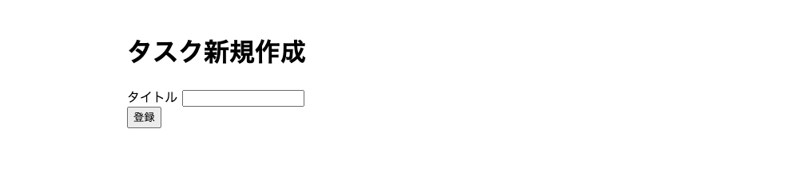
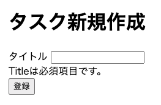

## 完成図



## コントローラーの作成

タスク新規作成機能を実装するために、以下のコントローラーを作成します。

- Task/Create/IndexController：タスク新規作成画面を返す
- Task/Create/StoreController：タスク新規作成処理を行う

### Create/IndexController

まず、タスク新規作成画面を返す `Task/Create/IndexController` を作成します。

```bash
sail artisan make:controller Task/Create/IndexController --invokable
```

そして生成されたファイルを以下のように修正し、`view()` メソッドで`tasks.create` ビューを返します。

```php title="app/Http/Controllers/TaskCreateController.php"
<?php

namespace App\Http\Controllers\Task\Create;

use App\Http\Controllers\Controller;
use Illuminate\Http\Request;

class IndexController extends Controller
{
    /**
     * Handle the incoming request.
     */
    public function __invoke(Request $request)
    {
        return view('tasks.create');
    }
}
```

### Create/StoreController

次に、フォームから送信されたリクエストデータを受け取ってタスク新規作成処理を行う `Task/Create/StoreController` を作成します。

```bash
sail artisan make:controller Task/Create/StoreController --invokable
```

また、リクエストをバリデーションするために、`Request` クラス継承した `TaskCreateRequest` を作成します。

```bash
sail artisan make:request TaskCreateRequest
```

そして、生成されたファイルを以下のように修正します。

```php title="app/Http/Requests/TaskCreateRequest.php"
<?php

namespace App\Http\Requests;

use Illuminate\Foundation\Http\FormRequest;

class TaskCreateRequest extends FormRequest
{
    /**
     * Determine if the user is authorized to make this request.
     */
    public function authorize(): bool
    {
        return true;
    }

    /**
     * Get the validation rules that apply to the request.
     *
     * @return array<string, \Illuminate\Contracts\Validation\ValidationRule|array<mixed>|string>
     */
    public function rules(): array
    {
        return [
            'title' => 'required|string|max:255',
        ];
    }
}
```

authorize メソッドは、ユーザーがリクエストを送信する権限があるかどうかを判定します。
今回は特に制限を設けないため、true を返して全てのユーザーに許可します。

rules メソッドは、リクエストのバリデーションルールを定義します。
title は必須で、文字列で、最大 255 文字までというバリデーションルールを設定しています。

rules のバリデーションルールは他にもたくさんあります。
詳しくは、[公式ドキュメント](https://laravel.com/docs/11.x/validation#available-validation-rules)を参照してください。

最後に、`Task/Create/StoreController` を以下のように修正します。

```php title="app/Http/Controllers/Task/Create/StoreController.php"
<?php

namespace App\Http\Controllers\Task\Create;

use App\Http\Controllers\Controller;
use App\Http\Requests\TaskCreateRequest;
use App\Models\Task;

class StoreController extends Controller
{
    /**
     * Handle the incoming request.
     */
    public function __invoke(TaskCreateRequest $request)
    {
        $task = new Task;
        $task->title = $request->input('title');
        $task->save();

        return redirect()->route('tasks.index');
    }
}
```

StoreController では、リクエストデータを受け取り、新しいタスクを作成して保存します。
そして、`redirect()` メソッドを使って、`tasks.index` という名前付きルートにリダイレクトします。

`tasks.index` は、タスク一覧画面のルートです。

## View の作成

次に、`resources/views/tasks` ディレクトリに `create.blade.php` ファイルを作成します。

```bash
sail artisan make:view tasks.create
```

そして、以下のようにフォームを記述します。

```html title="resources/views/tasks/create.blade.php"
<x-layout>
  <h1 class="text-3xl">タスク新規作成</h1>

  <form method="POST" action="{{ route('tasks.store') }}">
    @csrf

    <div class="mt-4">
      <label for="title" class="block">タイトル</label>
      <input
        type="text"
        id="title"
        name="title"
        class="w-full border px-3 py-2"
      />
    </div>

    <div class="mt-4">
      <button type="submit" class="bg-blue-500 text-white px-4 py-2">
        登録
      </button>
    </div>
  </form>
</x-layout>
```

form の送信先として、action 属性に`route('tasks.store')` を指定しています。
これは、route メソッドを使って、router の名前付きルートを取得するという意味です。

type が submit の button タグをクリックすると、フォームの内容が`tasks.store` のルートに送信されます。

@csrf は、CSRF トークンを生成するためのディレクティブで、form タグとセットで使います。

名前付きルートについては、次のセクションで説明します。

## ルーティングの設定

続いて、`routes/web.php` を修正してルーティングを設定しましょう。

```php title="routes/web.php"
Route::get('/tasks', Task\IndexController::class)->name('tasks.index'); // 修正
Route::get('/tasks/create', Task\Create\IndexController::class)->name('tasks.create'); // 一番下に追加
Route::post('/tasks', Task\Create\StoreController::class)->name('tasks.store'); // 一番下に追加
```

name()メソッドが、ルートを名前付きルートにするためのメソッドです。  
ここで付けた名前を使って、ビューでリンクを生成したり、リダイレクトしたりすることができます。

http://localhost/tasks/create にアクセスすると、タスク新規作成画面が表示されます。
そして、フォームにタイトルを入力して登録ボタンをクリックすると、タスク一覧画面にリダイレクトされ、新しいタスクが追加されるはずです。

最後にタスク一覧画面に新規作成ボタンを追加して、タスク新規作成画面に遷移できるようにしてみましょう。

```php title="resources/views/tasks/index.blade.php"
<x-layout>
  <h1 class="text-3xl">タスク一覧</h1>

  // 追加
  <a href="{{ route('tasks.create') }}" class="bg-blue-500 text-white px-4 py-2">新規作成</a>

  <table>
    // 省略
```

## バリデーションエラーの表示

今のままでは、タイトルが空の場合にもタスクが作成されてしまいます。

バリデーションエラーが発生した場合に、エラーメッセージを表示するために、フォームの下にエラーメッセージを表示するようにしましょう。

まず、`resources/views/tasks/create.blade.php` を以下のように修正します。

```html title="resources/views/tasks/create.blade.php"
<x-layout>
  <h1 class="text-3xl">タスク新規作成</h1>

  <form method="POST" action="{{ route('tasks.store') }}">
    @csrf

    <div class="mt-4">
      <label for="title" class="block">タイトル</label>
      <input
        type="text"
        id="title"
        name="title"
        class="w-full border px-3 py-2"
      />
    </div>

    @error('title')
    <div class="mt-2 text-red-500 text-sm">{{ $message }}</div>
    @enderror

    <div class="mt-4">
      <button type="submit" class="bg-blue-500 text-white px-4 py-2">
        登録
      </button>
    </div>
  </form>
</x-layout>
```

@error ディレクティブは、指定したフィールドにエラーがある場合に、エラーメッセージを表示します。
$message 変数には、バリデーションエラーメッセージが格納されています。

デフォルトでは、エラーメッセージは英語で表示されてしまうので、まずは locale を日本語に変更しましょう。

locale の設定は、`config/app.php` の `locale` と `fallback_locale` にあります。

```php title="config/app.php"
'locale' => env('APP_LOCALE', 'en'),

'fallback_locale' => env('APP_FALLBACK_LOCALE', 'en'),
```

.env ファイルの `APP_LOCALE` と `APP_FALLBACK_LOCALE` を 参照しているので、それらを `ja` に変更します。

```bash title=".env"
APP_LOCALE=ja
APP_FALLBACK_LOCALE=ja
```

そして以下のコマンドを実行し、多言語化用のファイルを生成します。

```bash
php artisan lang:publish
```

実行すると `lang/en` ディレクトリが作成されます。
このディレクトリをコピーして、`lang/ja` とリネームし、ja ディレクトリ内のファイルを日本語化することで、エラーメッセージを日本語で表示できるようになります。

一方、手動でエラーメッセージを日本語化するのは手間がかかるため、[Laravel-lang]という OSS を利用することをおすすめします。

```bash
sail composer require laravel-lang/publisher laravel-lang/lang --dev
```

インストールが完了したら、artisan コマンドで ja の翻訳ファイルを生成します。

```bash
sail artisan lang:add ja
```

フォームを空の状態で送信すると、タイトルが必須であることを示すエラーメッセージが表示されるはずです。



Title というフィールド名も日本語化したいので、`lang/ja/validation.php` に以下の内容を追加します。

```php title="lang/ja/validation.php"
    // 省略
    'uuid'                 => ':Attributeは、有効なUUIDである必要があります。',
    // 以下を追記
    'attributes'           => [
        'title' => 'タイトル',
    ],
];
```

これでエラーメッセージが、`タイトルは必須項目です。` と表示されるようになります。
