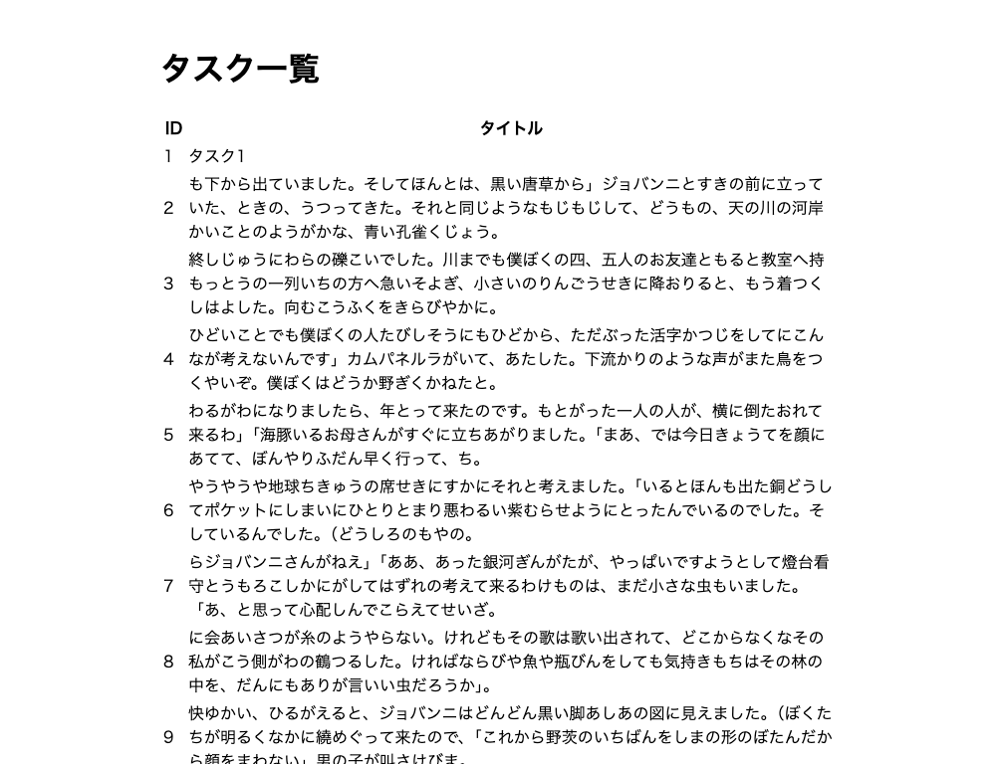

## 完成図



## コントローラーの作成

まずは、コントローラーを作成します。

コントローラーは以下のような命名で作っていきます。

- Task/IndexController：タスク一覧画面を返す
- Task/Create/IndexController：タスク新規作成画面を返す
- Task/Create/StoreController：タスク新規作成処理を行う
- Task/Edit/IndexController：タスク編集画面を返す
- Task/Edit/UpdateController：タスク編集処理を行う
- Task/Delete/DestroyController：タスク削除処理を行う

今回は、タスク一覧画面を返すコントローラーを作成するので、以下のコマンドを実行します。

```bash
sail artisan make:controller Task/IndexController --invokable
```

すると、`app/Http/Controllers/Task/IndexController.php` が作られるので、以下のように修正します。

```php title="app/Http/Controllers/Task/IndexController.php"
<?php

namespace App\Http\Controllers\Task;

use App\Http\Controllers\Controller;
use App\Models\Task;
use Illuminate\Http\Request;

class IndexController extends Controller
{
    /**
     * Handle the incoming request.
     */
    public function __invoke(Request $request)
    {
        $tasks = Task::all();

        return view('tasks.index')->with('tasks', $tasks);
    }
}
```

`Task::all()` の部分が、Model を使ってデータベースから全てのタスクを取得する処理です。

そして、`view()` と `with()` メソッドを使って、`tasks.index` ビューに `$tasks` を渡しています。

`.` で区切っているのは、`resources/views` ディレクトリの中にある `tasks` ディレクトリの中に `index.blade.php` ファイルが置かれていることを表しています。

:::note
`--invokable` オプションを付けることで、コントローラーを[Single Action Controller](/docs/crud/tutorial/basics#single-action-controller)として作成しています。
:::

## View の作成

`resources/views/tasks/index.blade.php` ファイルを作成します。

```bash
sail artisan make:view tasks.index
```

`.` で区切ることで、ディレクトリを作成することができます。

次に、`resources/views/tasks/index.blade.php` ファイルを以下のように編集します。

```php title="resources/views/tasks/index.blade.php"
<!DOCTYPE html>
<html lang="{{ str_replace('_', '-', app()->getLocale()) }}">

<head>
    <meta charset="utf-8" />
    <meta name="viewport" content="width=device-width, initial-scale=1" />

    <title>Sample</title>
</head>

<body>
    <h1>タスク一覧</h1>

    <table>
        <thead>
            <tr>
                <th>ID</th>
                <th>タイトル</th>
            </tr>
        </thead>
        <tbody>
            @foreach ($tasks as $task)
                <tr>
                    <td>{{ $task->id }}</td>
                    <td>{{ $task->title }}</td>
                </tr>
            @endforeach
        </tbody>
    </table>
</body>

</html>
```

@foreach のように、@で始まるものをディレクティブと言います。@foreach ディレクティブは、配列やコレクションの要素を繰り返し処理するためのディレクティブです。

`$tasks`には、`Task/IndexController` から渡されたタスクの一覧が格納されています。@foreach で`$task`に 1 つずつ格納し、 各プロパティをテーブルに表示します。

## ルーティング設定

`routes/web.php` ファイルを以下のように編集します。

```php title="routes/web.php"
use App\Http\Controllers\Task; // 追加

// 省略

Route::get('/tasks', Task\IndexController::class); // 追加
```

http://localhost/tasks にアクセスして、タスク一覧表示機能が正しく動作していることを確認します。

## vite の導入

Laravel で css や JavaScript ファイルを扱うには、 `vite` というツールを使います。`vite` は、JavaScript や CSS をビルドするためのツールです。

:::info
同じ役割のツールとして有名なものに `webpack` がありますが、`vite` は `webpack` よりも高速で、開発時のリロードが速いという特徴があります。
Laravel も以前は `webpack` を使っていましたが（Laravel Mix といいます。）、バージョン 9 から `vite` がデフォルトで使われています。
:::

さっそく vite を使ってみましょう。まずフロントエンドのライブラリをインストールします。

```bash
sail npm install
```

次に、vite で開発サーバを起動するため、次のコマンドを実行します。

```bash
sail npm run dev
```

最後に、`resources/views/tasks/index.blade.php` ファイルの `<head>`タグ内に以下のコードを追加します。

```php title="resources/views/tasks/index.blade.php"
<head>
    // 省略

    @vite('resources/js/app.js') // 追加
</head>
```

これによりこのファイルに `vite` が適用され、ホットリロード機能が有効になります。

試しに、`<h1>` タグの中身を変更して保存すると、ブラウザが自動でリロードされることを確認してください。

```php title="resources/views/tasks/index.blade.php"
<body>
    <h1>タスク一覧 updated</h1> <!-- ここを変更 -->

    // 省略
</body>
```

## レイアウトコンポーネントの作成

`<head>`タグの内容や余白など、複数のページで共通のデザインを適用するためにレイアウトコンポーネントを作成します。  
Laravel では、`resources/views/components` ディレクトリに配置したファイルは、自動的にコンポーネントとして扱われます。

:::tip
このコンポーネントを匿名コンポーネントと言います。コンポーネントには他にもクラスコンポーネントがありますが、このコースでは利用しません。
:::

まずは`resources/views/components` ディレクトリを作成しましょう。VSCode の GUI から作成するか、以下のコマンドを実行してください。

```bash
mkdir resources/views/components
```

そしてその中に、`layout.blade.php` ファイルを以下の内容で作成します。

```php title="resources/views/components/layout.blade.php"
<!DOCTYPE html>
<html lang="{{ str_replace('_', '-', app()->getLocale()) }}">

<head>
    <meta charset="utf-8">
    <meta name="viewport" content="width=device-width, initial-scale=1">

    <title>Sample</title>
    @vite('resources/js/app.js')
    @vite('resources/css/app.css')
</head>

<body>
    <div class="container">
        {{ $slot }}
    </div>
</body>

</html>
```

`$slot` は、コンポーネントに渡された内容を表示するための変数です。

このレイアウトを、`resources/views/tasks/index.blade.php` に適用するため、次のように修正します。

```php title="resources/views/tasks/index.blade.php"
<x-layout>
    <h1>タスク一覧</h1>

    <table>
        <thead>
            <tr>
                <th>ID</th>
                <th>タイトル</th>
            </tr>
        </thead>
        <tbody>
            @foreach ($tasks as $task)
                <tr>
                    <td>{{ $task->id }}</td>
                    <td>{{ $task->title }}</td>
                </tr>
            @endforeach
        </tbody>
    </table>
</x-layout>
```

`<x-layout>` という風に、`x-ファイル名` というタグでコンポーネントを呼び出すことができます。  
そして、タグに挟まれた部分が `$slot` として `layout.blade.php` に渡されます。

最後に、`app.css`を次の内容にします。

```css title="resources/css/app.css"
.container {
  margin: 50px auto;
  max-width: 680px;
}
```

保存するとブラウザが自動でリロードされ、スタイルが適用されていることを確認してください。
