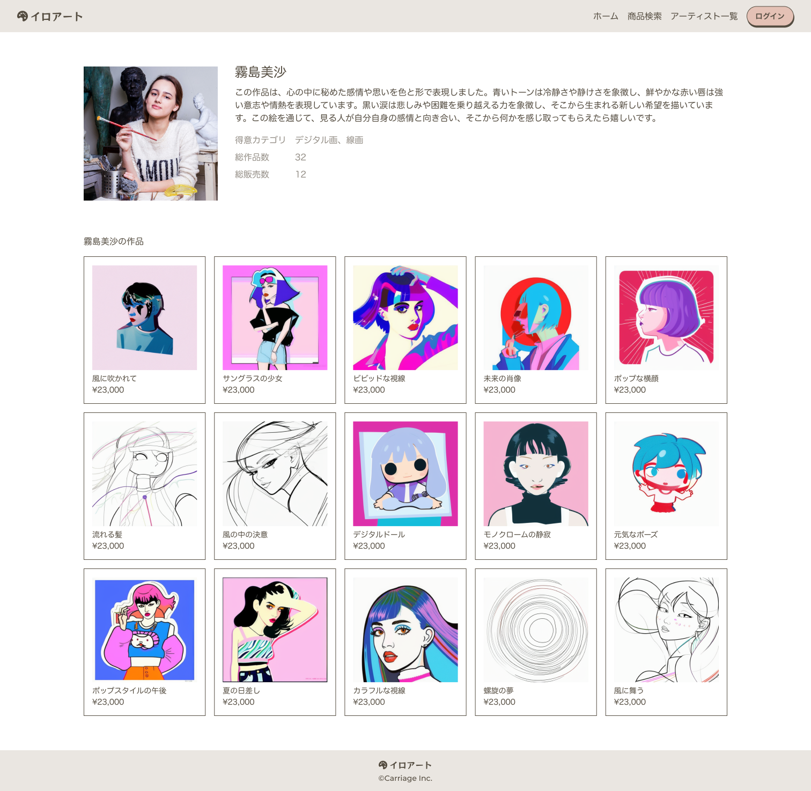

## 課題

アーティスト詳細画面を実装してください。

## 要件

- アーティスト情報を表示してください。
  - アーティスト画像
  - アーティスト名
  - アーティスト自己紹介
  - 得意カテゴリ
  - 作品数
  - 販売数
- アーティストの作品を全件表示してください。

## 提出方法

- 実装したファイルを GitHub にプッシュしてプルリクエストを作成し、 URL を共有してください。
