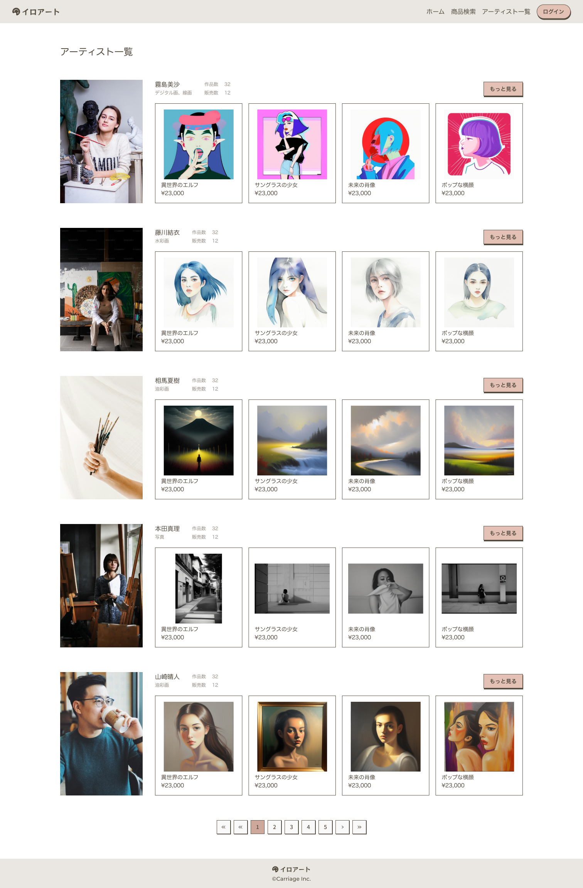

## 課題

アーティスト一覧画面を実装してください。

## 要件

- アーティスト情報を表示してください。
  - アーティスト画像
  - アーティスト名
  - 得意カテゴリ
  - 作品数
  - 販売数
  - 作品一覧（最新 4 件）
- アーティスト名、アーティスト画像、もっと見るボタンをクリックしたら、アーティスト詳細画面に遷移するようにしてください。
- 作品をクリックしたら、作品詳細画面に遷移するようにしてください。
- ページネーションを実装してください。

## 提出方法

- 実装したファイルを GitHub にプッシュしてプルリクエストを作成し、 URL を共有してください。
