## 課題

以下のコンポーネントを作成してください。

1. `Button`コンポーネント

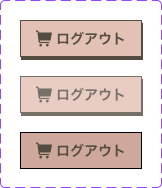
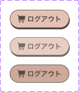

2. `TagButton`コンポーネント

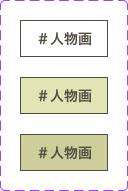

3. `CategoryButton`コンポーネント

4. `SortButton`コンポーネント

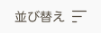

5. `Checkbox`コンポーネント

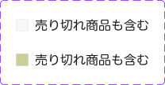

6. `Input`コンポーネント

7. `Menu`コンポーネント

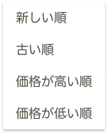

8. `Header`コンポーネント

9. `Footer`コンポーネント

10. `Paginator`コンポーネント

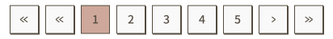

11. `ProductCard`コンポーネント

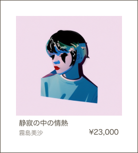

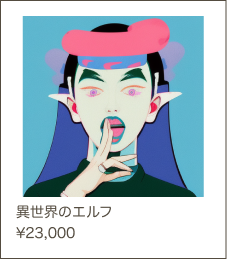
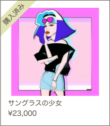

12. `PurchaseProduct`コンポーネント

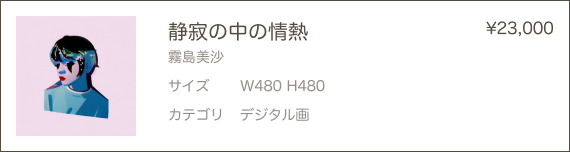

## 要件

- `Button`コンポーネント

  - ホバーとアクティブ時のスタイルを設定してください。
  - 以下の要素を引数によって変更できるようにしてください。
    - ラベル
    - アイコン
    - 背景色
    - 角丸にするかどうか
    - クリックハンドラー

- `TagButton`コンポーネント

  - ホバーとアクティブ時のスタイルを設定してください。
  - 以下の要素を引数によって変更できるようにしてください。
    - ラベル
    - クリックハンドラー

- `CategoryButton`コンポーネント

  - ホバーとアクティブ時のスタイルを設定してください。
  - 以下の要素を引数によって変更できるようにしてください。
    - ラベル
    - アイコン
    - クリックハンドラー

- `SortButton`コンポーネント

  - ホバーとアクティブ時のスタイルを設定してください。
  - 以下の要素を引数によって変更できるようにしてください。
    - ラベル
    - アイコン
    - メニューに表示するリスト
  - コンポーネント内で`Menu`コンポーネントを使用してください。

- `Checkbox`コンポーネント

  - 以下の要素を引数によって変更できるようにしてください。
    - ラベル
    - チェックされたかどうか

- `Input`コンポーネント

  - 以下の要素を引数によって変更できるようにしてください。
    - プレースホルダー
    - アイコン

- `Menu`コンポーネント

  - 以下の要素を引数によって変更できるようにしてください。
    - メニューのリスト
    - 選択された値
    - クリックハンドラー

- `Header`コンポーネント

  - ロゴとメニューを表示してください。
  - ログインボタンとアカウントボタンの切り替えは、後回しで構いません。

- `Footer`コンポーネント

  - フッターのコンテンツを表示してください。

- `Paginator`コンポーネント

  - 以下の要素を引数によって変更できるようにしてください。
    - 現在のページ
    - 全ページ数
    - ページネーションのリンクをクリックした時の処理

- `ProductCard`コンポーネント

  - 以下の要素を引数によって変更できるようにしてください。
    - 商品画像
    - 商品名
    - アーティスト名
    - 価格
    - シャドーを表示するかどうか
    - 購入済みかどうか

- `PurchaseProduct`コンポーネント

  - 以下の要素を引数によって変更できるようにしてください。
    - 商品画像
    - 商品名
    - アーティスト名
    - 価格
    - サイズ
    - カテゴリ

## ヒント

- 実装中のコンポーネントの見た目を確認するため、トップページなどでコンポーネントを読み込んで表示しながら作業を進めてください。

## 提出方法

- 追加したファイルを GitHub にプッシュしてプルリクエストを作成し、 URL を共有してください。
