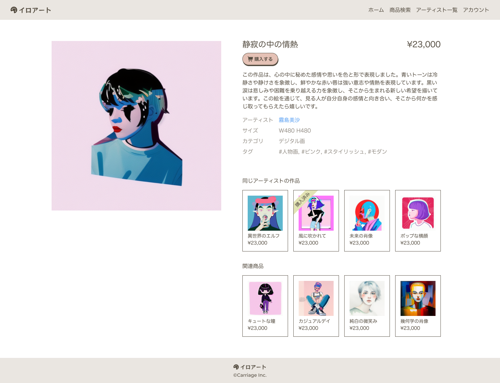

## 課題

作品詳細画面を実装してください。

## 要件

- 作品情報を表示してください。
  - 作品画像
  - 作品名
  - 価格
  - 作品説明
  - アーティスト名
  - サイズ
  - カテゴリ
  - タグ
  - 販売ステータス
- 購入ボタンをクリックしたら、作品購入画面へ遷移するようにしてください。
- 同じアーティストの作品を 10 件まで表示してください。
- 関連商品として、同じタグまたはカテゴリの作品を 10 件まで表示してください。

## 提出方法

- 実装したファイルを GitHub にプッシュしてプルリクエストを作成し、 URL を共有してください。
