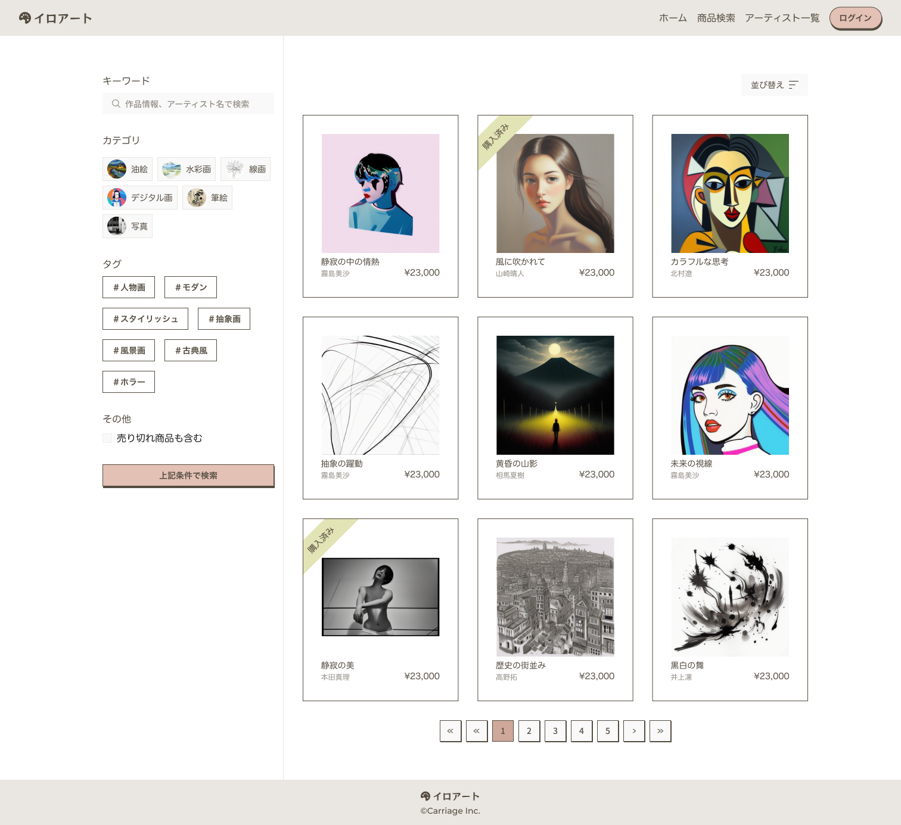

## 課題

作品検索画面を実装してください。

## 要件

- キーワード、カテゴリ、タグ、売り切れかどうかで検索できるようにしてください。
- カテゴリとタグは複数選択できるようにしてください。
- 検索は OR 検索で行ってください。
- 新しい順、古い順、価格が安い順、価格が高い順でソートできるようにしてください。
- 作品をクリックすると作品詳細画面に遷移できるようにしてください。
- ページネーションを実装してください。

## 提出方法

- 実装したファイルを GitHub にプッシュしてプルリクエストを作成し、 URL を共有してください。
