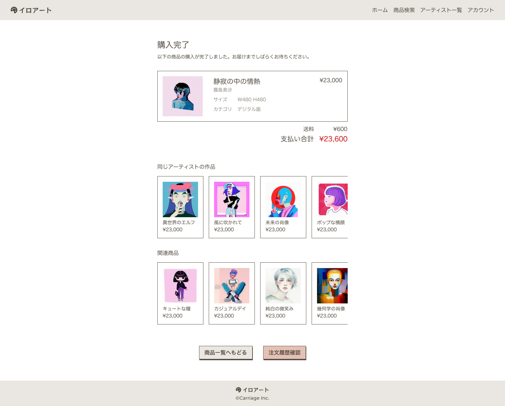

## 課題

購入完了画面を実装してください。

## 要件

- 購入完了した商品の情報を表示してください。
- 同じアーティストの作品を 10 件まで表示してください。
- 関連商品として、同じタグまたはカテゴリの作品を 10 件まで表示してください。
- 商品一覧画面へのリンクボタンと、購入履歴画面へのリンクボタンを表示してください。

## 提出方法

- 実装したファイルを GitHub にプッシュしてプルリクエストを作成し、 URL を共有してください。
