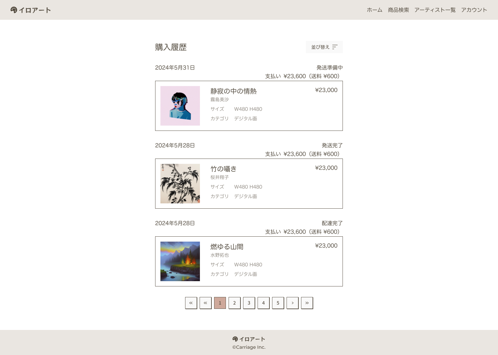

## 課題

購入履歴画面を実装してください。

## 要件

- 購入履歴を、購入日とともに表示してください。
- 発送ステータスを表示してください。ステータスは以下です。
  - 発送準備中
  - 発送完了
  - 配達完了
- 並び替えできるようにしてください。項目は以下です。
  - 新しい順
  - 古い順
- ページネーションを実装してください。1 ページあたり 5 件表示してください。

## 提出方法

- 実装したファイルを GitHub にプッシュしてプルリクエストを作成し、 URL を共有してください。
