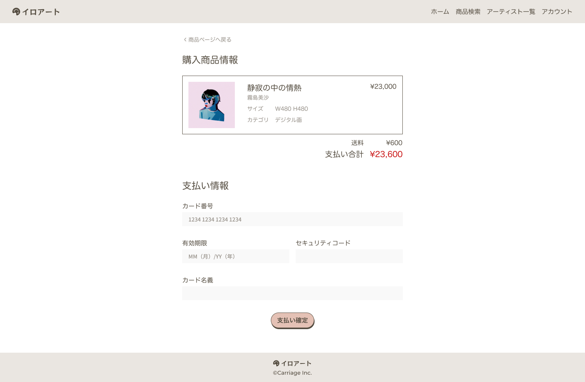

## 課題

作品購入画面を実装してください。

## 要件

- 購入対象の作品情報を表示してください。
- 送料は 600 円で固定とします。
- 合計を計算して表示してください。
- クレジットカード情報の入力フォームを表示してください。
  - 適切にバリデーションして、エラーを表示してください。
- フォームに問題がない場合、支払い確定を押せるようにしてください。
  - クリックしたらローディングを表示して、鑑賞したら購入完了画面に遷移してください。

## 提出方法

- 実装したファイルを GitHub にプッシュしてプルリクエストを作成し、 URL を共有してください。
