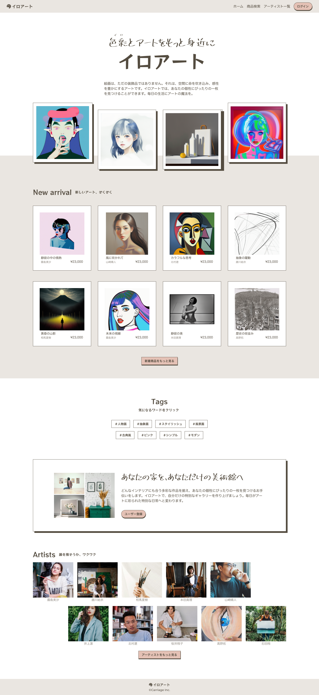

## 課題

トップ画面を実装してください。

## 要件

- ファーストビューはキャッチコピーと `Product`コンポーネントを表示してください。
- New arraival セクションには作品を新しい順に表示し、もっと見るをクリックすると作品一覧画面で「新しい順」を選択した状態で遷移するようにしてください。
- Tags セクションにはタグを表示し、クリックすると作品一覧画面でそのタグを選択した状態で遷移するようにしてください。
- コールトゥアクションセクションでボタンを押したら、ユーザー登録画面に遷移するようにしてください。
- アーティスト一覧セクションにはアーティストを表示し、クリックするとアーティスト詳細画面に遷移するようにしてください。またもっと見るをクリックするとアーティスト一覧画面に遷移するようにしてください。

## 提出方法

- 実装したファイルを GitHub にプッシュしてプルリクエストを作成し、 URL を共有してください。
