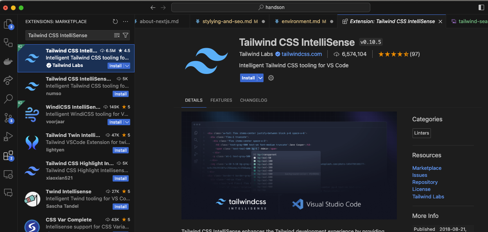
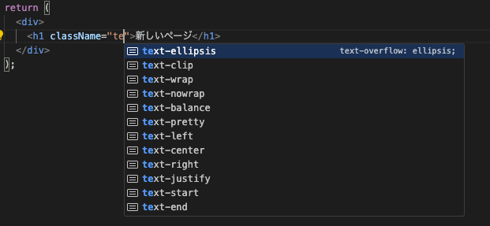

EC サイトを実装するための環境構築手順を説明します。

## Node.js

Node.js は JavaScript の実行環境です。Next.js は Node.js 上で動作するため、Node.js をインストールします。

nvm という Node.js のバージョン管理ツールを使うと、複数のバージョンの Node.js を切り替えることができ、開発に便利なので導入しましょう。

### nvm のインストール

せっかくなので、英語を読む練習も兼ねて、公式の手順に従ってインストールしてみましょう。

[nvm の GitHub リポジトリ](https://github.com/nvm-sh/nvm?tab=readme-ov-file#installing-and-updating) にインストール方法が記載されています。

### Node.js のインストール

nvm を使って Node.js をインストールします。

```bash
nvm install node
```

上記のコマンドで最新の Node.js がインストールされます。

バージョンを指定してインストールすることもできます。

```bash
nvm install 20
```

インストール可能なバージョンを確認するには、以下のコマンドを実行します。

```bash
nvm ls-remote
```

インストールした Node.js の一覧を確認するには、以下のコマンドを実行します。

```bash
nvm ls
```

そして、以下のコマンドで Node.js のバージョンを切り替えることができます。

```bash
nvm use 20
```

## Yarn

Yarn は JavaScript のパッケージマネージャです。npm と同様の機能を持っていますが、パフォーマンスが向上しているため、Yarn を使うことが推奨されています。

### Yarn のインストール

以下のコマンドで Yarn をインストールします。

```bash
npm install -g yarn
```

以上で Next.js の開発環境を構築するための Node.js と Yarn のインストールが完了しました。

## VSCode 拡張機能のインストール

### Tailwind CSS IntelliSense

Tailwind CSS のクラス名を自動補完するためのプラグインです。Tailwind CSS については、[スタイリングと SEO](tutorial/stylying.md#tailwind)の章で説明しますが、このプラグインを導入することで、Tailwind CSS のクラス名を自動補完することができます。

VSCode の拡張機能から `Tailwind CSS IntelliSense` をインストールします。



次のように、Tailwind CSS のクラス名を入力すると、自動補完が表示されるようになります。


