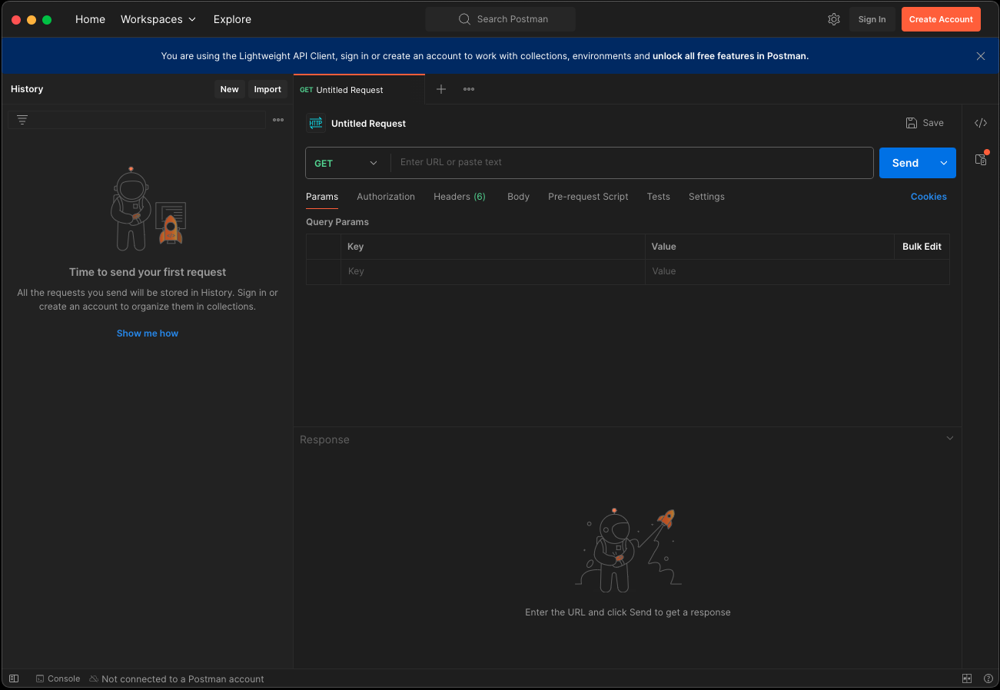
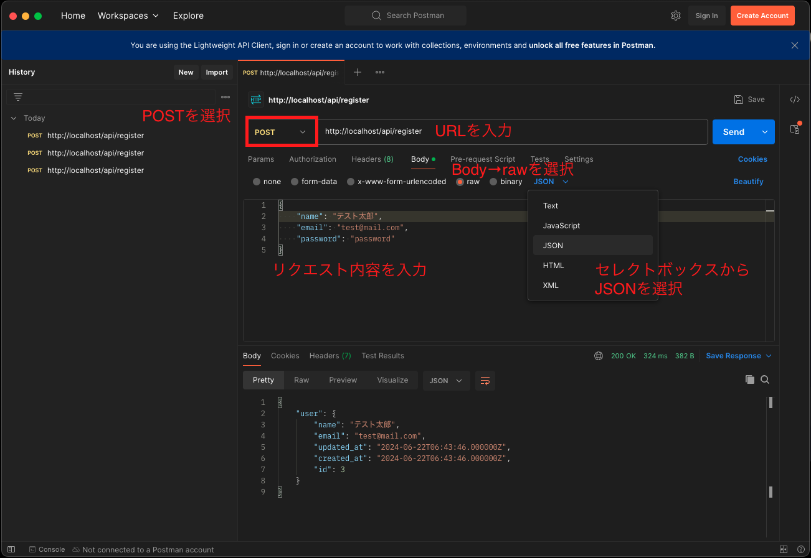
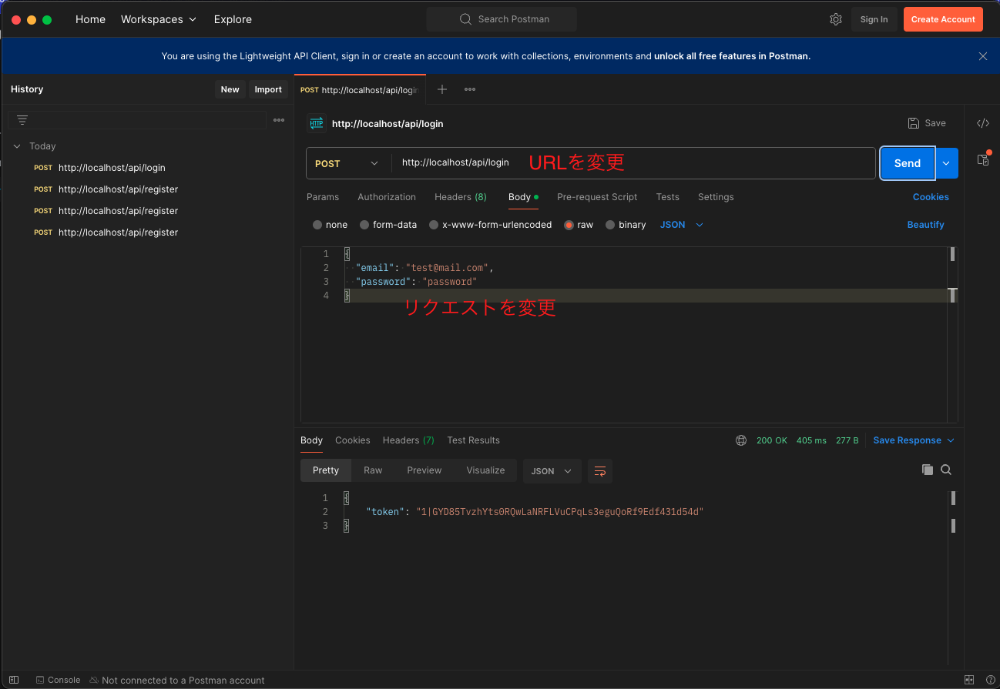
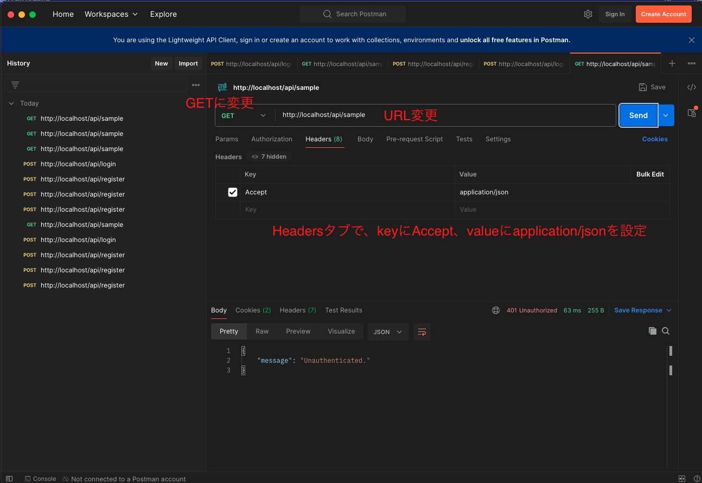
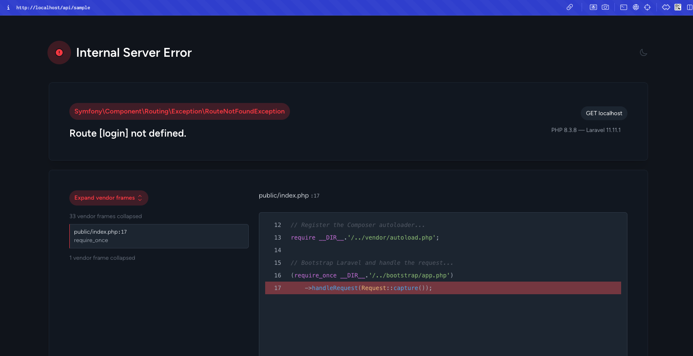
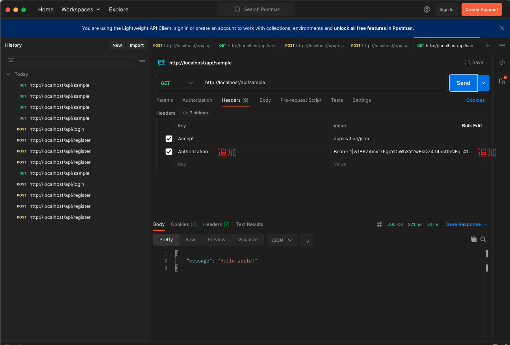

このコースでは、CRUD アプリコースとは違い、Laravel を API サーバーとして実装することになるため、必要な準備を行いましょう。

## プロジェクトの作成

[Laravel プロジェクト作成](../crud/start-project.md)に沿って、プロジェクトを作成してください。

## ルーティングの設定

API サーバーとしてのルーティングを設定します。以下のコマンドを実行して、`api.php`ファイルを作成します。

```bash
sail artisan install:api
```

途中でマイグレーションを行うかどうか聞かれるので、`yes`を入力してください。

次に、`routes/api.php`に以下のコードを追加してください。

```php title="routes/api.php"
Route::get('/sample', function () {
    return response()->json(['message' => 'Hello World!']);
});
```

`sail up -d`でサーバを立ち上げ、http://localhost/api/sample にアクセスすると、`{"message":"Hello World!"}`と表示されることが確認できます。

`api.php`で定義したルートには、自動で`api`のプレフィックスが付与されることに注意してください。

最後にユーザー関連のテーブルのマイグレーションが必要なので、以下のコマンドを実行してください。

```bash
sail artisan migrate
```

## 認証の設定

CURD コースでは、`Laravel Breeze`を使って認証機能を実装しましたが、API サーバーでは`Laravel Sanctum`というパッケージを使って認証機能を実装します。`sail artisan install:api`コマンドを実行した時点で、`Laravel Sanctum`がインストールされています。

それでは、新規登録とログインのためのエンドポイントを作成しましょう。まずは、以下のコマンドを実行してコントローラーを作成します。

```bash
sail artisan make:controller Auth/RegisterController --invokable
sail artisan make:controller Auth/LoginController --invokable
```

次に、`routes/api.php`に以下のコードを追加してください。

```php title="routes/api.php"
// highlight-start
use App\Http\Controllers\Auth\RegisterController;
use App\Http\Controllers\Auth\LoginController;
// highlight-end

// 省略

// highlight-start
Route::post('/register', RegisterController::class);
Route::post('/login', LoginController::class);
// highlight-end
```

### ユーザー登録処理

`app/Http/Controllers/Auth/RegisterController.php`にユーザー登録の処理を追加しましょう。

```php title="app/Http/Controllers/Auth/RegisterController.php"
<?php

namespace App\Http\Controllers\Auth;

use App\Http\Controllers\Controller;
use App\Models\User;
use Illuminate\Http\Request;
use Illuminate\Support\Facades\Hash;

class RegisterController extends Controller
{
    /**
     * Handle the incoming request.
     */
    public function __invoke(Request $request)
    {
        $request->validate([
            'name' => 'required|string|max:255',
            'email' => 'required|string|email|max:255|unique:users',
            'password' => 'required|string|min:8',
        ]);

        $user = User::create([
            'name' => $request->name,
            'email' => $request->email,
            'password' => Hash::make($request->password),
        ]);

        return response()->json(['user' => $user]);
    }
}
```

### postman の利用

試しにリクエストを送りたいのですが、画面が存在しないのでどうすればいいでしょうか。

API サーバー開発においては、フロントエンドの画面が出来るまでは`postman`というツールを使ってリクエストを送り、動作確認をすることが多いです。

[postman のダウンロードページ](https://www.postman.com/downloads/)にアクセスし、ダウンロードとインストールを行ってください。

インストールが完了したら、postman を起動します。起動すると以下のような画面が表示されます。



ここで、メソッドや URL、リクエストパラメータなどを設定してリクエストを送信することができます。
それでは実際に `http://localhost/api/register` にリクエストを送ってみましょう。

以下の画像を参考に設定してください。



JSON はこちらの内容を入力してください。

```json
{
  "name": "テスト太郎",
  "email": "test@mail.com",
  "password": "password"
}
```

送信ボタンを押すと、下の方に 200 OK でレスポンスが返ってくることが確認できます。
Laravel 側で mysql の中身をみて、ユーザーが登録されていることも確認してみてください。

### ログイン処理

次に、ログイン処理を実装します。`app/Http/Controllers/Auth/LoginController.php`に以下のコードを追加してください。

```php title="app/Http/Controllers/Auth/LoginController.php"
<?php

namespace App\Http\Controllers\Auth;

use App\Http\Controllers\Controller;
use Illuminate\Http\Request;

class LoginController extends Controller
{
    /**
     * Handle the incoming request.
     */
    public function __invoke(Request $request)
    {
      // highlight-start
        $request->validate([
            'email' => 'required|string|email',
            'password' => 'required|string',
        ]);

        if (!auth()->attempt($request->only('email', 'password'))) {
            return response()->json(['message' => 'Unauthorized'], 401);
        }

        return response()->json(['token' => $request->user()->createToken('token')->plainTextToken]);
      // highlight-end
    }
}
```

`User`モデルにも修正が必要なので、ファイルを開いて以下のコードを追加してください。

```php title="app/Models/User.php"
use Illuminate\Notifications\Notifiable;
// highlight-next-line
use Laravel\Sanctum\HasApiTokens;

class User extends Authenticatable
{
    // highlight-next-line
    use HasFactory, Notifiable, HasApiTokens; // HasApiTokens を追加
    ...
```

`postman`を使ってログイン処理を試してみましょう。`http://localhost/api/login`にリクエストを送り、以下の JSON を入力してください。

```json
{
  "email": "test@mail.com",
  "password": "password"
}
```

正しく実行できると以下のように token のレスポンスが返ってきます。



### 認証保護とトークンの利用

取得したトークンを使って、認証が必要なエンドポイントにアクセスすることができます。
最初に作った`sample`エンドポイントに認証をかけてみましょう。

`routes/api.php`を開いて、以下のように修正してください。

```php title="routes/api.php"

// 省略

Route::get('/sample', function () {
    return response()->json(['message' => 'Hello World!']);
    // highlight-next-line
})->middleware('auth:sanctum');
```

middleware `auth:sanctum`によって、未認証の場合のアクセスを制限することができます。
postman から試してみましょう。
header に `Accept:application/json`を設定するのを忘れないようにしてください。



レスポンスとして、`{"message": "Unauthenticated."}`が返ってくることが確認できます。

:::tip
ブラウザから認証保護されているルートにアクセスすると、login ページにリダイレクトされてしまいます。（login ページを実装していないので下記のようなエラー画面が出ます。）

ブラウザからのアクセスには、`Accept:application/json` がヘッダーに設定されないからです。



:::

ログイン処理で取得したトークンを使って、認証を通過させることができます。

postman のヘッダーに、`Authorization: Bearer {取得したトークン}`を追加してリクエストを送信してみてください。



正しく実行できると、`{"message":"Hello World!"}`が返ってくることが確認できます。

#### トークンの扱い

フロントエンドでトークンを扱う場合、`localStorage`や`cookie`に保存しておくことが一般的です。

ログイン画面でログインエンドポイントにリクエストを送り、トークンを取得したら、`localStorage`に保存しておきます。

```javascript
localStorage.setItem("token", "取得したトークン");
```

そして、認証が必要なリクエストを送る際に、`localStorage`からトークンを取得して、`Authorization`ヘッダーに設定してリクエストを送ります。

```javascript
const token = localStorage.getItem("token");

fetch("http://localhost/api/sample", {
  method: "GET",
  headers: {
    Accept: "application/json",
    Authorization: `Bearer ${token}`,
  },
});
```

ログアウトする際は、`localStorage`からトークンを削除します。

```javascript
localStorage.removeItem("token");
```

### CORS の設定

API サーバーを別のドメインからアクセスする場合、CORS の設定が必要になります。フロントエンドとバックエンドを分けて実装する場合は、基本的に別ドメインになるため、CORS の設定が必要です。

以下のコマンドを実行して、CORS の設定ファイルを生成します。

```bash
sail artisan config:publish cors
```

`config/cors.php`が生成されるので、以下のように設定してください。

```php title="config/cors.php"
...
// highlight-next-line
'allowed_origins' => ['http://localhost:3000'],
...
```

3000 は Next.js のデフォルトのポート番号です。フロントエンドのポート番号に合わせて設定してください。
また本番環境では、本番のドメインを設定してください。

以上で Laravel API サーバーの構築準備は完了です。
