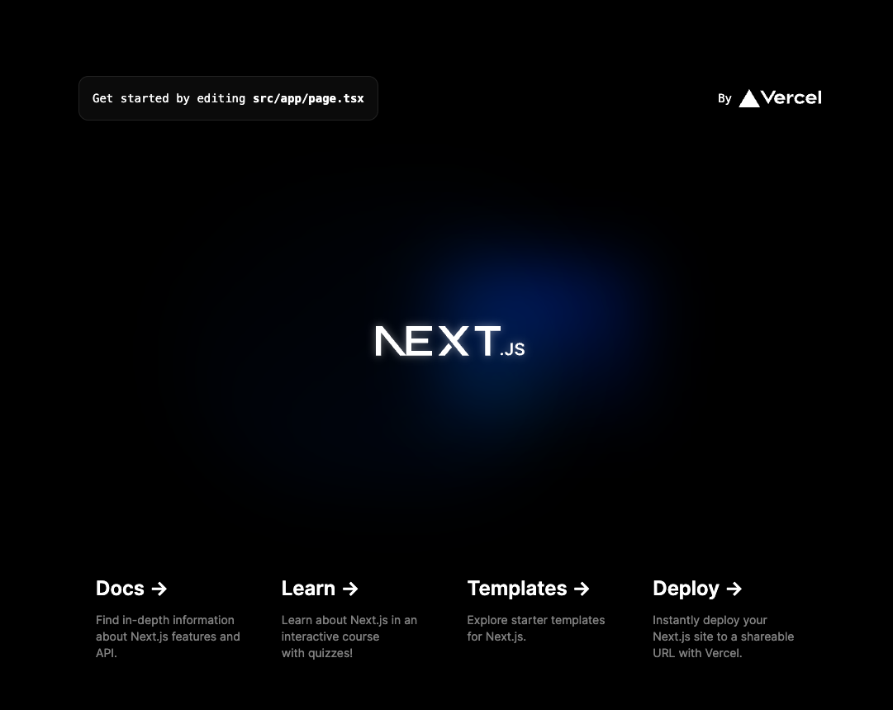

Next.js のプロジェクトを作成する方法を説明します。

## プロジェクトの作成

以下のコマンドを実行します。

```bash
yarn create next-app sample-app
```

sample-app の部分はプロジェクト名になるので、適宜変更してください。

インストール中に次のような質問を聞かれます。

### TypeScript の利用

- Would you like to use TypeScript?

昨今の開発では型のある言語を使うことが一般的なので、TypeScript を使うことをおすすめします。
Yes を選択してください。

### ESLint の利用

- Would you like to use ESLint?

ESLint はコードの書き方のルールをチェックしてくれるツールです。
使用することで、チーム開発時にコードの品質を保つことができます。
Yes を選択してください。

### Tailwind CSS の利用

- Would you like to use Tailwind CSS?

Tailwind CSS は、CSS フレームワークです。
Next.js でスタイリングする方法はいくつかありますが、Tailwind CSS は手軽に使えるのでおすすめです。
このコースでは Tailwind CSS を使うので、Yes を選択してください。

### src ディレクトリの利用

- Would you like to use `src/` directory?

src ディレクトリを使うかどうかを聞かれます。
src ディレクトリを使うことで、設定ファイルとソースコードを分けることができて管理しやすいので、Yes を選択してください。

### App Router の利用

- Would you like to use App Router? (recommended)

Next.js 13 以降では App Router が導入されています。
ここは新しい機能を積極的に使っていきたいので、Yes を選択してください。

### import エイリアスのカスタマイズ

- Would you like to customize the default import alias (@/\*)?

`import エイリアス`とは、`import` 文でファイルを読み込む際に、`@` を使ってディレクトリを指定する機能です。
デフォルトではルートディレクトリが指定されており、特に変える理由はないので、No を選択してください。

## ライブラリのインストール

プロジェクトのディレクトリに移動して、必要なライブラリをインストールします。

```bash
cd sample-app
yarn add next@14.2.4
```

:::note
このコースでは、Next.js バージョン 14.2.4 を使います。
:::

## 開発サーバの起動

プロジェクトのディレクトリに移動して、開発サーバを起動します。

```bash
yarn dev
```

ブラウザで http://localhost:3000 にアクセスして、Next.js のデフォルトページが表示されれば成功です。


