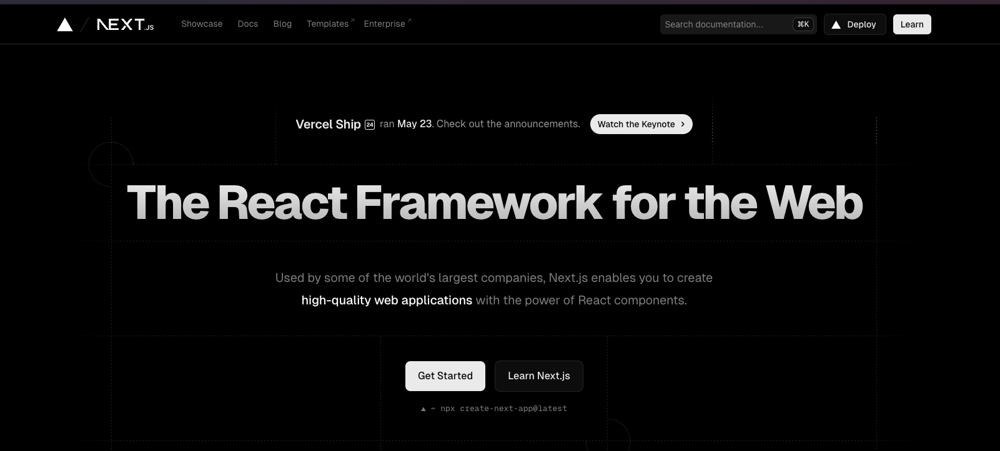

## React から Next.js へ

ここまで React の使い方を見てきました。React は UI を構築することに特化しており、目的や使い方がシンプルなため、これまで多くの開発者に利用され進化してきました。

しかしそれゆえに、React を使ってアプリケーションを開発する際には、開発者が自分で設定を行う必要があります。例えば、ルーティングやレンダリング、ビルド環境の設定など、アプリケーションを作る上で必要な機能を自分で実装する必要があります。

そこで、React の開発をより効率的に行うために、Next.js というフレームワークが登場しました。Next.js は React をベースにしたフレームワークで、アプリケーション開発必要な機能を提供してくれるため、開発者はロジックの実装に集中することができます。

Next.js は、以下のような特徴を持っています。

- ルーティングの自動設定
- ページの事前ビルド
- 静的ファイルの配信
- API ルートの作成
- プロジェクトの設定ファイルの簡略化

などなど。

業務ではここまでの例のように React を素で使うことはほとんどなく、Next.js を使って開発を行うことが圧倒的に多いです。
このコースを通して、Next.js を使った開発を学んでいきましょう。

## Page Router と App Router

Next.js は、バージョン 13 以前と以降で、仕組みがかなり変わりました。

バージョン 13 以前で使われていたのは、`Page Router`という仕組みです。これは、`pages`ディレクトリ内にファイルを作成することで、そのファイル名を URL としてルーティングが作られるというものでした。

一方、バージョン 13 以降では、`App Router`という仕組みが導入されました。ルーティングに関しては、決められたファイルの命名規則に従うルールに変わりました。またルーティング以外にも、React の最新機能である Suspense が導入され、一つのページの中にサーバーサイドで生成したコンポーネントと、クライアントで生成したコンポーネントを混在させることが可能になりました。

このコースでは、Next.js の最新バージョンであるバージョン 14 の`App Router`を使って開発を行っていきます。

:::tip
`App Router`になってからは、「設定より規約」の方向性へと変わり、覚えなければならない概念も増えたため、開発者の間の評価は分かれています。しかし、Next.js の開発チームは、今後も今の方針で進めていくとしているため、今後は`App Router`を使った開発が主流になるはずです。今身につければ、かなり重宝されるスキルになるでしょう。
:::

## Next.js プロジェクトの立ち上げ

[Next.js プロジェクト作成](../start-project.md)の章に従って、プロジェクトを作成してください。名前は `nextjs-tutorial` としてください。

次のステップからは、すでにプロジェクトが作成されていることを前提に進めていきます。
