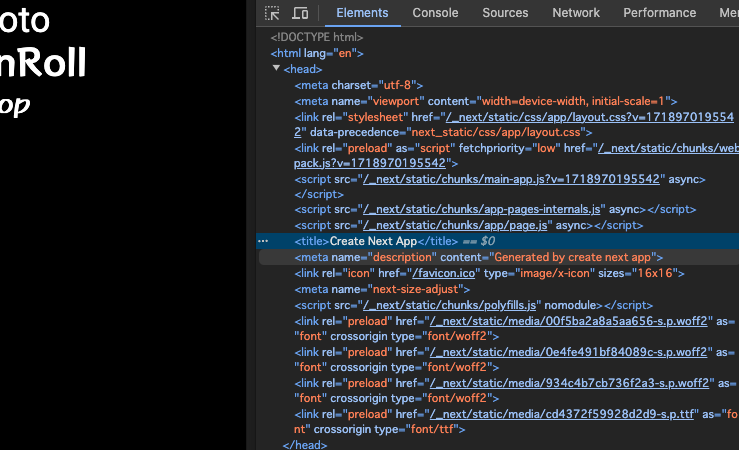

## フォントの設定

Web サイトでは、デザイン性を高めるためにフォントを設定することがあります。以下の二つのフォント追加方法を見ていきましょう。

- Google Fonts
- ローカルフォント

### Google Fonts

Google Fonts は、Google が提供している Web フォントのサービスです。Google Fonts には、多くのフォントが用意されており、簡単に Web サイトに追加することができます。

`layout.tsx`には、すでに Google Fonts のフォントを追加するためのコードが書かれているので、見てみましょう。

```tsx title="layout.tsx"
import type { Metadata } from "next";
// highlight-next-line
import { Inter } from "next/font/google";
import "./globals.css";
// highlight-next-line
const inter = Inter({ subsets: ["latin"] });

export const metadata: Metadata = {
  title: "Create Next App",
  description: "Generated by create next app",
};

export default function RootLayout({
  children,
}: Readonly<{
  children: React.ReactNode;
}>) {
  return (
    <html lang="en">
      // highlight-next-line
      <body className={inter.className}>{children}</body>
    </html>
  );
}
```

まず、`import { Inter } from "next/font/google";`で Google Fonts の Inter フォントを読み込んでいます。次に、`const inter = Inter({ subsets: ["latin"] });`で、subset として latin を指定しています。

最後に、`<body className={inter.className}>{children}</body>`で、Inter フォントを body タグに適用しています。

フォント設定を別ファイルに切り出したいので、`src/app/fonts.ts`を作成して、以下のコードを追加してください。

```tsx title="src/app/fonts.ts"
import { RocknRoll_One } from "next/font/google";

export const rocknRoll = RocknRoll_One({ subsets: ["latin"], weight: ["400"] });
```

そして、`layout.tsx`で`rocknRoll`を読み込んで適用してください。

```tsx title="layout.tsx"
import type { Metadata } from "next";
// highlight-next-line
import { rocknRoll } from "./fonts";
import "./globals.css";

export const metadata: Metadata = {
  title: "Create Next App",
  description: "Generated by create next app",
};

export default function RootLayout({
  children,
}: Readonly<{
  children: React.ReactNode;
}>) {
  return (
    <html lang="en">
      // highlight-next-line
      <body className={rocknRoll.className}>{children}</body>
    </html>
  );
}
```

ブラウザを開くと、フォントが変わっていることが確認できます。

一部のテキストで別のフォントを使いたいこともあると思います。そのため、まず `src/app/fonts.ts` に別のフォントを追加してみましょう。

```tsx title="src/app/fonts.ts"
import { RocknRoll_One } from "next/font/google";
// highlight-next-line
import { Roboto } from "next/font/google";

export const rocknRoll = RocknRoll_One({ subsets: ["latin"], weight: ["400"] });
// highlight-next-line
export const roboto = Roboto({ subsets: ["latin"], weight: ["400", "700"] });
```

そして、`src/app/page.tsx`で Roboto フォントを使うように変更してください。

```tsx title="src/app/page.tsx"
import { roboto } from "./fonts";

export default function Home() {
  return (
    <div>
      <h1 className={`${roboto.className} text-4xl`}>新しいページ roboto</h1>
      <h1 className="text-4xl">新しいページ rocknRoll</h1>
    </div>
  );
}
```

ブラウザを開くと、それぞれのテキストで異なるフォントが適用されていることが確認できます。

### ローカルフォント

次にローカルフォントを追加する方法を見ていきましょう。

851 マカポップというフリーフォントを追加してみます。まず、[851 マカポップ](https://pm85122.onamae.jp/851mkpop.html)からフォントをダウンロードしてください。

次に `src/app/fonts`ディレクトリを作成し、ダウンロードした`851MkPOP_101.ttf`ファイルをディレクトリ内に配置してください。

続いて、`src/app/fonts.ts`に以下のコードを追加してください。

```tsx title="src/app/fonts.ts"
import { RocknRoll_One } from "next/font/google";
import { Roboto } from "next/font/google";
// highlight-next-line
import localFont from "next/font/local";

export const rocknRoll = RocknRoll_One({ subsets: ["latin"], weight: ["400"] });
export const roboto = Roboto({ subsets: ["latin"], weight: ["400", "700"] });
// highlight-next-line
export const mkpop = localFont({
  src: "./fonts/851MkPOP_101.ttf",
});
```

そして、`page.tsx`で`mkpop`を読み込んで適用してください。

```tsx title="src/app/page.tsx"
// highlight-next-line
import { mkpop, roboto } from "./fonts";

export default function Home() {
  return (
    <div>
      <h1 className={`${roboto.className} text-4xl`}>新しいページ roboto</h1>
      <h1 className="text-4xl">新しいページ rocknRoll</h1>
      // highlight-next-line
      <h1 className={`${mkpop.className} text-4xl`}>新しいページ mkpop</h1>
    </div>
  );
}
```

ブラウザを開くと、mkpop フォントが適用されていることが確認できます。

## 画像の挿入

Next.js では、画像を挿入するために`<Image />`コンポーネントを提供しています。`<Image />`コンポーネントを使うと、画像の遅延読み込みやレスポンシブな画像の表示が簡単に行えます。

`src/app/page.tsx`に以下のコードを追加してください。

```tsx title="src/app/page.tsx"
import { mkpop, roboto } from "./fonts";

export default function Home() {
  return (
    <div>
      <h1 className={`${roboto.className} text-4xl`}>新しいページ roboto</h1>
      <h1 className="text-4xl">新しいページ rocknRoll</h1>
      <h1 className={`${mkpop.className} text-4xl`}>新しいページ mkpop</h1>
      // highlight-next-line
      <Image src="/images/test.jpg" alt="Next.js" width={200} height={200} />
    </div>
  );
}
```

`public`ディレクトリに`test.jpg`や`test.png`という名前で適当な画像を配置してください。

ブラウザを開くと、画像が表示されていることが確認できます。

## SEO

SEO（Search Engine Optimization）は、検索エンジン最適化のことです。SEO を行うことで、Web サイトが検索エンジンの検索結果で上位に表示されるようになります。

Next.js で SEO 対策を行うには、meta タグを設定することが重要です。`App Router`では、`metadata` という変数を`layout.tsx`や`page.tsx`から export するだけで、meta タグを設定することができます。

`layout.tsx`を開いてください。すでにデフォルトで`metadata`が export されています。

```tsx title="layout.tsx"
export const metadata: Metadata = {
  title: "Create Next App",
  description: "Generated by create next app",
};
```

`title`は Web サイトのタイトル、`description`は Web サイトの説明です。ブラウザの開発者ツールで確認すると、`<head>`タグ内に`<title>`と`<meta name="description">`が設定されていることが確認できます。



`metadata`を`page.tsx`から export して、`title`や`description`を変更してみましょう。

```tsx title="src/app/page.tsx"
import { mkpop, roboto } from "./fonts";
// highlight-next-line
import type { Metadata } from "next";

// highlight-start
export const metadata: Metadata = {
  title: "ホームページ",
  description: "チュートリアルのホームページ",
};
// highlight-end
```

開発者ツールで確認すると、`<title>`と`<meta name="description">`が変更されていることが確認できます。
