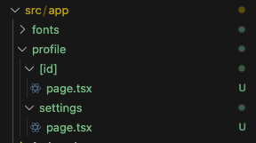

ここからいくつかの`Segment`のパターンを紹介します。

:::note
`Segment`って何だったっけ？という方は、[こちら](./routing-and-navigation.md#segment)
:::

### Dynamic Segment

`Dynamic Segment`は、URL の一部が動的に変わる場合に使います。例えば、`/profile/:id`のように、`:id`の部分によって表示する内容を変える場合などです。

`Dynamic Segment`のルーティングを設定するには、`[id]`という名前のディレクトリを作成し、その中に`page.tsx`を作成します。



`src/app/profile/[id]/page.tsx`に以下のコードを追加してください。

```tsx title="src/app/profile/[id]/page.tsx"
type Props = {
  params: {
    id: Number;
  };
};

export default function Profile({ params }: Props) {
  return <h1>プロフィールページ: {params.id.toString()}</h1>;
}
```

少しコードが複雑になったので、一つずつ説明します。

まず、`Props`という型を定義しています。この型は、`Profile`コンポーネントに渡される`props`の型を定義しています。TypeScript を使っているので、このように型を定義することが重要です。

次に、`Profile`コンポーネントの引数に`Props`型を指定しています。これによって、`Profile`コンポーネントに`params`というプロパティが渡されることを示しています。

最後に、`params.id`を表示することで、URL の`:id`の部分が表示されるようになります。

http://localhost:3000/profile/1 にアクセスすると、`プロフィールページ: 1`と表示されていることが確認できます。また、http://localhost:3000/profile/2 にアクセスすると、`プロフィールページ: 2`と表示が変わることを確認してください。

### Route Groups

`Route Groups`は、ページのグループを作成するための機能です。例えば、`featureA`という機能に関連するページ`a`と`b`があるとします。もし、`featureA`というディレクトリを作成し、その中に`a`と`b`というディレクトリを作成すると、URL 上に `featureA`が含まれることになります。

時には、`featureA`という文字は URL に含めたくない場合もあります。その場合、`featureA`ディレクトリの名前を、`(featureA)`というふうに`()`で囲むことで、URL 上に表示されないようにすることができます。

試しに、`profile`ディレクトリの名前を`(profile)`に変更してみましょう。

http://localhost:3000/profile/1 を開くと 404 が表示されるようになり、代わりに http://localhost:3000/1 にアクセスすることで、元のページが表示されることが確認できます。

このように、`Route Groups`を使うことで、URL に影響を与えずにページをグループ化することができます。

#### Route Groups で Layout を個別に設定する

例えば、ログイン前はナビゲーションを上に表示したいが、ログイン後はサイドバーとして表示したいケースなどあると思います。そのような場合、`Route Groups`を使って、それぞれのページに異なるレイアウトを適用することができます。

例えば以下のようなフォルダ構成とすることで、ログインページとログイン後のホームページにそれぞれレイアウトを適用できます。

```
src/app
├── (guest)
│   ├── layout.tsx  // ログイン前のレイアウト
│   ├── login
│   │   └── page.tsx
└── (member)
    ├── layout.tsx  // ログイン後のレイアウト
    └── home
        └── page.tsx
```

### Private Folder とコロケーション

`Private Folder`機能を使うと、ルーティングに影響を与えないファイルを配置できます。例えば、`Profile`にしか使わない UI コンポーネントを配置する場合、`profile`ディレクトリの中に`components`ディレクトリを作成し、その中にファイルを格納できます。

このように、関連するファイルをまとめて配置することを、`コロケーション`といいます。

#### Private Folder

もし、`profile/components`の下に間違って`page.tsx`を配置してしまった場合、`page.tsx`はルーティングの対象になってしまいます。そこで、フォルダ名の前に`_`をつけることで、`Private Folder`として扱うことができます。

`profile/_components`のようにフォルダ名を変更することで、`_components`ディレクトリの中に配置されたファイルはルーティングの対象にならなくなります。

```
src/app
└── profile
    ├── _components
    │   └── page.tsx  // ルーティングの対象外
    └── components
        └── page.tsx  // profile/components というURLでアクセスできてしまう
```

### その他の Segment パターン

その他にも、`Catch-all Segment`や`Optional Catch-all Segment`、`Parallel Routes`と`Intercepting Routes`などの機能がありますが、今の段階ですべて覚えようとすると理解が追いつかないと思うので、まずはここまで紹介したもので十分です。

アプリを作っていく中で、実現できないことがあれば、その都度調べていくようにしましょう。
