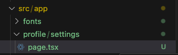

Next.js は、React をベースにしたフレームワークで、ルーティングや画面遷移の仕組みを提供しています。さっそく使い方を見ていきましょう。

## ルーティング

`App Router`では、`src/app`配下のディレクトリ構造によって、ルーティングのパス（URL）を定義します。例えば、`/profile/settings`という URL で表示するページを作成する場合、`src/app/profile/settings`というディレクトリを作成します。

そして、その中に`page.tsx`というファイルを作成することで、ページの内容を定義します。`page.tsx`という名前は、`App Router`の規約によって定めれれている、固定のファイル名です。



実際にファイルを作成して、ページを開いてみましょう。

`src/app/profile/settings/page.tsx`に以下のコードを追加してください。

```tsx title="src/app/profile/settings/page.tsx"
export default function Settings() {
  return <h1>設定ページ</h1>;
}
```

http://localhost:3000/profile/settings にアクセスすると、`設定ページ`と表示されていることが確認できます。
これが基本のルーティングの仕組みです。

### Segment

ここで、一つ用語を覚えておきましょう。`Segment`とは、URL のパスをスラッシュ `/` で区切った部分のことです。例えば、`/profile/settings`の場合、`profile`と`settings`が`Segment`になります。

### layout.tsx

これまで、`layout.tsx`というファイルが何度か登場しています。`layout.tsx`は、各`segment`に対して一つずつ作成することができます。例えば、先ほどの`src/app/profile/settings`というディレクトリに対して、`layout.tsx`を作成することができます。そして、`layout.tsx`はネストされてページにレイアウトが適用されます。

実際に具体例を見ていきましょう。

`src/app/profile/settings/layout.tsx`ファイルを作成し、以下のコードを追加してください。

```tsx title="src/app/profile/settings/layout.tsx"
export default function SettingsLayout({
  children,
}: Readonly<{
  children: React.ReactNode;
}>) {
  return (
    <div>
      <h1>プロフィールページ</h1>
      {children}
    </div>
  );
}
```

そして、`src/app/layout.tsx`の return の中身を以下のコードに変更してください。

```tsx title="src/app/layout.tsx"
<html lang="en">
  <body className={rocknRoll.className}>
    <h1>全体のレイアウト</h1>
    {children}
  </body>
</html>
```

http://localhost:3000/profile/settings にアクセスすると、`全体のレイアウト`、`プロフィールページ`、`設定ページ`の順番で表示されていることが確認できます。

つまり`layout.tsx`はそのファイルが存在するディレクトリ以下のすべてのページに適用されるということがわかります。
この仕組みを利用して、アプリのレイアウトを組んでいくことになります。

:::note
あるページでは親のレイアウトを適用したくない、というケースもあるでしょう。その場合、[Route Groups](dynamic-routing-and-route-groups.md)という機能を使います。あとの章で改めて説明します。
:::

## 画面遷移

次に、画面遷移の仕組みを見ていきましょう。通常の html での画面遷移は、`<a>`タグを使って行いますが、Next.js では`<Link>`コンポーネントを使って画面遷移を行います。

`<a>`タグと`<Link>`コンポーネントの違いを確認するために、`src/app/page.tsx`に以下のコードを追加してください。

```jsx title="src/app/page.tsx"
import Image from "next/image";
import { mkpop, roboto } from "./fonts";
import type { Metadata } from "next";
// highlight-next-line
import Link from "next/link";

export const metadata: Metadata = {
  title: "ホームページ",
  description: "チュートリアルのホームページ",
};

export default function Home() {
  return (
    <div>
      <h1 className={`${roboto.className} text-4xl`}>新しいページ roboto</h1>
      <h1 className="text-4xl">新しいページ rocknRoll</h1>
      <h1 className={`${mkpop.className} text-4xl`}>新しいページ mkpop</h1>
      <Image src="/test.jpg" alt="Next.js" width={200} height={200} />
      // highlight-start
      <a className="block" href="/profile/settings">
        プロフィールページへ：aタグ
      </a>
      <Link className="block" href="/profile/settings">
        プロフィールページへ：Linkタグ
      </Link>
      // highlight-end
    </div>
  );
}
```

それぞれをクリックして、画面遷移の挙動を確認してみてください。

`<a>`タグを使った場合、ブラウザ側でページ全体がリロードされるため、一瞬ページが読み込み状態になり遷移に若干時間がかかるはずです。一方、`<Link>`コンポーネントを使った場合、ブラウザのリロードが発生せず、JavaScript によって画面の書き換えが行われます。そのため、画面遷移が一瞬で行われるはずです。

また、`<Link>`コンポーネントの場合、遷移先のページをプリフェッチします。つまり遷移する前から、遷移先のページのデータを取得してくれるので、ページ表示速度が向上し、ユーザー体験が高くなります。

Next.js でアプリを実装する場合は、基本的に`<Link>`コンポーネントを使って画面遷移を行うようにしましょう。
