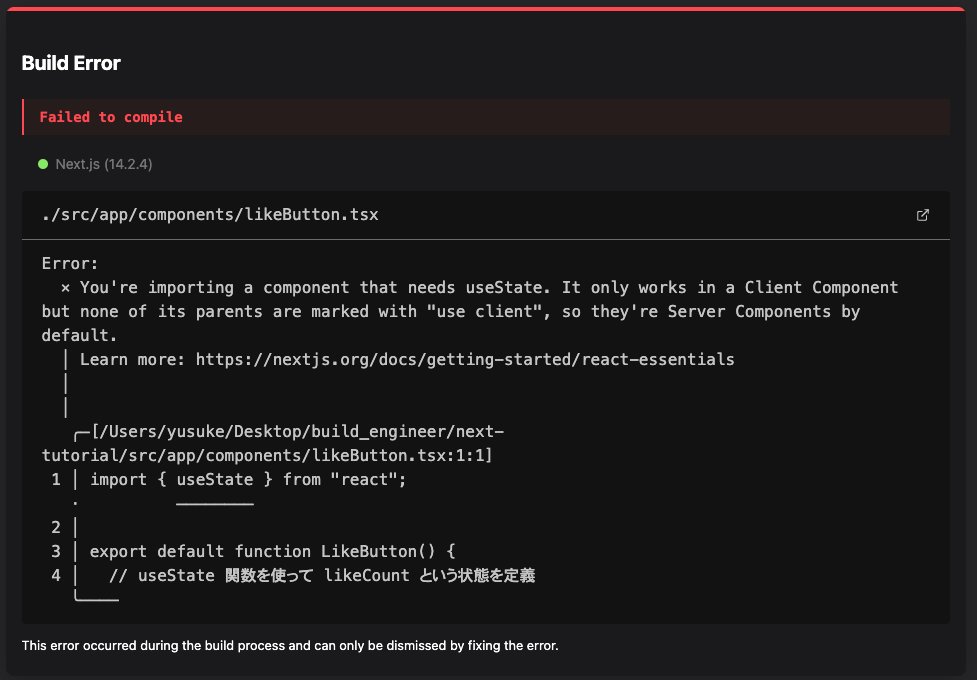

`App Router`では、React の `Server Component`の利用が出来るようになりました。
`Server Component`は、サーバーサイドでのレンダリングを行うコンポーネントです。

これだけ言われてもピンとこないと思うので、具体的に説明していきます。

## サーバーサイド JavaScript

まず、Next.js のアプリケーションをユーザーに提供するためには、サーバーが必要です。
サーバーといっても物理的なマシンという意味でのサーバーではなく、アプリケーションを実行するためのソフトウェアのことです。

Next.js では、サーバーとして Node.js が使われています。Node.js は JavaScript を実行するためのランタイム環境です。

従来、JavaScript はブラウザ上でのみ実行されていました。例えば Chrome や Firefox など、ブウラザの中に JavaScript のランタイムが組み込まれており、JavaScript のコードを実行していました。ブラウザはユーザーが使うものなので、クライアントサイドと呼ばれています。

しかし、Node.js が登場することで、JavaScript をサーバーサイドで実行することが可能になりました。つまり、CRUD アプリで使った PHP のように、サーバーサイドでアプリのプログラムを実行することができるようになったのです。これをサーバーサイド JavaScript と呼びます。

クライアントサイドのパフォーマンスはユーザーの環境に左右されてしまいます。そのため、サーバーサイドで処理を行うことで、ユーザーの環境に左右されず、安定したパフォーマンスを提供することができます。近年はこのように、クライアントの負荷をいかに減らして、サーバーサイドで処理を行うかが重要視されています。

## Server Component

React は、元々はクライアントサイドでのみ動作するライブラリでした。つまり今まで書いてきた jsx や tsx のコードは、ブラウザ上で動作するためのコードでした。

しかし、React バージョン 18 からの新しい機能として、`Server Component`が登場しました。`Server Component`は、サーバーサイドで実行されるコンポーネントです。

そして、`App Router`になってからは、`Server Component`がデフォルトで使われるようになりました。チュートリアルで書いてきたコンポーネントは、基本的にすべて `Server Component`です。

実際にサーバー側で実行されていることを確認するために、`page.tsx`に以下のコードを追加してください。

```tsx title="src/app/page.tsx"
export default function Home() {
  // highlight-next-line
  console.log("Server Component");
  return (
    ...
  )
}
```

ブラウザで、http://localhost:3000 にアクセスすると、ブラウザの開発者ツールではなく、`yarn dev`を実行しているターミナルの方に `Server Component` と表示されていることが確認できます。

## Client Component

ここで、いいねボタンをコンポーネントとして定義し、`page.tsx`に追加してみましょう。

`src/app/components`ディレクトリを作成し、`likeButton.tsx`ファイルを作成してください。

```tsx title="src/app/components/likeButton.tsx"
import { useState } from "react";

export default function LikeButton() {
  const [likeCount, setLikeCount] = useState(0);

  return (
    <button className="border" onClick={() => setLikeCount(likeCount + 1)}>
      Like {likeCount}
    </button>
  );
}
```

そして、`page.tsx`に`LikeButton`コンポーネントを追加してください。

```tsx title="src/app/page.tsx"
import Image from "next/image";
import { mkpop, roboto } from "./fonts";
import type { Metadata } from "next";
import Link from "next/link";
// highlight-next-line
import LikeButton from "@/app/components/likeButton";

export const metadata: Metadata = {
  title: "ホームページ",
  description: "チュートリアルのホームページ",
};

export default function Home() {
  console.log("Server Component");
  return (
    <div>
      <h1 className={`${roboto.className} text-4xl`}>新しいページ roboto</h1>
      <h1 className="text-4xl">新しいページ rocknRoll</h1>
      <h1 className={`${mkpop.className} text-4xl`}>新しいページ mkpop</h1>
      <Image src="/test.jpg" alt="Next.js" width={200} height={200} />
      <a className="block" href="/profile/settings">
        プロフィールページへ：aタグ
      </a>
      <Link className="block" href="/profile/settings">
        プロフィールページへ：Linkタグ
      </Link>
      // highlight-next-line
      <LikeButton />
    </div>
  );
}
```

http://localhost:3000 にアクセスすると、以下のようなエラーが表示されます。



これは、useState がクライアントサイドでのみ利用できるためです。いいね数の表示切り替えなど画面の状態の変化はユーザーのブラウザ内で起こることなので、クライアントサイドで処理せざるを得ません。

そこで、`"use client"`という記述を使うことで、`Server Component`をクライアントサイドで利用することができます。

```tsx title="src/app/components/likeButton.tsx"
// highlight-next-line
"use client";

import { useState } from "react";

export default function LikeButton() {
  const [likeCount, setLikeCount] = useState(0);

  return (
    <button className="border" onClick={() => setLikeCount(likeCount + 1)}>
      Like {likeCount}
    </button>
  );
}
```

もう一度 http://localhost:3000 にアクセスすると、エラーが解消され、いいねボタンが表示されることが確認できます。

このように、`"use client"`を付けたコンポーネントを、`Client Component`と呼びます。

本当に、クライアントで実行されているのか確認するために、`likeButton.tsx`に以下のコードを追加してください。

```tsx title="src/app/components/likeButton.tsx"
// highlight-next-line
export default function LikeButton() {
  console.log("Client Component");
  ...
}
```

今度は、ブラウザの開発者ツールのコンソールに `Client Component` と表示されていることが確認できます。

## 使い分けについて

`Server Component`と`Client Component`の違いを見てきましたが、どのように使い分ければ良いのでしょうか。

Next.js のデフォルトは`Server Component`であるため、基本は`Server Component`を使い、クライアントでの処理が必要な場合にのみ`Client Component`を使うと良いでしょう。

`Client Component`にネストされたコンポーネントは、すべて`Client Component`として扱われます。そのため、クライアントの処理が必要な部分は細かいコンポーネントに分けてあげて、`Client Component`になる部分が局所的になるように実装してください。

また、データの取得などをそれぞれで行うため、各コンポーネントがどこで実行されているのかを把握していないと、エラーが起きた時に原因を特定するのが難しくなります。そのため、`Server Component`と`Client Component`の使い分けには注意が必要です。
