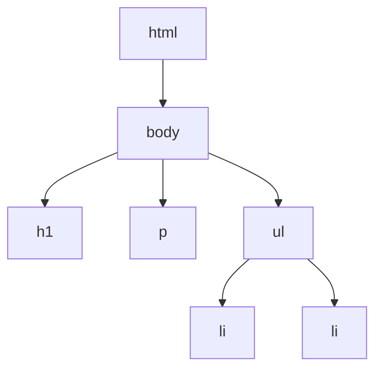

## React とは

React は、Facebook によって開発された ユーザーインターフェースを構築するための JavaScript ライブラリです。
Web 画面に表示するためのコンポーネントを素早く作成し、扱うことができるような便利な機能を提供しています。

React は、コンポーネントを組み合わせて画面を構築するため、再利用性が高く、保守性が高いコードを書くことができます。

UI を実装するためのライブラリはいくつもありますが、React はその中でも特に採用実績が多く、デファクトスタンダードとなっています。

:::note
日本では Vue.js も React に並び人気ですが、最近の Vue.js は React と似たような設計思想を持つようになっており、あえて採用する理由は少なくなってきています。求人倍率の観点からも React の方が有利です。
:::

## DOM について

DOM（Document Object Model）は、Web ページの構造を表現するための仕組みです。
HTML で記述された Web ページは、ブラウザによって DOM に変換され、JavaScript から操作することができます。

DOM の操作を理解するために、以下の index.html ファイルを適当なフォルダ内に作成し、Live Server を起動してみましょう。

```html title="index.html"
<html>
  <body>
    <h1>Hello, World!</h1>
    <p>This is a paragraph.</p>
    <ul>
      <li>Item 1</li>
      <li>Item 2</li>
    </ul>
  </body>
</html>
```

このファイルを Live Server で開くと、以下のような Web ページが表示されます。

<div style={{ border: "1px solid #ccc", padding: "10px", marginBottom: "40px" }}>
  <h1>Hello, World!</h1>
  <p>This is a paragraph.</p>
  <ul>
    <li>Item 1</li>
    <li>Item 2</li>
  </ul>
</div>

この HTML はブラウザによって以下のような DOM に変換されます。



そして、JavaScript を使って DOM を操作することで、Web ページの表示を変更することができます。
以下のコードを追加してみましょう。

```html title="index.html"
<html>
  <body>
    <h1>Hello, World!</h1>
    <p>This is a paragraph.</p>
    <ul>
      <li>Item 1</li>
      <li>Item 2</li>
    </ul>
    <script type="text/javascript">
      document.querySelector("h1").textContent = "Hello, JavaScript!";
    </script>
    // highlight-end
  </body>
</html>
```

すると、Web ページがリロードされ、以下のように表示が変わります。

<div style={{ border: "1px solid #ccc", padding: "10px", marginBottom: "40px" }}>
  <h1>Hello, JavaScript!</h1>
  <p>This is a paragraph.</p>
  <ul>
    <li>Item 1</li>
    <li>Item 2</li>
  </ul>
</div>

この例は簡単なテキストの変更でしたが、より複雑になると、DOM 自体を JavaScript で生成して挿入することもあります。

例えば、index.html を以下のコードにして、div の中に h1 タグを生成して挿入するようにしてみましょう。

```html title="index.html"
<html>
  <body>
    <div id="app"></div>
    <script type="text/javascript">
      // div タグを取得
      const app = document.getElementById("app");

      // h1 タグを生成
      const h1 = document.createElement("h1");
      h1.textContent = "Hello, JavaScript!";

      // h1 タグを div に挿入
      app.appendChild(h1);
    </script>
  </body>
</html>
```

このように、JavaScript で DOM を操作することで、Web ページの表示を動的に変更することができます。

## React で DOM を操作する

### 命令型プログラミングと宣言型プログラミング

さて、さきほどの例は単純なものでしたが、Web ページが複雑になると JavaScript だけで DOM を操作するのは大変になります。
なぜなら、app タグと取得して、h1 タグを作って、app タグに挿入して〜と DOM の操作を手続き的に書いているためです。

このような書き方を「命令型プログラミング」といいます。そして、それとは対照的に手続きを書くのではなく、あるべき状態を定義してそれを元に DOM を生成するような書き方を「宣言型プログラミング」といいます。

React は、この宣言型プログラミングを実現するためのライブラリです。

### React の場合

宣言的とはどういうことなのか理解するために、React で DOM を生成する方法を見てみましょう。

React を使い始めるには、CDN を使って React のライブラリを読み込むか、npm でインストールして使う方法があります。
今回は、CDN を使って React を読み込んでみましょう。

```html title="index.html"
<html>
  <body>
    <div id="app"></div>
    <!-- React のライブラリをCDNで読み込む -->
    <script src="https://unpkg.com/react@17/umd/react.development.js"></script>
    <script src="https://unpkg.com/react-dom@17/umd/react-dom.development.js"></script>
    // highlight-end

    <script type="text/javascript">
      // div タグを取得
      const app = document.getElementById("app");
      const root = ReactDom.createRoot(app);

      // h1タグにDOMをレンダー
      root.render(<h1>Hello, React!</h1>);
    </script>
  </body>
</html>
```

このままだとエラーが出るはずです。なぜなら、React は JSX という記法を使ってコンポーネントを記述するため、このままだとブラウザが理解できないからです。

JSX とは、JavaScript の拡張記法で、html に似た記法でコンポーネントを記述できるようにしたものです。

JSX を使うためには、Babel というトランスパイラを使って JSX を JavaScript に変換する必要があります。

以下のようにコードを書き換えましょう。

```html title="index.html"
<html>
  <body>
    <div id="app"></div>
    <!-- React のライブラリをCDNで読み込む -->
    <script src="https://unpkg.com/react@18/umd/react.development.js"></script>
    <script src="https://unpkg.com/react-dom@18/umd/react-dom.development.js"></script>

    <!-- Babel のライブラリをCDNで読み込む -->
    <script src="https://unpkg.com/@babel/standalone/babel.min.js"></script>

    <!-- text/jsxを指定 -->
    <script type="text/jsx">
      // highlight-end
      const app = document.getElementById("app");
      const root = ReactDOM.createRoot(app);

      root.render(<h1>Hello, React!</h1>);
    </script>
  </body>
</html>
```

すると、ブラウザに「Hello, React!」と表示されるはずです。

先ほどの JavaScript の手続き的な書き方と比べて、React では h1 タグを関数で生成するのではなく、jsx で定義したタグ自体をレンダリングするという宣言的な書き方ができるようになりました。

:::note
「宣言的」の意味はすぐには理解できないかもしれません。とりあえず、React を使えば JavaScript で地道に書くよりも簡単に UI 構築ができるということを押さえておいてください。
:::
