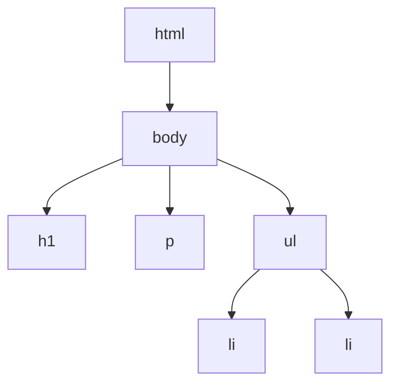

## React とは

React は、Facebook によって開発された ユーザーインターフェースを構築するための JavaScript ライブラリです。
Web 画面に表示するためのコンポーネントを素早く作成し、扱うことができるような便利な機能を提供しています。

React は、コンポーネントを組み合わせて画面を構築するため、再利用性が高く、保守性が高いコードを書くことができます。

UI を実装するためのライブラリはいくつもありますが、React はその中でも特に採用実績が多く、デファクトスタンダードとなっています。

:::note
日本では Vue.js も React に並び人気ですが、最近の Vue.js は React と似たような設計思想を持つようになっており、あえて採用する理由は少なくなってきています。求人倍率の観点からも React の方が有利です。
:::

## DOM について

DOM（Document Object Model）は、Web ページの構造を表現するための仕組みです。
HTML で記述された Web ページは、ブラウザによって DOM に変換され、JavaScript から操作することができます。

DOM の操作を理解するために、以下の index.html ファイルを適当なフォルダ内に作成し、Live Server を起動してみましょう。

```html title="index.html"
<html>
  <body>
    <h1>Hello, World!</h1>
    <p>This is a paragraph.</p>
    <ul>
      <li>Item 1</li>
      <li>Item 2</li>
    </ul>
  </body>
</html>
```

このファイルを Live Server で開くと、以下のような Web ページが表示されます。

<div style={{ border: "1px solid #ccc", padding: "10px", marginBottom: "40px" }}>
  <h1>Hello, World!</h1>
  <p>This is a paragraph.</p>
  <ul>
    <li>Item 1</li>
    <li>Item 2</li>
  </ul>
</div>

この HTML はブラウザによって以下のような DOM に変換されます。



そして、JavaScript を使って DOM を操作することで、Web ページの表示を変更することができます。

```js title="script.js"
document.querySelector("h1").textContent = "Hello, JavaScript!";
```

```html title="index.html"
<html>
  <body>
    <h1>Hello, World!</h1>
    <p>This is a paragraph.</p>
    <ul>
      <li>Item 1</li>
      <li>Item 2</li>
    </ul>
    // highlight-next-line
    <script src="script.js"></script>
  </body>
</html>
```
