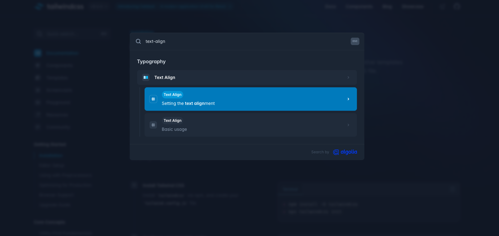

まずは開発サーバを立ち上げて、ブラウザで http://localhost:3000 にアクセスしてください。

```bash
yarn dev
```

Next.js のデフォルトページが表示されます。まずはこのページの内容を削除してしまいましょう。

`src/app/page.tsx`を開いて、return の内容をただの`<div>`に変更します。

```tsx title="src/app/page.tsx"
import Image from "next/image";

export default function Home() {
  return <div>新しいページ</div>;
}
```

ブラウザが自動でリロードされ、ページの内容が変わっていることを確認してください。

このページにスタイリングを適用していきます。

## CSS スタイリングの方法

Next.js では以下のように複数の方法で CSS スタイリングを行うことができます。

- [Global CSS](#global-css)
- [Tailwind](#tailwind)
- [CSS Modules](#css-modules)
- [CSS-in-JS](#css-in-js)

### Global CSS

`src/app/globals.css`というファイルがあります。このファイルはグローバルな CSS を定義するためのファイルです。
`src/app/layout.tsx`でこのファイルを読み込んでいます。

```tsx title="src/app/layout.tsx"
import "./globals.css";
```

`layout.tsx`については、[Segment の規約ファイル](segment-rule-files.md)の章でより詳しく説明しますが、サイドバーやヘッダーなどの各画面で共通するレイアウトを定義するファイルです。

`layout.tsx`で`globals.css`を読み込むことで、全てのページでこの CSS ファイルが適用されるようになります。

試しに`globals.css`の一部を書き換えてみましょう。

```css title="src/app/globals.css"
body {
  color: rgb(var(--foreground-rgb));
  background: linear-gradient(
      to bottom,
      transparent,
      rgb(var(--background-end-rgb))
    ) rgb(var(--background-start-rgb));
  // highlight-next-line
  text-align: center;
}
```

最初に追加したテキスト「新しいページ」が中央に表示されるようになりました。

`globals.css`と同様に、任意の `css` ファイル作成して、コンポーネントに `import` して適用できますが、適用範囲がコンポーネント外にも及ぶため、Web サイト全体のフォントや背景色などグローバルなスタイル以外のスタイリングには他の方法を使ってください。

### Tailwind

Tailwind は ユーティリティファーストの CSS フレームワークです。クラス名を使ってスタイリングを行うため、CSS を書く必要がなく、スタイリングが簡単に行えます。

`page.tsx`を以下のように書き換えて、Tailwind のスタイリングを適用してみましょう。

```tsx title="src/app/page.tsx"
import Image from "next/image";

export default function Home() {
  return (
    <div>
      <h1 className="text-4xl font-bold">新しいページ</h1>
    </div>
  );
}
```

jsx でクラス名を指定する場合、html のように`class`属性を使うのではなく、`className`という属性を使います。
ブラウザを見ると文字が大きく太字になっているはずです。このように、css のスタイルをクラス名で指定することができます。

:::tip
クラス名を調べるには、[Tailwind の公式ドキュメント](https://tailwindcss.com/docs)を参照してください。Quick Search のところに css のプロパティを入力すると、それに対応するクラス名が調べられます。


:::

### clsx

`clsx` は、条件に応じてクラス名を付け替えるために便利なライブラリです。
例えば、ボタンをクリックしたときにクラス名を変更してスタイルを変えるような場合に使います。

以下のコマンドで`clsx`をインストールします。

```bash
yarn add clsx
```

`page.tsx`で`clsx`を使って、クラス名を付け替える例を示します。以下のコードをコピペしてください。

```tsx title="src/app/page.tsx"
"use client";

import Image from "next/image";
import clsx from "clsx";
import { useState } from "react";

export default function Home() {
  const [isActive, setIsActive] = useState(false);

  return (
    <div>
      <h1
        className={clsx("text-4xl font-bold", {
          "text-red-500": isActive,
          "text-blue-500": !isActive,
        })}
      >
        新しいページ
      </h1>
      <button
        className="border border-gray-300 p-2"
        onClick={() => setIsActive(!isActive)}
      >
        切り替える
      </button>
    </div>
  );
}
```

この例では、`isActive` が`true`のときは`text-red-500`クラスが適用され、`false`のときは`text-blue-500`クラスが適用されます。

#### prettier-plugin-tailwindcss

クラスをたくさん付けるとどうしても可読性が悪くなってしまいます。そのため、`prettier-plugin-tailwindcss`というプラグインを入れて、クラス名の並び順を自動で整えるようにしましょう。

以下のコマンドでプラグインをインストールします。プロジェクトのルートディレクトリで実行してください。

```bash
yarn add -D prettier prettier-plugin-tailwindcss
```

そしてルートディレクトリに、`.prettierrc`というファイルを作成して、以下のように設定します。

```json title=".prettierrc"
{
  "plugins": ["prettier-plugin-tailwindcss"]
}
```

これで設定は完了です。試しに、`page.tsx`のクラス名を以下のように追加し、保存してみてください。

```tsx title="src/app/page.tsx"
<div>
  // highlight-next-line
  <h1 className="text-white px-4 sm:px-8 py-2 sm:py-3 bg-sky-700 hover:bg-sky-800">
    新しいページ
  </h1>
</div>
```

保存すると、クラス名が以下の順番で自動で並び替えられるはずです。

```tsx title="src/app/page.tsx"
<h1 className="bg-sky-700 px-4 py-2 text-white hover:bg-sky-800 sm:px-8 sm:py-3">
```

### CSS Modules

CSS Modules は、CSS ファイルをモジュール化して、コンポーネントごとにスコープを分けることができる方法です。

`src/app/page.module.css`というファイルを作成して、以下のようにスタイリングを記述します。

```css title="src/app/page.module.css"
.title {
  color: red;
  font-size: 24px;
}
```

`page.tsx`でこの CSS ファイルを読み込んで、スタイリングを適用します。

```tsx title="src/app/page.tsx"
import Image from "next/image";
import styles from "./page.module.css";

export default function Home() {
  return (
    <div>
      <h1 className={styles.title}>新しいページ</h1>
    </div>
  );
}
```

`styles.title`という形でクラス名を指定することで、`page.module.css`のスタイルが適用されます。
ブラウザを見ると、文字色が赤くなっているはずです。

### CSS-in-JS

`CSS-is-JS` は、CSS を JavaScript のオブジェクトとして記述する方法で、`styled-components`や`emotion`などのライブラリを使って実装します。

少し前までは `CSS-in-JS`はよく使われていましたが、`React Server Components` の登場によりサーバー側でのレンダリングにライブラリの対応が追いつかず、より手軽な`Tailwind`が使われるようになってきています。

ここでは`CSS-in-JS`の説明は省略しますが、興味がある方はそれぞれのライブラリの公式ドキュメントを参照してください。

### まとめ

スタイリングの方法はいくつかありますが、このコースでは一番手軽な`Tailwind`を使っていきます。昨今のフロントエンド界隈でも、`Tailwind`はどんどん人気が出てきているので、使い方を覚えておくと良いでしょう。

就職して既存のプロジェクトに触る際には、`CSS Modules`や`CSS-in-JS`を使うこともあると思うので、それぞれの特徴を理解しておいてください。
