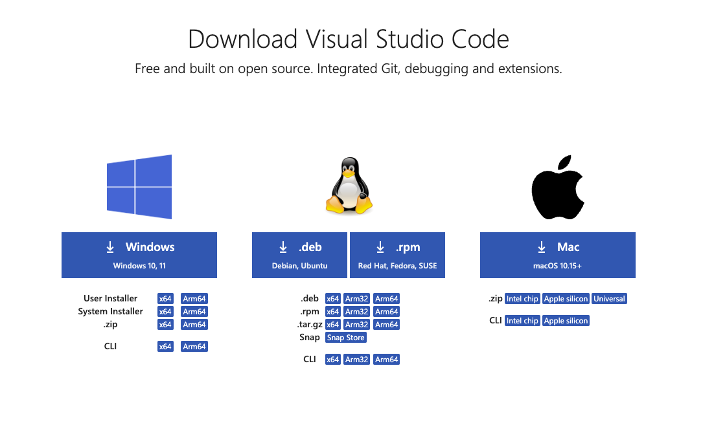
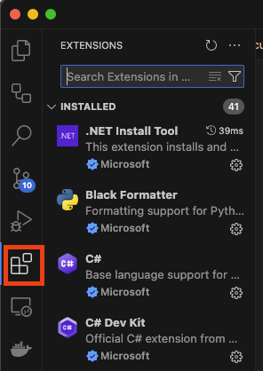
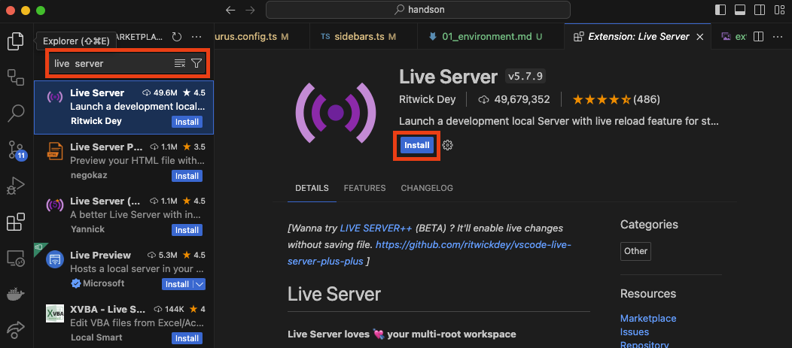
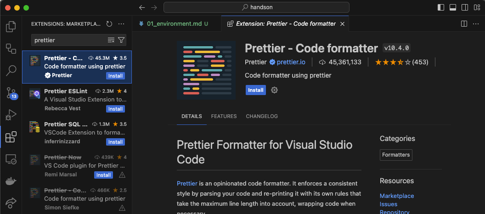

LP サイトを実装するための環境構築手順を説明します。

## エディターのインストール

まずはコードを書くためのエディターをダウンロードしましょう。  
色々なエディターがありますが、ここでは [Visual Studio Code](https://code.visualstudio.com/) （以下 VSCode）を使います。

VSCode は Microsoft 社が提供している無料のエディターで、多くのエンジニアが愛用しています。  
特に強いこだわりがない場合は、VSCode を使うことをおすすめします。  
※ 本コースでも VSCode を使う前提で説明します。

[ダウロードページ](https://code.visualstudio.com/Download) にアクセスし、自分の OS に合ったインストーラーをダウンロードしてください。

ダウンロードが完了したらファイルを起動し、指示に従ってインストールを行ってください。

## 拡張機能のインストール

VSCode には様々な拡張機能があり、それらを使うことでより便利にコーディングを行うことができます。  
Visual Studio Code を起動し、左側のアイコンから Extensions（拡張機能）を選択してください。

### Live Server

まずは、`Live Server` という拡張機能をインストールしましょう。  
この拡張機能を使うと、HTML ファイルを更新すると自動的にブラウザがリロードされるようになります。

検索バーに `Live Server` と入力し、Install ボタンをクリックしてください。

### Prettier

続いて、`Prettier - Code formatter` をインストールします。  
この拡張機能を使うと、コードのフォーマットを自動で行ってくれ、インデントやスペースの調整を手間なく行うことができます。

検索バーに `Prettier` と入力し、Install ボタンをクリックしてください。

以上で、LP サイト実装に必要な環境構築は完了です。
