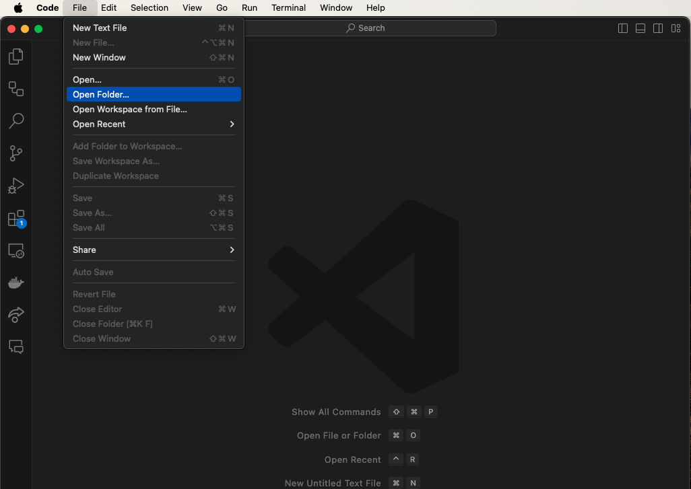
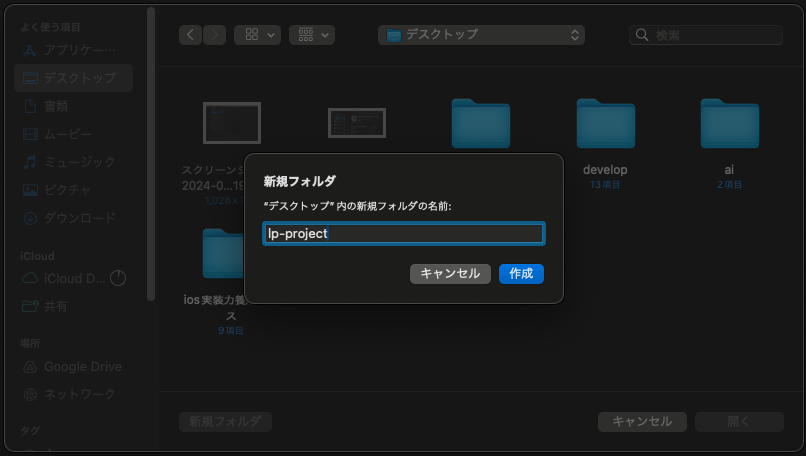
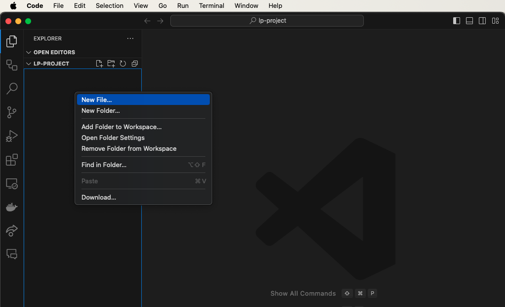
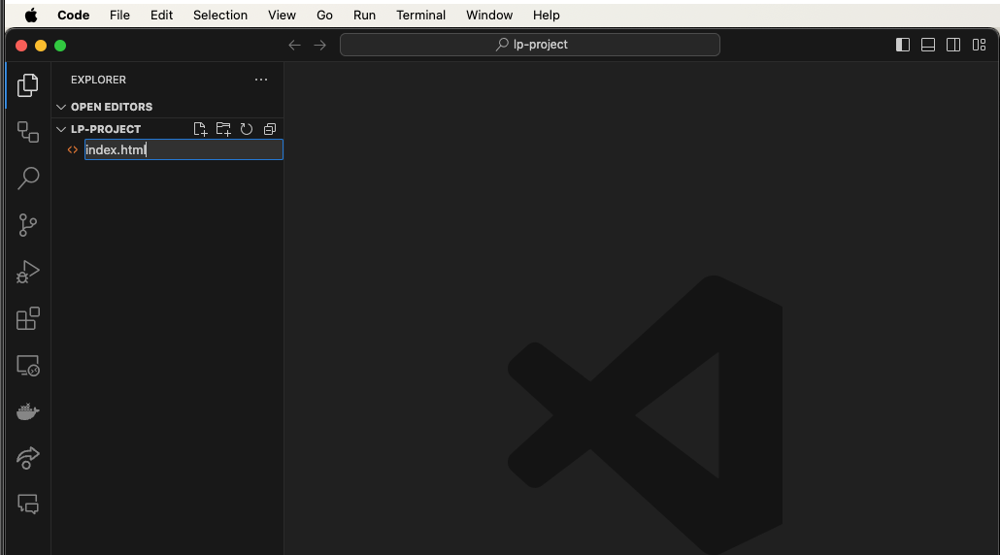
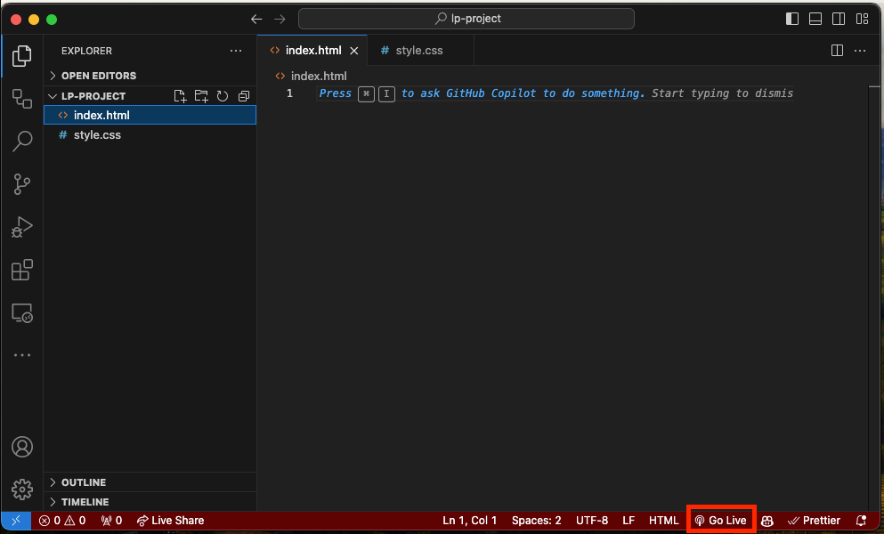

このコースを進めるにあたって、ローカルで HTML/CSS のコーディングができるようにプロジェクトを作成しましょう。

## プロジェクト作成手順

### 1. プロジェクトディレクトリの作成

まずは、プロジェクトを保存するためのディレクトリを作成します。

VSCode を使う場合は、メニューの File > Open Folder から新規フォルダを作成し、開いてください。
フォルダ名は任意ですが、ここでは `lp-project` とします。




### 2. ファイルの作成

次に、HTML ファイルと CSS ファイルを作成します。

VSCode を使う場合は、右クリックメニューの New File から新規ファイルを作成します。
以下の 4 つのファイルを作成してください。

- `index.html`
- `destyle.css`
- `style.css`
- `script.js`




### 3. destyle.css のダウンロード

`destyle.css`には、ブラウザのデフォルトスタイルをリセットする CSS を記述します。

[destyle.css](../../static/downloads/destyle.css) を開いて、ページ内の CSS コードをコピーし、先ほど作成した`destyle.css` 内に貼り付けてください。

### 3. HTML の基本構造を記述

index.html に、以下の内容を記述してください。

```html title="index.html"
<!DOCTYPE html>
<html lang="ja">
  <head>
    <meta charset="UTF-8" />
    <meta name="viewport" content="width=device-width, initial-scale=1.0" />
    <title>LP サイト</title>
    <!-- Google Fonts -->
    <link rel="preconnect" href="https://fonts.googleapis.com" />
    <link rel="preconnect" href="https://fonts.gstatic.com" crossorigin />
    <link
      href="https://fonts.googleapis.com/css2?family=Montserrat:ital,wght@0,100..900;1,100..900&family=Noto+Sans+JP:wght@100..900&display=swap"
      rel="stylesheet"
    />

    <!-- CSS Styles -->
    <link rel="stylesheet" href="destyle.css" />
    <link rel="stylesheet" href="style.css" />
  </head>
  <body>
    <!-- ここにコンテンツを記述 -->

    <!-- scripts -->
    <script src="script.js"></script>
  </body>
</html>
```

このあとのステップでは、`<body>`タグ内にコンテンツを記述するようにしてください。

### 4. Live Server の起動

HTML ファイルをブラウザで確認するために、Live Server を起動します。
index.html ファイルを開いた状態で、右下の「GoLive」をクリックしてください。



ブラウザが自動的に開かれ、http://127.0.0.1:5500 の URL で、index.html
ファイルが表示されるはずです。

## 次のステップ

これで、プロジェクトの準備が整いました。
次のステップから、HTML/CSS のコーディングを進めていきましょう。
